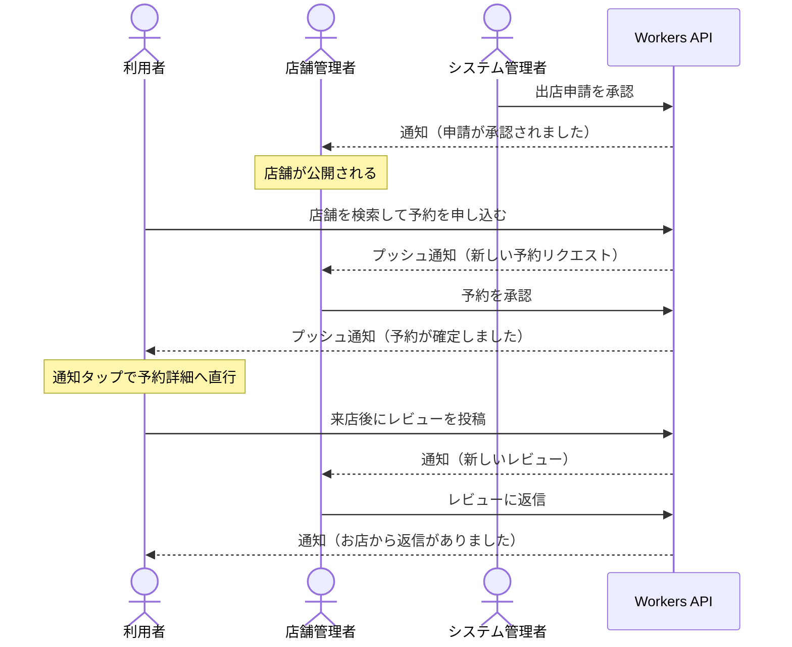

# Phase 10: 仕上げ（通知 / ディープリンク / アニメーション / README / デモ動画）実装計画

> **For agentic workers:** REQUIRED SUB-SKILL: Use superpowers:subagent-driven-development (recommended) or superpowers:executing-plans to implement this plan task-by-task. Steps use checkbox (`- [ ]`) syntax for tracking.

**Goal:** Phase 4〜9 で出来上がった 3 ロールのアプリに「外から中へ入る導線」（プッシュ通知・ディープリンク）と「触って気持ちのいい 3 画面」を足し、README とデモ動画で**提出できる状態**にする。

**Architecture:** 通知は Cloudflare Workers から Expo Push Service（`https://exp.host/--/api/v2/push/send`）へ HTTPS で投げる。端末トークンは新設する D1 の `push_tokens` に保持し、チケット／レシートで返る `DeviceNotRegistered` を受けて無効化する。ディープリンクは「カスタムスキーム（`meshimap://`）＋ Universal Links / App Links（`https://`）」の 2 経路を同じパス空間に写像する。URL の正規化は expo-router の `+native-intent.tsx`（`redirectSystemPath`）で行い、**ログイン状態とロールに応じた書き換えはそこではやらない** — `redirectSystemPath` は React の外で、認証状態が確定する前に走るため。認証が要る画面への着地は、React 側のフック（`useDeepLinkGate`）が純粋関数 `resolveDeepLinkGate` の判定に従って「行き先を預ける → ログイン → 預けた行き先へ戻す」の 3 手で処理する。アニメーションは設計書 §5.2 が指定する 3 画面だけに入れ、**判断式はすべて `'worklet';` 付きの純粋関数に切り出してから** Reanimated に渡す（テスト環境では worklets プラグインが無効なのでただの関数として単体テストできる）。

**Tech Stack:**（すべて実ファイルで確認した値）

| 対象                    | バージョン           | 確認したファイル               |
| ----------------------- | -------------------- | ------------------------------ |
| expo                    | `~57.0.22`           | `apps/mobile/package.json`     |
| expo-notifications      | `~57.0.18`           | 同上                           |
| expo-linking            | `~57.0.10`           | 同上                           |
| expo-device             | `~57.0.2`            | 同上                           |
| expo-constants          | `~57.0.18`           | 同上                           |
| expo-dev-client         | `~57.0.19`           | 同上                           |
| expo-router             | `~57.0.21`           | 同上                           |
| react-native-reanimated | `4.5.1`              | 同上                           |
| react-native-worklets   | `0.10.1`             | 同上                           |
| react-native            | `0.86.3`             | 同上                           |
| react                   | `19.2.3`             | 同上                           |
| zod                     | `^4.6.5`             | 同上 / `apps/api/package.json` |
| hono                    | `^4.13.7`            | `apps/api/package.json`        |
| drizzle-orm             | `^0.45.2`            | 同上                           |
| drizzle-kit             | `^0.31.10`           | 同上                           |
| wrangler                | `^4.131.2`           | 同上                           |
| miniflare               | `5.20260911.1-alpha` | 同上                           |
| typescript              | `~6.0.3`             | ルート `package.json`          |
| Node                    | `22.23.2`            | `.nvmrc`                       |

**このフェーズでは新しい npm パッケージを 1 つも追加しない。** 通知・ディープリンク・アニメーションに必要な
`expo-notifications` / `expo-linking` / `expo-device` / `expo-constants` / `react-native-reanimated` /
`react-native-worklets` は、すべて `apps/mobile/package.json` に**すでに入っている**（上表）。
「アニメーションのために Reanimated を入れる」といった追加は不要。

---

## Global Constraints

- ファイル名・ディレクトリ名は **kebab-case**（例外なし）。expo-router の動的セグメントは `[shopId]` のように具体名にする
- コンポーネント名・型名は **PascalCase**、関数・変数は **camelCase**、定数は **UPPER_SNAKE_CASE**、DB のテーブル・カラムは **snake_case**
- `any` 禁止・`as` によるアサーション禁止（ブランド型生成のみ例外）・`!` 非 null アサーション禁止
- `console.*` 禁止。モバイルは `@/lib/logger` の `logger`、Worker は `src/lib/logger.ts` の `logError` を使う
- マジックナンバー・マジックストリング禁止（モバイルは `src/constants/`、Worker は `src/lib/constants.ts` か `src/db/constants.ts`）
- デフォルトエクスポート禁止（expo-router の画面ファイルと `+native-intent.tsx` のみ例外）
- 数値には単位を名前に含める（`PUSH_RECEIPT_CHECK_DELAY_MS`, `HEADER_COLLAPSE_DISTANCE_PX`）
- 真偽値は `is` / `has` / `can` / `should` で始める
- **`exactOptionalPropertyTypes` が有効**なので、省略可能なプロパティは `?: T | undefined` と書く
- **`verbatimModuleSyntax` が有効**なので、型だけの import は `import type` にする
- **`noUncheckedIndexedAccess` が有効**なので、配列・インデックスアクセスの結果は `T | undefined` として扱う
- 外部から来たデータ（Expo Push API のレスポンス、ディープリンクのパラメータ、通知の `data`）は**必ず zod で `parse` / `safeParse` してから**型を信じる
- コメントは日本語で「なぜ」を書く。テスト名も日本語で振る舞いを書く
- **`className` は NativeWind が `cssInterop` で登録したコンポーネントにしか効かない。** `Animated.View` / `MapView` / `Marker` / `BottomSheetView` / `react-native-svg` の各要素には `className` を書かず `style` に `@/constants/theme` の値を渡す
- テスト環境では babel の worklets / reanimated プラグインが無効化されている（`apps/mobile/babel.config.js`）。`'worklet';` ディレクティブ付きの関数は Jest では**ただの関数**として実行できる。アニメーションの計算式はこの形で切り出してテストする
- `jest-setup.ts` が `react-native-reanimated` を公式モック（`react-native-reanimated/mock`）に差し替えている。`useSharedValue` などは動くが、**アニメーションの値の変化は Jest では観測できない**。観測するのは切り出した純粋関数の戻り値だけにする
- RNTL 14 の `render` / `fireEvent` / `renderHook` は **Promise を返す。必ず `await` する**
- `Icon` は a11y から隠れているため、テストでは `screen.getByTestId(id, { includeHiddenElements: true })` で取る
- `apps/api` の `src/index.ts` は **Hono のメソッドチェーンを切らない**（切ると `AppType` が劣化して Hono RPC の型推論が死ぬ）
- 作業ディレクトリはリポジトリルート `/Users/hattori/Downloads/alee`。ワークスペース向けコマンドは `-w @meshimap/mobile` / `-w @meshimap/api` を付ける
- ターミナルを開くたび `nvm use`（Node 22.23.2）

---

## 他フェーズから受け取るもの（このフェーズでは作らない）

| 提供元                                                                 | 名前                                                                                               | 用途                                             |
| ---------------------------------------------------------------------- | -------------------------------------------------------------------------------------------------- | ------------------------------------------------ |
| Phase 3 `apps/api/src/db`                                              | `notifications` テーブル（`admin.ts`）/ `NOTIFICATION_TYPES` / `NotificationType`                  | アプリ内通知の保存先と種別                       |
| Phase 3 `apps/api/src/db`                                              | `CREATED_AT_DEFAULT` / `IDENTIFIER_MAX_LENGTH` / `inValues` / `lengthAtMost` / `isBooleanInteger`  | 新テーブル定義に使う既存部品                     |
| Phase 3 `apps/api/src/db/testing/local-d1.ts`                          | `createMigratedD1()` / `readMigrationSql()` / `LocalD1`                                            | miniflare 製ローカル D1                          |
| Phase 3 `apps/api/src/test/fixtures.ts`                                | `createTestWorld` / `seedUser` / `seedShop` / `seedMasters` / `readRow` / `countRows` / `runWrite` | テスト用の世界                                   |
| Phase 4 `apps/api/src/index.ts`                                        | `AppBindings` / `AppEnv` / `AppType` / Hono アプリ本体                                             | ルートのマウント先と型                           |
| Phase 4 `apps/api/src/middleware`                                      | `authMiddleware` / `roleGuard(...roles)`                                                           | 認証・ロール検証                                 |
| Phase 4 `apps/api/src/middleware`                                      | `requireUserActor(c)` / `requireOwnerActor(c)` / `requireAdminActor(c)` / `requireActor(c)`        | ブランド型 Actor の取り出し                      |
| Phase 4 `apps/api/src/lib/http-error.ts`                               | `unauthorized()` / `forbidden()` / `notFound()` / `invalidInput()`                                 | エラー応答（**実装済み。実ファイルで確認**）     |
| Phase 4 `apps/api/src/test/fixtures.ts`                                | `createTestBindings` / `signUpAs` / `TEST_MOBILE_APP_SCHEME`（= `'meshimap'`）                     | 認証付きのリクエストテスト                       |
| Phase 5 `apps/mobile/src/features/auth`                                | `AuthState`（`restoring` / `unauthenticated` / `profile-unavailable` / `authenticated`）           | ディープリンクの分岐条件                         |
| **Phase 7** `apps/mobile/src/lib/api-client`                           | `apiFetch(path, init: ApiFetchInit)` / `ApiError`                                                  | トークン登録・通知一覧の取得（**下の注を必読**） |
| Phase 5 `apps/mobile/src/app/index.tsx`                                | ロール判定 → `ROLE_HOME_ROUTES` へのリダイレクト                                                   | ログイン直後の復帰先差し込み点                   |
| Phase 6 `apps/mobile/src/app/(user)/(tabs)/map.tsx`                    | 地図画面                                                                                           | アニメーション対象 1                             |
| Phase 6 `apps/mobile/src/app/(user)/shop/[shopId]/index.tsx`           | 店舗詳細画面                                                                                       | アニメーション対象 2・ディープリンク着地点 1     |
| Phase 7 `apps/mobile/src/app/(user)/reservations/[reservationId].tsx`  | 予約詳細（利用者）                                                                                 | ディープリンク着地点 2                           |
| Phase 7 `apps/mobile/src/app/(owner)/reservations/[reservationId].tsx` | 予約詳細（店舗管理者）                                                                             | 同じパスの共有ルート。グループ解決が要る         |
| Phase 7 `apps/api/src/routes/reservations.ts`                          | 予約の承認・拒否ハンドラ                                                                           | `notifyReservationStatusChanged` の呼び出し元    |
| Phase 8 `apps/mobile/src/app/(owner)/(tabs)/dashboard.tsx`             | オーナーダッシュボード                                                                             | アニメーション対象 3                             |
| Phase 9 `apps/mobile/src/app/(admin)/…`                                | 管理画面一式                                                                                       | デモ動画のシナリオ 3 ロール目                    |

### 着手前に必ず片付ける 3 点（2026-09-16 追記。どれも実ファイル・他フェーズの計画書で確認済み）

**1. `apiFetch` / `ApiError` は Phase 5 ではなく Phase 7 が作る。** Phase 5 計画書がモバイルの API クライアントとして作るのは `apiClient`（`hc<AppType>`）と `buildAuthHeaders` だけで、`apiFetch` は作らない（`hc` の型推論を守るために `fetch` のラッパを持たないと決めている）。**実物は Phase 7 Task 7-14 Step 1 が足す**（Phase 7 計画書 8584 行に実装、同 81 行にこの名前の衝突の説明がある）。Phase 6 / 7 / 9 / 10 の 4 フェーズが前提にしているので、着手時に `grep -n 'export async function apiFetch' apps/mobile/src/lib/api-client.ts` で実在を確かめ、無ければ Phase 7 Task 7-14 Step 1 を先に済ませること。

**2. `apiFetch` は 204 を解釈できない。** Phase 7 の実装は末尾が `return await response.json();` で、**本文が空の 204 応答でも必ず `json()` を呼ぶ**（空本文の `json()` は `SyntaxError` を投げる）。Task 10-5 の `POST /me/push-tokens` は `return c.body(null, 204);` なので、`postToken` がそのまま例外になる。**Task 10-5 の着手時に `apiFetch` へ次の 3 行を足し、Phase 7 の `api-client.test.ts` に「204 のときは null を返す」ケースを 1 件足すこと**（エンドポイント側を 200 に変えて逃げない。204 は「返す情報が無い」ことの正しい表現である）。

```ts
// 204 / 205 は本文を持たない。json() を呼ぶと空本文で SyntaxError になる
if (response.status === 204 || response.status === 205) {
  return null;
}
return await response.json();
```

**3. Phase 10 はルートを 5 本足すのに、`EXPECTED_ROUTE_PATTERNS` を直す指示がどこにも無い。** `apps/api/src/routes/permission-matrix.test.ts` は `declaredRoutePatterns()` を `toEqual` で厳密比較しているので、**ルートを足した瞬間に落ちる**。この計画書には `EXPECTED_ROUTE_PATTERNS` という語が 1 度も出てこない（`grep` で 0 件だった）。Phase 10 が足すのは次の 5 本で、**Phase 9 を終えた時点の 87 本から 92 本になる。**

| 足すルート                                    | 足すタスク | 匿名 | user | owner | admin |
| --------------------------------------------- | ---------- | ---- | ---- | ----- | ----- |
| `POST /me/push-tokens`                        | 10-5       | 401  | 204  | 204   | 204   |
| `GET /me/notifications`                       | 10-5       | 401  | 200  | 200   | 200   |
| `POST /me/notifications/:notificationId/read` | 10-5       | 401  | 404  | 404   | 404   |
| `GET /.well-known/apple-app-site-association` | 10-10      | 200  | 200  | 200   | 200   |
| `GET /.well-known/assetlinks.json`            | 10-10      | 200  | 200  | 200   | 200   |

積み上げ: Phase 4 = 10 → Phase 7 後 = 19 → Phase 8 後 = 51 → Phase 9 Task 9-17 後 = 83 → Phase 9 Task 9-26 後 = **87** → **Phase 10 後 = 92**。`DELEGATED_ROUTE_PATTERNS` は 41 本のまま（この 5 本は `/admin/**` でも予約系でもない）。**Task 10-5 と Task 10-10 の Files: に `Modify: apps/api/src/routes/permission-matrix.test.ts` を足し、Phase 7 計画書 2470-2530 行の 4 手順**（ソート順を保って行を足す / `it(...)` のテスト名の数字を直す / 委譲の要否を決める / `covered` に `...DELEGATED_ROUTE_PATTERNS` を混ぜる）**をそのコミットの中で実行すること。**`ENDPOINT_CASES` にも 5 行足す。`/.well-known/**` の 2 本は `authMiddleware` より前に置くか後に置くかで匿名の扱いが変わるので、**匿名 200 になっていることをテストで固定する**こと。

> ソート位置の目安（UTF-16 コード単位の辞書順）: `'GET /.well-known/apple-app-site-association'` と `'GET /.well-known/assetlinks.json'` は `.`（0x2E）で始まるので **`GET` 群の先頭**（`'GET /admin/...'` より前）。`'GET /me/notifications'` は `'GET /me'` の直後。`'POST /me/notifications/:notificationId/read'` と `'POST /me/push-tokens'` は `POST` 群の `'/me/'` の並びに入る（`n` < `p`）。**必ず実物を `.sort()` させて確かめること。**

---

**タスク数について。** 依頼時の見込みは 10 タスクだったが、**15 タスク**（Task 10-0 〜 Task 10-14）になった。増えた理由は 4 つ。

1. 「プッシュ通知」は D1 のテーブル追加・Worker 側の送信クライアント・リポジトリ・配信サービス・エンドポイント・モバイル側の登録の 6 つに割れる。1 タスクにまとめるとレビュー単位として大きすぎ、途中で落ちたときに切り戻せない
2. `push_tokens` を足すと `check-constraints.test.ts` のメタテスト（Drizzle 側の CHECK 名の集合とマイグレーションの CHECK 名の集合の一致を見る）が**確実に落ちる**。これは既存テストの読み取り範囲が `0000_init.sql` 固定になっている潜在バグでもあるため、独立したタスクとして扱う（Task 10-2）
3. 「ディープリンク」は「カスタムスキームで届く」「未ログイン時にログイン後へ戻す」「`https://` で届く（AASA / assetlinks.json）」の 3 つが別の失敗の仕方をするので分けた（Task 10-8 / 10-9 / 10-10）
4. Phase 4 で実装済みの `repository-convention.test.ts` が、リポジトリ層の全 export に `(db: Database, actor: <Actor 系>)` を強制する。Cron とプッシュ配信から呼ばれる関数には人間の行為者がいないため、**`SystemActor` を先に足さないと Task 10-4 が書けない**。既存タスクの番号を振り直さずに済むよう、先頭に Task 10-0 として置いた（Phase 9 が `Task 9-0` を同じ理由で先頭に置いている）

---

## 前提：Expo SDK 57 のプッシュ通知について確認した事実

以下は **`https://docs.expo.dev/versions/v57.0.0/sdk/notifications/`（SDK 57 の公式リファレンス）と `node_modules/expo-notifications/build/*.d.ts` で確認した**事実のみ。推測は含めない。

- 公式リファレンス冒頭の注意書き（原文）:

  > "Push notifications (remote notifications) functionality provided by `expo-notifications` is unavailable in Expo Go on Android from SDK 53. A development build is required to use push notifications. Local notifications (in-app notifications) remain available in Expo Go."

  つまり **Android の Expo Go ではプッシュ通知が動かず、development build が必須**。iOS について同等の制限は同ページに書かれていない（**iOS の Expo Go の可否は未確認**）。本リポジトリはすでに `expo-dev-client` を導入済みで、README も「Expo Go では動かない」と書いているため、**development build を前提**にして計画する

- `NotificationBehavior` は SDK 57 では `shouldShowBanner` / `shouldShowList` / `shouldPlaySound` / `shouldSetBadge` が必須。`shouldShowAlert` は `@deprecated`（`node_modules/expo-notifications/build/Notifications.types.d.ts:611-622`）
- `getExpoPushTokenAsync(options?: ExpoPushTokenOptions): Promise<ExpoPushToken>`、`ExpoPushToken = { type: 'expo'; data: string }`。`projectId` は `Constants.expoConfig.extra.eas.projectId` から補完されるが、JSDoc に「it is **recommended** to set it manually」とある（`Tokens.types.d.ts`）ので明示的に渡す
- `addNotificationReceivedListener` / `addNotificationResponseReceivedListener` は `EventSubscription`（`expo-modules-core`）を返す。解除は `subscription.remove()`
- `getLastNotificationResponse(): NotificationResponse | null` と `clearLastNotificationResponse(): void` は**同期**。`...Async` 版は `@deprecated`
- `NotificationContent.data?: Record<string, unknown>`（`any` ではない。規約に抵触しない）
- `setNotificationChannelAsync(channelId, channel)` は Android 専用。`AndroidImportance.HIGH = 6`（`NotificationChannelManager.types.d.ts:24-36`）
- config plugin は `node_modules/expo-notifications/app.plugin.js` に実在する（`./plugin/build/withNotifications` を読む）
- Expo Push API（`https://docs.expo.dev/push-notifications/sending-notifications/`）: `POST https://exp.host/--/api/v2/push/send` に**同一プロジェクト宛なら 1 リクエスト最大 100 件**。レスポンスはチケット配列で `{ status: 'ok', id } | { status: 'error', message, details: { error } }`。`details.error` の値は `DeviceNotRegistered` / `MessageTooBig` / `MessageRateExceeded` / `MismatchSenderId` / `InvalidCredentials`。レシートは `POST https://exp.host/--/api/v2/push/getReceipts` に `{ ids: string[] }`。`DeviceNotRegistered` について公式は "Stop sending notifications to this device's push token until it re-registers with your server." と書いている

---

### Task 10-0: システム行為者（`SystemActor`）を追加する

**このタスクは Task 10-4 より先に走らせる。** 順番を入れ替えると Task 10-4 が確実に落ちる。

Phase 4 で実装済みの `apps/api/src/repositories/repository-convention.test.ts`（コミット `9a2556b`）が、
`src/repositories/` 配下の **export された全関数**に対して次を構文レベルで強制している（実ファイルの 20-26 行と 238-272 行）。

```ts
const ACTOR_TYPE_NAMES = new Set(['UserActor', 'OwnerActor', 'AdminActor', 'Actor', 'Viewer']);
const ACTOR_PARAMETER_NAMES = new Set(['actor', '_actor', 'viewer', '_viewer']);
const DB_PARAMETER_NAME = 'db';
const DB_TYPE_NAME = 'Database';
```

- 引数が 2 つ未満 → 違反
- 第 1 引数が `db: Database` でない（**名前も型も**）→ 違反
- 第 2 引数の名前が `actor` / `_actor` / `viewer` / `_viewer` でない → 違反
- 第 2 引数の型が Actor 系でない → 違反
- **除外・許可リストの仕組みは無い**（`listRepositoryFiles()` は `.test.ts` 以外の `.ts` を全部拾う）

一方 Task 10-4 が作る `listActivePushTokens` / `deactivatePushTokens` / `markPushTokensUsed` は
**Cron とプッシュ配信から呼ばれる。人間の行為者がいない。**
`registerPushToken` は端末の持ち主が行為者なので `Actor` でよいが、残り 3 本には渡せる Actor が存在しない。

**採らない選択肢とその理由:**

| 案                                            | 採らない理由                                                                                                                                                              |
| --------------------------------------------- | ------------------------------------------------------------------------------------------------------------------------------------------------------------------------- |
| 規約の検査からファイルを除外する              | この repo の方針で「除外する」は選択肢に無い。除外の仕組みを 1 つ作ると、次に困った人が同じ穴を使う                                                                       |
| 関数を `src/repositories/` の外に置く         | 実質的な除外。D1 への読み書きが 2 箇所に散る                                                                                                                              |
| 使わない `_actor: Actor` を足す               | 「行為者がいないのに行為者を要求する」嘘になる。呼び出し側は渡す Actor を捏造するしかない                                                                                 |
| `@meshimap/core` の `Role` に `system` を足す | `profiles.role` に `ck_profiles_role`（`inValues(table.role, ROLES)`、`src/db/schema/master.ts:57`）が張ってある。`ROLES` を変えると CHECK が変わりマイグレーションが要る |

**採る案: システム自身を行為者として明示的にモデル化する。**
`audit_logs.actor_id` が nullable（`references(() => user.id, { onDelete: 'set null' })`、`src/db/schema/admin.ts`）なのと
同じ形で、「行為者はいるが、それはユーザーではない」を表す。

**`SystemActor` を `Actor` にも `Viewer` にも含めないこと。** これが設計の要点で、理由は 2 つある。

1. `src/lib/app-env.ts` の `AppVariables` は `readonly viewer: Viewer` と書かれている。`Viewer` に `SystemActor` が入ると
   `c.set('viewer', SYSTEM_ACTOR)` が**型を通る**。リクエスト経路にシステム権限が載る道を最初から作らない
2. `requireActor(c): Actor`（`src/middleware/role-guard.ts:75`）の戻り値に `SystemActor` が混ざると、
   `actor.userId` の型が `UserId | null` に広がり、`src/routes/me.ts:17` の `eq(profiles.userId, actor.userId)` が型エラーになる。
   実装済みの Phase 4〜6 のコードを、プッシュ通知の都合で壊すことになる

つまり `SystemActor` は「Actor の仲間だが、リクエストからは絶対に生まれない別のユニオン」として置く。
規約（`ACTOR_TYPE_NAMES`）には載せるので、リポジトリ関数は従来どおり `(db, actor)` の形を強制され続ける。**除外ではない。**

**Files:**

- Modify: `apps/api/src/auth/actor.ts`
- Modify: `apps/api/src/auth/actor.test.ts`
- Modify: `apps/api/src/auth/actor.type-test.ts`
- Modify: `apps/api/src/auth/actor-encapsulation.test.ts`
- Modify: `apps/api/src/repositories/repository-convention.test.ts`

**Interfaces:**

- Consumes: `BrandedActor` / `brandActor`（`src/auth/actor.ts` のモジュール内部。export しない）/ `isRole` / `ROLES`（`@meshimap/core`）/ `ts`（`typescript`）
- Produces:
  - `ROLE_SYSTEM: 'system'`（`src/auth/actor.ts`）
  - `type SystemActor`（`src/auth/actor.ts`）
  - `SYSTEM_ACTOR: SystemActor`（`src/auth/actor.ts`）

**着手前に読むもの（推測で書かない）:**

| ファイル                                                  | 見るところ                                                                     |
| --------------------------------------------------------- | ------------------------------------------------------------------------------ |
| `apps/api/src/auth/actor.ts`                              | `BrandedActor` / `brandActor` / `ROLE_ANONYMOUS` / `ANONYMOUS_VIEWER` の書き方 |
| `apps/api/src/auth/actor-encapsulation.test.ts`           | `ACTOR_FACTORY_ALLOWLIST` と `collectActorFactoryViolations`                   |
| `apps/api/src/repositories/repository-convention.test.ts` | `ACTOR_TYPE_NAMES`                                                             |
| `apps/api/src/lib/app-env.ts`                             | `AppVariables.viewer` の型                                                     |

- [ ] **Step 1: 失敗するテストを書く**

`apps/api/src/auth/actor.test.ts` の import を差し替える。

```ts
import { ROLE_ADMIN, ROLE_OWNER, ROLE_USER, isRole } from '@meshimap/core';
import { describe, expect, it } from 'vitest';
import {
  ANONYMOUS_VIEWER,
  ROLE_ANONYMOUS,
  ROLE_SYSTEM,
  SYSTEM_ACTOR,
  isAdminActor,
  isAuthenticatedActor,
  isOwnerActor,
  isUserActor,
  toActor,
} from './actor';
```

`describe('ANONYMOUS_VIEWER', ...)` の直後に足す。

```ts
describe('SYSTEM_ACTOR', () => {
  it('role は system で userId は null である', () => {
    // userId が null なのは、対応する profiles の行が存在しないから。
    // audit_logs.actor_id が nullable なのと同じ「行為者はいるがユーザーではない」の表現
    expect(SYSTEM_ACTOR.role).toBe(ROLE_SYSTEM);
    expect(SYSTEM_ACTOR.userId).toBeNull();
  });

  it('凍結されていて書き換えられない', () => {
    expect(Object.isFrozen(SYSTEM_ACTOR)).toBe(true);
  });

  it('@meshimap/core の Role には含まれない', () => {
    // profiles.role の CHECK（ck_profiles_role）は ROLES しか許さない。
    // system が ROLES に混ざると、DB の行から system を名乗る Actor が生まれてしまう。
    // ここが true になったらマイグレーションが必要になっている合図
    expect(isRole(SYSTEM_ACTOR.role)).toBe(false);
  });
});
```

- [ ] **Step 2: 実行して失敗することを確認する**

Run: `npm test -w @meshimap/api -- src/auth/actor.test.ts`
Expected: FAIL。`does not provide an export named 'SYSTEM_ACTOR'`

- [ ] **Step 3: `actor.ts` に `SystemActor` を実装する**

`apps/api/src/auth/actor.ts` の `ROLE_ANONYMOUS` の定義のすぐ下に足す。

```ts
/**
 * システム自身を表すロール値。@meshimap/core の Role には含めない。
 * `profiles.role` には `ck_profiles_role`（`inValues(table.role, ROLES)`）が張ってあり、
 * ROLES に 'system' を足すと CHECK が変わってマイグレーションが要る。
 * system は DB に保存される値ではないので、ROLE_ANONYMOUS と同じくこのモジュールに置く。
 */
export const ROLE_SYSTEM = 'system';
```

`AnonymousActor` の定義のすぐ下に足す。

```ts
/**
 * システム自身。Cron・プッシュ配信など、人間の行為者がいない処理の主体。
 *
 * userId が null なのは、対応する profiles の行が無いから。
 * `audit_logs.actor_id` が nullable（`on delete set null`、`src/db/schema/admin.ts`）なのと同じ形で、
 * 「行為者はいるが、それはユーザーではない」ことを表す。
 *
 * **Actor にも Viewer にも含めない。** 含めると `AppVariables.viewer: Viewer`（`src/lib/app-env.ts`）へ
 * 代入でき、`c.set('viewer', SYSTEM_ACTOR)` が型を通ってしまう。
 * また `requireActor(c): Actor` の戻り値に混ざると `actor.userId` が `UserId | null` に広がり、
 * `src/routes/me.ts` の `eq(profiles.userId, actor.userId)` が壊れる。
 */
export type SystemActor = BrandedActor<typeof ROLE_SYSTEM, null>;
```

`ANONYMOUS_VIEWER` の定義のすぐ下に足す。

```ts
/**
 * システム行為者の唯一の値。
 * 認証経路（`auth/` `middleware/` `routes/`）からの import は
 * `actor-encapsulation.test.ts` が機械的に禁止する（Step 7-9）。
 */
export const SYSTEM_ACTOR: SystemActor = Object.freeze(brandActor(ROLE_SYSTEM, null));
```

`Actor` / `Viewer` / `toActor` / `isAuthenticatedActor` は**一切変更しない**。

- [ ] **Step 4: テストが通ることを確認する**

Run: `npm test -w @meshimap/api -- src/auth/actor.test.ts`
Expected: PASS（14 件。変更前は 11 件）

- [ ] **Step 5: 型で「リクエスト経路に載らない」ことを固定する**

`apps/api/src/auth/actor.type-test.ts` の import に `SystemActor` を足す。

```ts
import type {
  AdminActor,
  Actor,
  AnonymousActor,
  OwnerActor,
  SystemActor,
  UserActor,
  Viewer,
} from './actor';
```

`declare const anonymousViewer: AnonymousActor;` の下に足す。

```ts
declare const systemActor: SystemActor;
```

`// @ts-expect-error 匿名は認証済み Actor に代入できない` の組の下に足す。

```ts
// @ts-expect-error システム行為者は認証済み Actor に代入できない（requireActor の戻り値に混ざらない）
export const systemToActor: Actor = systemActor;

// @ts-expect-error システム行為者は Viewer に代入できない（c.set('viewer', SYSTEM_ACTOR) を型で塞ぐ）
export const systemToViewer: Viewer = systemActor;

// @ts-expect-error 認証済みユーザーをシステム行為者として扱えない（逆向きのなりすましも塞ぐ）
export const userToSystem: SystemActor = userActor;

// @ts-expect-error 匿名はシステム行為者ではない
export const anonymousToSystem: SystemActor = anonymousViewer;
```

- [ ] **Step 6: 型チェックを実行する**

Run: `npm run typecheck -w @meshimap/api`
Expected: エラーなし（4 つの `@ts-expect-error` がすべて「実際にエラーになる行」に付いている）

- [ ] **Step 7: 認証経路からの持ち込みを禁じる検査を書く（失敗するテスト）**

`apps/api/src/auth/actor-encapsulation.test.ts` の `ACTOR_FACTORY_SYMBOLS` の下に足す。

```ts
/** システム行為者の値。名前だけを持つ定数にして、検査側とメッセージ側で同じ文字列を使う */
const SYSTEM_ACTOR_SYMBOL = 'SYSTEM_ACTOR';

/**
 * SYSTEM_ACTOR を import してはいけないディレクトリ（src/ からの相対パスの接頭辞）。
 * ACTOR_FACTORY_ALLOWLIST とは向きが逆の「禁止リスト」。
 *
 * ファイル単位の許可リストにしないのは、下の「実在する」検査があるため
 * **まだ存在しないファイル（`services/notify.ts` など）を先に書けない**から。
 * リクエストが通る 3 ディレクトリを丸ごと塞ぐ方が、後から穴が開かない。
 *
 * 型の側でも `Viewer` に `SystemActor` を入れていないので `c.set('viewer', SYSTEM_ACTOR)` は
 * コンパイルエラーになる。これはその二層目で、認証経路が値を手に取ること自体を禁じる。
 */
const SYSTEM_ACTOR_FORBIDDEN_DIRECTORIES = ['auth/', 'middleware/', 'routes/'];
```

`NAMESPACE_IMPORT_REASON` の下に足す。

```ts
/** 名前空間 import を表す印。actor モジュールの export 名と衝突しない記号を使う */
const NAMESPACE_IMPORT_MARKER = '*';
```

`collectActorFactoryViolations` を、次の 3 つの関数に置き換える（走査部分を切り出して 2 つの検査で共有する）。

```ts
/**
 * actor モジュールから **値として** import されているシンボル名を集める。
 *
 * `import * as actorModule from './actor'` は `NAMESPACE_IMPORT_MARKER` として 1 件返す。
 * `actorModule.toActor(...)` と書けるので、名前付き import と同じだけの能力があるため。
 * ここを見落とすと検査全体が素通りになる。
 */
function collectActorValueImports(sourceFile: ts.SourceFile): string[] {
  const imported: string[] = [];
  for (const statement of sourceFile.statements) {
    if (!ts.isImportDeclaration(statement)) {
      continue;
    }
    const moduleSpecifier = statement.moduleSpecifier;
    if (!ts.isStringLiteral(moduleSpecifier)) {
      continue;
    }
    if (!/(^|\/)actor$/.test(moduleSpecifier.text)) {
      continue;
    }
    const clause = statement.importClause;
    if (clause === undefined || clause.isTypeOnly) {
      // `import type { OwnerActor } from './actor'` は生成能力を持たないので対象外
      continue;
    }
    const bindings = clause.namedBindings;
    if (bindings === undefined) {
      continue;
    }
    if (ts.isNamespaceImport(bindings)) {
      imported.push(NAMESPACE_IMPORT_MARKER);
      continue;
    }
    if (!ts.isNamedImports(bindings)) {
      continue;
    }
    for (const element of bindings.elements) {
      if (element.isTypeOnly) {
        continue;
      }
      // `import { toActor as make }` では name が別名になるので、元の名前がある propertyName を優先する
      imported.push((element.propertyName ?? element.name).text);
    }
  }
  return imported;
}

/** そのファイルが actor モジュールの生成能力を持ち込んでいれば、違反メッセージを返す */
function collectActorFactoryViolations(sourceFile: ts.SourceFile, relativePath: string): string[] {
  const violations: string[] = [];
  for (const imported of collectActorValueImports(sourceFile)) {
    if (imported === NAMESPACE_IMPORT_MARKER) {
      violations.push(`${relativePath} が ${NAMESPACE_IMPORT_REASON}`);
      continue;
    }
    if (ACTOR_FACTORY_SYMBOLS.has(imported)) {
      violations.push(`${relativePath} が ${imported} を import している`);
    }
  }
  return violations;
}

/**
 * 認証経路のディレクトリにあるファイルが SYSTEM_ACTOR を持ち込んでいれば、違反メッセージを返す。
 * 名前空間 import も同じ扱い（`actorModule.SYSTEM_ACTOR` と書けるため）。
 * 禁止ディレクトリの外のファイル（`services/` など）は対象外なので空配列を返す。
 */
function collectSystemActorViolations(sourceFile: ts.SourceFile, relativePath: string): string[] {
  const isForbidden = SYSTEM_ACTOR_FORBIDDEN_DIRECTORIES.some((directory) =>
    relativePath.startsWith(directory),
  );
  if (!isForbidden) {
    return [];
  }
  const violations: string[] = [];
  for (const imported of collectActorValueImports(sourceFile)) {
    if (imported === NAMESPACE_IMPORT_MARKER || imported === SYSTEM_ACTOR_SYMBOL) {
      violations.push(`${relativePath} が認証経路から ${SYSTEM_ACTOR_SYMBOL} を持ち込んでいる`);
    }
  }
  return violations;
}
```

`describe('検査器そのものの取りこぼし', ...)` の末尾に足す。

```ts
/** SYSTEM_ACTOR 側の検査を、実ファイルを作らずに試すヘルパ */
function systemViolationsOf(relativePath: string, code: string): string[] {
  const sourceFile = ts.createSourceFile(relativePath, code, ts.ScriptTarget.ES2022, true);
  return collectSystemActorViolations(sourceFile, relativePath);
}

it('認証経路のファイルが SYSTEM_ACTOR を import していたら捕まえる', () => {
  expect(
    systemViolationsOf('routes/notifications.ts', "import { SYSTEM_ACTOR } from '../auth/actor';"),
  ).toEqual(['routes/notifications.ts が認証経路から SYSTEM_ACTOR を持ち込んでいる']);
});

it('認証経路のファイルの名前空間 import も捕まえる', () => {
  // `actorModule.SYSTEM_ACTOR` と書けるので、名前付き import と同じだけの能力がある
  expect(
    systemViolationsOf('middleware/auth.ts', "import * as actorModule from '../auth/actor';"),
  ).toEqual(['middleware/auth.ts が認証経路から SYSTEM_ACTOR を持ち込んでいる']);
});

it('認証経路の外のファイルは SYSTEM_ACTOR を import してよい', () => {
  // Cron とプッシュ配信はここから呼ぶ。禁止すると SystemActor を渡せる場所が無くなる
  expect(
    systemViolationsOf('services/notify.ts', "import { SYSTEM_ACTOR } from '../auth/actor';"),
  ).toEqual([]);
});

it('型だけの import は認証経路でも見逃す', () => {
  // 型は漏れても値は作れない。SystemActor を引数の型として書くことまでは禁じない
  expect(
    systemViolationsOf(
      'routes/notifications.ts',
      "import type { SystemActor } from '../auth/actor';",
    ),
  ).toEqual([]);
});
```

`describe('Actor ファクトリの閉じ込め', ...)` の中を、次のように書き換える。
ディレクトリ走査が 2 つの検査で同じになるので、`listInspectableSources` に切り出す。

```ts
type InspectableSource = {
  readonly relativePath: string;
  readonly sourceFile: ts.SourceFile;
};

/**
 * src 配下の実装ファイルを AST 付きで列挙する。
 * テストファイルは本番に載らないので除く。actor.ts 本体は定義元なので除く。
 */
async function listInspectableSources(): Promise<InspectableSource[]> {
  const files = await listSourceFiles(SOURCE_ROOT);
  const sources: InspectableSource[] = [];
  for (const file of files) {
    const relativePath = path.relative(SOURCE_ROOT, file).split(path.sep).join('/');
    if (relativePath.endsWith('.test.ts') || relativePath.endsWith('.type-test.ts')) {
      continue;
    }
    if (relativePath === 'auth/actor.ts') {
      continue;
    }
    const content = await readFile(file, 'utf8');
    sources.push({
      relativePath,
      sourceFile: ts.createSourceFile(
        file,
        content,
        ts.ScriptTarget.ES2022,
        true,
        ts.ScriptKind.TS,
      ),
    });
  }
  return sources;
}

describe('Actor ファクトリの閉じ込め', () => {
  it('toActor と ANONYMOUS_VIEWER を import してよいのはホワイトリストのファイルだけ', async () => {
    const violations = (await listInspectableSources())
      .filter((source) => !ACTOR_FACTORY_ALLOWLIST.has(source.relativePath))
      .flatMap((source) => collectActorFactoryViolations(source.sourceFile, source.relativePath));

    expect(violations).toEqual([]);
  });

  it('ホワイトリストに載っているファイルが実在する', async () => {
    // パスを書き間違えると検査が素通りするので、実在確認もテストにする
    const relativePaths = new Set(
      (await listInspectableSources()).map((source) => source.relativePath),
    );
    for (const allowed of ACTOR_FACTORY_ALLOWLIST) {
      // test/fixtures.ts は .test.ts ではないので listInspectableSources に含まれる
      expect(relativePaths.has(allowed)).toBe(true);
    }
  });

  it('認証経路のディレクトリからは SYSTEM_ACTOR を import できない', async () => {
    // ホワイトリストのファイル（middleware/auth.ts など）も除外せず全部見る。
    // 「Actor を作ってよい場所」と「システム権限を持ってよい場所」は別の集合だから
    const violations = (await listInspectableSources()).flatMap((source) =>
      collectSystemActorViolations(source.sourceFile, source.relativePath),
    );

    expect(violations).toEqual([]);
  });

  it('禁止ディレクトリが 1 つも空振りしていない', async () => {
    // 接頭辞を書き間違えると検査が素通りするので、実在確認もテストにする
    const sources = await listInspectableSources();
    for (const directory of SYSTEM_ACTOR_FORBIDDEN_DIRECTORIES) {
      expect(sources.some((source) => source.relativePath.startsWith(directory))).toBe(true);
    }
  });
});
```

- [ ] **Step 8: 実行して失敗することを確認する**

Run: `npm test -w @meshimap/api -- src/auth/actor-encapsulation.test.ts`
Expected: FAIL。`collectSystemActorViolations is not defined`（Step 7 のテストだけ先に書いた場合）

> Step 7 は検査器の追加とテストの追加を 1 つの編集にまとめて書いてある。
> TDD の順序を厳密に踏むなら、**先に 4 つの `it` と `systemViolationsOf` だけを貼って赤を確認し**、
> そのあと `collectActorValueImports` / `collectSystemActorViolations` を貼ること。

- [ ] **Step 9: テストが通ることを確認する**

Run: `npm test -w @meshimap/api -- src/auth/actor-encapsulation.test.ts`
Expected: PASS（14 件。変更前は 8 件）

- [ ] **Step 10: リポジトリ規約に `SystemActor` を載せる（失敗するテスト）**

`apps/api/src/repositories/repository-convention.test.ts` の
`describe('検査器そのものの取りこぼし', ...)` の中、`it('第 2 引数の型が string の関数を違反として検出する', ...)` の下に足す。

```ts
it('第 2 引数が SystemActor の関数を通す', () => {
  // Cron とプッシュ配信から呼ばれる関数には人間の行為者がいない。
  // 規約から除外するのではなく、システム自身を行為者として要求する
  const violations = violationsOf(
    [
      'export async function sweepTokens(',
      '  db: Database,',
      '  _actor: SystemActor,',
      '  tokens: readonly string[],',
      '): Promise<number> {',
      '  return tokens.length;',
      '}',
    ].join('\n'),
  );
  expect(violations).toEqual([]);
});
```

Run: `npm test -w @meshimap/api -- src/repositories/repository-convention.test.ts`
Expected: FAIL。`sweepTokens の第 2 引数の型が Actor 系ではない（SystemActor）`

続けて `ACTOR_TYPE_NAMES` を書き換える。

```ts
/** 第 2 引数に許される型名。src/auth/actor.ts の export と一致させること */
const ACTOR_TYPE_NAMES = new Set([
  'UserActor',
  'OwnerActor',
  'AdminActor',
  'Actor',
  'Viewer',
  // Cron・プッシュ配信など、人間の行為者がいない処理の主体（Task 10-0 で追加）。
  // Actor / Viewer のユニオンには入っていないので、ここに明示的に並べる必要がある
  'SystemActor',
]);
```

Run: `npm test -w @meshimap/api -- src/repositories/repository-convention.test.ts`
Expected: PASS（26 件。変更前は 25 件）

- [ ] **Step 11: わざと壊してテストが落ちることを確認する**

1. `actor.ts` の `SYSTEM_ACTOR` から `Object.freeze(...)` を外して `brandActor(ROLE_SYSTEM, null)` だけにする → `凍結されていて書き換えられない` が **FAIL**。戻す
2. `actor.ts` の `ROLE_SYSTEM` の値を `'system'` から `'user'` に変える → `@meshimap/core の Role には含まれない` が **FAIL**（`isRole('user')` が true）。`role は system で userId は null である` は同じ定数どうしの比較なので**通ってしまう**ことも確認する。戻す
3. `actor.ts` の `Viewer` を `Actor | AnonymousActor | SystemActor` に変える → `npm run typecheck -w @meshimap/api` が `actor.type-test.ts` の `systemToViewer` の行で **FAIL**（`Unused '@ts-expect-error' directive`）。これがリクエスト経路への混入を止めている本体。戻す
4. `actor-encapsulation.test.ts` の `SYSTEM_ACTOR_FORBIDDEN_DIRECTORIES` から `'routes/'` を外す → `認証経路のファイルが SYSTEM_ACTOR を import していたら捕まえる` が **FAIL**（空配列が返る）。戻す
5. `collectSystemActorViolations` の `imported === NAMESPACE_IMPORT_MARKER` の条件を消す → `認証経路のファイルの名前空間 import も捕まえる` が **FAIL**。戻す
6. `repository-convention.test.ts` の `ACTOR_TYPE_NAMES` から `'SystemActor'` を外す → `第 2 引数が SystemActor の関数を通す` が **FAIL**。戻す

- [ ] **Step 12: 全体テストと型チェック、コミット**

Run: `npm test -w @meshimap/api -- src/auth src/repositories`
Expected: PASS（`actor.test.ts` 14 件 + `actor-encapsulation.test.ts` 14 件 + `repository-convention.test.ts` 26 件 + 既存のリポジトリテスト）

Run: `npm run typecheck -w @meshimap/api`
Expected: エラーなし

Run: `npm run lint -w @meshimap/api`
Expected: エラーなし

```bash
git add apps/api/src/auth/actor.ts apps/api/src/auth/actor.test.ts apps/api/src/auth/actor.type-test.ts apps/api/src/auth/actor-encapsulation.test.ts apps/api/src/repositories/repository-convention.test.ts
git commit -m "feat(api): システム行為者 SystemActor を追加する"
```

---

### Task 10-1: アプリ識別子を `meshimap` に統一する（カスタムスキームは Phase 5 で統一済み）

> **担当の分割（2026-09-16 の横断判断）。** `app.json` の `expo.scheme` と `apps/mobile/src/constants/auth.ts` の `APP_SCHEME` を `alee` → `meshimap` にする手順は、**Phase 5 の Task 5-1b（Task 5-2 の直前）へ移した**。Better Auth のクライアントを作るのは Phase 5 Task 5-2 であり、その前に直さないと Phase 5〜9 の 5 フェーズ分が「実機では `Invalid origin` で認証が通らない」状態のまま積み上がるため。しかもモバイル側のテストは `@better-auth/expo` をモックするので、**緑のまま誰も気づけない**。
>
> **このタスクが扱うのは識別子だけ**になった。`expo.name` / `expo.slug` / `ios.bundleIdentifier` / `android.package` / `extra.eas.projectId` の 5 つ。これらは development build と `getExpoPushTokenAsync` にしか要らず、Phase 5 のテストには影響しないのでこのフェーズに残してある。

`create-expo-app` の初期値 `alee` が `app.json` の `name` / `slug` に残っている（`apps/mobile/app.json:3-4`）。
`ios.bundleIdentifier` / `android.package` / `extra.eas.projectId` は未設定（同ファイル 10-21 行に該当キーが無い）で、
この 3 つが無いと development build も `getExpoPushTokenAsync` も動かない。まとめて入れる。
ここで直しておかないと Task 10-8 以降が全部ずれる。

**`expo.scheme` はこのタスクでは書き換えない。** ここに到達した時点で既に `"meshimap"` になっているはずで、Step 1 のテストはそれが**巻き戻っていないこと**を見る回帰テストとして働く。もし `"alee"` のままだったら Phase 5 Task 5-1b が飛ばされているので、**先にそちらを済ませること**。

**Files:**

- Create: `apps/mobile/src/constants/app.ts`
- Create: `apps/mobile/src/constants/app.test.ts`
- Modify: `apps/mobile/app.json`（`name` / `slug` / `ios.bundleIdentifier` / `android.package` / `extra.eas.projectId`。**`scheme` は触らない**）

**Interfaces:**

- Consumes: `APP_SCHEME === 'meshimap'` と `app.json` の `expo.scheme === 'meshimap'`（どちらも Phase 5 Task 5-1b が確定させたもの。ここでは読むだけ）
- Produces: `APP_BUNDLE_IDENTIFIER: 'jp.co.ukcorp.meshimap'` / `EAS_PROJECT_ID_PATTERN: RegExp` / `app.json` の `expo.extra.eas.projectId`

- [ ] **Step 1: 失敗するテストを書く（アプリ識別子）**

```ts
// apps/mobile/src/constants/app.test.ts
import { APP_BUNDLE_IDENTIFIER, EAS_PROJECT_ID_PATTERN } from './app';

/** app.json は JSON なので import ではなく require で読む（fonts.test.ts / auth.test.ts と同じ方針） */
const appConfig: {
  expo: {
    name: string;
    slug: string;
    scheme: string;
    ios?: { bundleIdentifier?: string };
    android?: { package?: string };
    extra?: { eas?: { projectId?: string } };
  };
  // eslint-disable-next-line @typescript-eslint/no-require-imports
} = require('../../app.json');

describe('アプリ識別子', () => {
  it('slug と scheme はどちらも meshimap である', () => {
    // slug はこのタスクで変える。scheme は Phase 5 Task 5-1b で変えてあるので、
    // ここの assert は「巻き戻っていないこと」を見る回帰テスト。
    // Worker 側の vars.MOBILE_APP_SCHEME と一致していないと Better Auth の
    // trustedOrigins に載らず、カスタムスキームからの復帰が弾かれる
    expect(appConfig.expo.slug).toBe('meshimap');
    expect(appConfig.expo.scheme).toBe('meshimap');
  });

  it('表示名は MeshiMap である', () => {
    expect(appConfig.expo.name).toBe('MeshiMap');
  });

  it('iOS の bundleIdentifier と Android の package が同じ値である', () => {
    // 2 つがズレると AASA / assetlinks.json の片方だけが通り、原因の切り分けが難しくなる
    expect(appConfig.expo.ios?.bundleIdentifier).toBe(APP_BUNDLE_IDENTIFIER);
    expect(appConfig.expo.android?.package).toBe(APP_BUNDLE_IDENTIFIER);
  });

  it('Android の package にハイフンを含めない', () => {
    // Android のパッケージ名の各セグメントは Java 識別子でなければならず、ハイフンはビルドで落ちる
    expect(APP_BUNDLE_IDENTIFIER).not.toContain('-');
  });

  it('EAS の projectId が UUID 形式で設定されている', () => {
    // getExpoPushTokenAsync は既定でここを読む（expo-notifications の Tokens.types.d.ts）
    expect(appConfig.expo.extra?.eas?.projectId ?? '').toMatch(EAS_PROJECT_ID_PATTERN);
  });
});
```

- [ ] **Step 2: 実行して失敗することを確認する**

Run: `npm test -w @meshimap/mobile -- src/constants/app.test.ts`
Expected: FAIL。`Cannot find module './app' from 'src/constants/app.test.ts'`

- [ ] **Step 3: 定数ファイルを作り、app.json を書き換える**

```ts
// apps/mobile/src/constants/app.ts

/**
 * iOS の bundleIdentifier / Android の package に使う逆ドメイン名。
 * Android のパッケージ名は各セグメントが Java 識別子である必要があるため、
 * 組織のドメイン uk-corp.co.jp のハイフンを落として ukcorp にしてある。
 */
export const APP_BUNDLE_IDENTIFIER = 'jp.co.ukcorp.meshimap';

/** `eas init` が app.json に書き込む projectId の形式（UUID v4） */
export const EAS_PROJECT_ID_PATTERN =
  /^[0-9a-f]{8}-[0-9a-f]{4}-[0-9a-f]{4}-[0-9a-f]{4}-[0-9a-f]{12}$/;
```

`apps/mobile/app.json` の `expo` 直下を次のように変える（`web` / `plugins` / `experiments` は触らない。`scheme` は Phase 5 Task 5-1b で既に `meshimap` になっているので、下のブロックでも `meshimap` のまま）。

```json
{
  "expo": {
    "name": "MeshiMap",
    "slug": "meshimap",
    "version": "1.0.0",
    "orientation": "portrait",
    "icon": "./assets/images/icon.png",
    "scheme": "meshimap",
    "userInterfaceStyle": "automatic",
    "ios": {
      "icon": "./assets/expo.icon",
      "bundleIdentifier": "jp.co.ukcorp.meshimap"
    },
    "android": {
      "package": "jp.co.ukcorp.meshimap",
      "adaptiveIcon": {
        "backgroundColor": "#E6F4FE",
        "foregroundImage": "./assets/images/android-icon-foreground.png",
        "backgroundImage": "./assets/images/android-icon-background.png",
        "monochromeImage": "./assets/images/android-icon-monochrome.png"
      },
      "predictiveBackGestureEnabled": false
    }
  }
}
```

> `android.adaptiveIcon` の 4 つの画像パスは**現在の `app.json` に書かれている値をそのまま残すこと**。
> 上のブロックは現行値の写しだが、実装時は必ず現物を確認してから貼り替える。
>
> 同じ理由で、上のブロックには `expo.web`（`output` / `favicon`。`apps/mobile/app.json:22-25` に実在する）を書いていないが、**消さないこと**。`expo` 直下をブロックごと差し替えるのではなく、**キー単位の追加・変更**として当てる。

**`apps/mobile/src/constants/auth.ts` は触らない。** `APP_SCHEME = 'meshimap'` は Phase 5 Task 5-1b Step 3 で既に入っている。ここで二重に書き換えると、Phase 5 のコミットと衝突した差分が出る。

- [ ] **Step 4: `eas init` で projectId を発行する**

Run: `npx eas init -w @meshimap/mobile`（対話で「Create a new project?」に yes）
Expected: `apps/mobile/app.json` に `expo.extra.eas.projectId` が追記される

> `eas init` は Expo アカウントへのログインを要求する。ログインできない環境ではこのタスクを完了できない。
> **発行される projectId の実値はこの計画書の執筆時点では未確認**（EAS へ接続していないため）。

- [ ] **Step 5: スキームの回帰テストが入っていることを確認する（コードは書かない）**

`apps/mobile/src/constants/auth.test.ts` に、**Phase 5 Task 5-1b Step 1 で入れた**次のテストがあることを確認するだけ。無ければ Phase 5 Task 5-1b が飛ばされているので、先にそちらをやる。

```ts
it('scheme は app.json の scheme と一致し、値は meshimap である', () => {
  expect(APP_SCHEME).toBe(appConfig.expo.scheme);
  expect(APP_SCHEME).toBe('meshimap');
});
```

Run: `grep -n "値は meshimap である" apps/mobile/src/constants/auth.test.ts`
Expected: 1 行ヒットする（0 行なら Phase 5 Task 5-1b へ戻る）

- [ ] **Step 6: テストを実行して通ることを確認する**

Run: `npm test -w @meshimap/mobile -- src/constants/app.test.ts src/constants/auth.test.ts`
Expected: PASS（app.test.ts 5 件 / auth.test.ts 6 件）。`auth.test.ts` はこのタスクで 1 行も変えていないので、**6 件のまま増えも減りもしない**のが正しい

- [ ] **Step 7: わざと壊してテストが落ちることを確認する**

1. `apps/mobile/app.json` の `"scheme"` を一時的に `"alee"` に戻す → `app.test.ts` の `slug と scheme はどちらも meshimap である` と `auth.test.ts` の `scheme は app.json の scheme と一致し、値は meshimap である` の **2 件が FAIL**（`expect(received).toBe(expected) // Object.is equality`）することを確認して戻す。Phase 5 Task 5-1b の成果が Phase 10 で巻き戻っていないことを、この 2 件が両側から押さえている
2. `src/constants/app.ts` の `APP_BUNDLE_IDENTIFIER` を一時的に `'jp.co.uk-corp.meshimap'` に変える → `Android の package にハイフンを含めない` と `iOS の bundleIdentifier と Android の package が同じ値である` の **2 件が FAIL** することを確認して戻す

- [ ] **Step 8: 型チェックとコミット**

Run: `npm run typecheck -w @meshimap/mobile`
Expected: エラーなし

```bash
git add apps/mobile/app.json apps/mobile/src/constants/app.ts apps/mobile/src/constants/app.test.ts
git commit -m "feat(mobile): アプリ識別子を meshimap に統一する"
```

- [ ] **Step 9: development build を作り直す（手動・端末が要る）**

`bundleIdentifier` / `package` / `projectId` を入れたら**ネイティブ側の再ビルドが必須**。
スキームについても同じで、公式ドキュメント（`https://docs.expo.dev/linking/into-your-app/`）に
"After adding a custom scheme to your app, you need to create a new development build." と明記されている。
ただし**スキームの変更自体は Phase 5 Task 5-1b で済んでいる**ので、Phase 5 の実機確認（Phase 5 Task 5-21 Step 6）の時点で一度ビルドし直しているはず。ここでのビルドは識別子の反映が目的で、手順は同じ。

Run: `npx eas build --profile development --platform ios -w @meshimap/mobile`（Android も同様に）
成功と言える条件:

- ビルドが完了し、端末／シミュレータにインストールできる
- `npx uri-scheme open meshimap://  --ios` でアプリが前面に出る
- `npx uri-scheme open alee:// --ios` では**何も起きない**（古いスキームが残っていない証拠）

---

### Task 10-2: `push_tokens` テーブルを D1 に追加する

設計書 §6 のテーブル一覧に**プッシュトークンの置き場がない**（実ファイルで確認）。`notifications` はアプリ内通知の
履歴であって端末トークンではないため、新しいテーブルが要る。

このリポジトリではテーブルを 1 つ足すと**4 箇所が連動して落ちる**。すべてこのタスクで直す。

| 落ちる場所                                         | 理由                                                                                                                                                         |
| -------------------------------------------------- | ------------------------------------------------------------------------------------------------------------------------------------------------------------ |
| `apps/api/src/db/schema/design-doc-sync.test.ts`   | 設計書 §6 のコードブロックを機械的に読み、export されたテーブル名と突き合わせている                                                                          |
| `apps/api/src/db/schema/index.test.ts`             | `DESIGN_DOC_TABLE_NAMES` に手書きの一覧がある                                                                                                                |
| `apps/api/src/db/schema/check-constraints.test.ts` | Drizzle 側の CHECK 名の集合と**`0000_init.sql` だけ**から読んだ CHECK 名の集合を比較している（1104 行目）。新しい CHECK は `0002_*.sql` に出るので必ずズレる |
| 同上（部分索引）                                   | `マイグレーション上の部分索引はすべて表に載っている` も `0000_init.sql` だけを読む（1000-1006 行目）                                                         |

`check-constraints.test.ts` が `0000_init.sql` 固定なのは、マイグレーションが 1 本しかなかった時期の名残で、
**同ファイル内の `MIGRATION_SQL` は既に `readMigrationSql()`（全マイグレーション連結）を使っている**という食い違いがある。
ここで読み取り元を `readMigrationSql()` に揃える。

**Files:**

- Create: `apps/api/src/db/schema/push-token.ts`
- Create: `apps/api/src/db/schema/push-token.test.ts`
- Create: `apps/api/migrations/0002_push_tokens.sql`（`drizzle-kit generate` の生成物）
- Modify: `apps/api/src/db/constants.ts`（`PUSH_TOKEN_PLATFORMS` など）
- Modify: `apps/api/src/db/schema/index.ts`（バレルに追加）
- Modify: `apps/api/src/db/schema/index.test.ts`（`DESIGN_DOC_TABLE_NAMES` に追加）
- Modify: `apps/api/src/db/schema/check-constraints.test.ts`（読み取り元の統一 / `BASE_ROWS` / `CONSTRAINT_CASES` / `PARTIAL_INDEXES`）
- Modify: `docs/superpowers/specs/2026-09-15-meshimap-design.md`（§6 の一覧に 1 行追加）
- Test: `apps/api/src/db/schema/push-token.test.ts`

**Interfaces:**

- Consumes: `user`（`schema/auth.ts`）/ `CREATED_AT_DEFAULT` / `IDENTIFIER_MAX_LENGTH` / `inValues` / `lengthAtMost` / `isBooleanInteger`
- Produces: `pushTokens` テーブル / `PUSH_TOKEN_PLATFORMS: readonly ['ios', 'android']` / `PushTokenPlatform` / `EXPO_PUSH_TOKEN_PREFIX` / `PUSH_TOKEN_MAX_LENGTH` / `PUSH_TOKEN_DEVICE_NAME_MAX_LENGTH`

- [ ] **Step 1: 失敗するテストを書く**

```ts
// apps/api/src/db/schema/push-token.test.ts
import { afterAll, beforeAll, describe, expect, it } from 'vitest';
import { createMigratedD1, type LocalD1 } from '../testing/local-d1';

const OWNER_USER_ID = 'usr_push_owner';
const OTHER_USER_ID = 'usr_push_other';
/** Expo が発行する形式。角括弧の中身は Expo 側の識別子 */
const VALID_TOKEN = 'ExponentPushToken[xxxxxxxxxxxxxxxxxxxxxx]';

let local: LocalD1;

beforeAll(async () => {
  local = await createMigratedD1();
  await local.d1.batch([
    local.d1
      .prepare('INSERT INTO user (id, name, email) VALUES (?, ?, ?)')
      .bind(OWNER_USER_ID, 'プッシュ所有者', 'push-owner@example.test'),
    local.d1
      .prepare('INSERT INTO user (id, name, email) VALUES (?, ?, ?)')
      .bind(OTHER_USER_ID, '別の人', 'push-other@example.test'),
  ]);
});

afterAll(async () => {
  await local.dispose();
});

async function insertToken(id: string, userId: string, token: string): Promise<D1Result> {
  return local.d1
    .prepare('INSERT INTO push_tokens (id, user_id, token, platform) VALUES (?, ?, ?, ?)')
    .bind(id, userId, token, 'ios')
    .run();
}

describe('push_tokens', () => {
  it('Expo 形式のトークンを保存でき、既定で有効になる', async () => {
    await insertToken('pst_default', OWNER_USER_ID, VALID_TOKEN);

    const row = await local.d1
      .prepare('SELECT is_active, last_used_at, created_at FROM push_tokens WHERE id = ?')
      .bind('pst_default')
      .first<{ is_active: number; last_used_at: number | null; created_at: number }>();

    expect(row?.is_active).toBe(1);
    // 未送信のうちは NULL。最初の送信で埋まる
    expect(row?.last_used_at).toBeNull();
    expect(row?.created_at).toBeGreaterThan(0);
  });

  it('同じトークンを別のユーザーで登録できない', async () => {
    // 端末を譲渡・アカウント切替したときに旧ユーザー宛の通知が届き続けるのを防ぐ
    await insertToken('pst_dup_a', OWNER_USER_ID, 'ExponentPushToken[dup000000000000000000]');

    await expect(
      insertToken('pst_dup_b', OTHER_USER_ID, 'ExponentPushToken[dup000000000000000000]'),
    ).rejects.toThrow(/UNIQUE constraint failed/);
  });

  it('Expo 形式でないトークンは書き込めない', async () => {
    await expect(insertToken('pst_bad', OWNER_USER_ID, 'fcm-raw-token')).rejects.toThrow(
      /CHECK constraint failed: ck_push_tokens_token_format/,
    );
  });

  it('ユーザーを削除するとトークンも消える', async () => {
    await local.d1
      .prepare('INSERT INTO user (id, name, email) VALUES (?, ?, ?)')
      .bind('usr_push_gone', '退会予定', 'push-gone@example.test')
      .run();
    await insertToken('pst_cascade', 'usr_push_gone', 'ExponentPushToken[cascade0000000000000]');

    await local.d1.prepare('DELETE FROM user WHERE id = ?').bind('usr_push_gone').run();

    const row = await local.d1
      .prepare('SELECT id FROM push_tokens WHERE id = ?')
      .bind('pst_cascade')
      .first<{ id: string }>();
    expect(row).toBeNull();
  });

  it('有効なトークンの絞り込みに部分索引が効く', async () => {
    const plan = await local.d1
      .prepare('EXPLAIN QUERY PLAN SELECT token FROM push_tokens WHERE user_id = ? AND is_active')
      .bind(OWNER_USER_ID)
      .first<{ detail: string }>();

    expect(plan?.detail).toContain('idx_push_tokens_user_active');
  });
});
```

- [ ] **Step 2: 実行して失敗することを確認する**

Run: `npm test -w @meshimap/api -- src/db/schema/push-token.test.ts`
Expected: FAIL。`D1_ERROR: no such table: push_tokens`

- [ ] **Step 3: 定数とスキーマを書く**

`apps/api/src/db/constants.ts` の末尾に追加する。

```ts
/** プッシュトークンの発行元。Expo Push Token は 1 本だが、無効化の原因を切り分けるために保持する */
export const PUSH_TOKEN_PLATFORM_IOS = 'ios';
export const PUSH_TOKEN_PLATFORM_ANDROID = 'android';

export const PUSH_TOKEN_PLATFORMS = [PUSH_TOKEN_PLATFORM_IOS, PUSH_TOKEN_PLATFORM_ANDROID] as const;

export type PushTokenPlatform = (typeof PUSH_TOKEN_PLATFORMS)[number];

/** Expo Push Token の接頭辞。`ExponentPushToken[...]` の形で発行される */
export const EXPO_PUSH_TOKEN_PREFIX = 'ExponentPushToken[';

/** トークン列の上限。実際は 41 文字前後だが、Expo 側の書式変更に耐える余裕を持たせる */
export const PUSH_TOKEN_MAX_LENGTH = 200;

/** 端末名の上限。`Device.deviceName` は利用者が自由に付けられるので長さを縛る */
export const PUSH_TOKEN_DEVICE_NAME_MAX_LENGTH = 100;
```

```ts
// apps/api/src/db/schema/push-token.ts
import { sql } from 'drizzle-orm';
import { check, index, integer, sqliteTable, text, uniqueIndex } from 'drizzle-orm/sqlite-core';
import {
  IDENTIFIER_MAX_LENGTH,
  PUSH_TOKEN_DEVICE_NAME_MAX_LENGTH,
  PUSH_TOKEN_MAX_LENGTH,
  PUSH_TOKEN_PLATFORMS,
} from '../constants';
import { inValues, isBooleanInteger, lengthAtMost } from '../sql-helpers';
import { CREATED_AT_DEFAULT, user } from './auth';

/**
 * 端末のプッシュ通知トークン。
 *
 * 1 ユーザーが複数端末を持つので 1 対多。トークンは端末側で再発行されうるため、
 * 「消す」のではなく `is_active` を落として履歴を残す
 * （Expo から DeviceNotRegistered が返った事実を後から追えるようにするため）。
 */
export const pushTokens = sqliteTable(
  'push_tokens',
  {
    id: text('id').primaryKey(),
    userId: text('user_id')
      .notNull()
      .references(() => user.id, { onDelete: 'cascade' }),
    token: text('token').notNull(),
    platform: text('platform', { enum: PUSH_TOKEN_PLATFORMS }).notNull(),
    // 設定画面で「どの端末か」を見せるためだけの表示用。取得できない端末では NULL
    deviceName: text('device_name'),
    isActive: integer('is_active', { mode: 'boolean' }).notNull().default(true),
    // 最後に送信に成功した時刻。長期間使われていないトークンの掃除に使う
    lastUsedAt: integer('last_used_at', { mode: 'timestamp_ms' }),
    createdAt: integer('created_at', { mode: 'timestamp_ms' })
      .notNull()
      .default(CREATED_AT_DEFAULT),
    updatedAt: integer('updated_at', { mode: 'timestamp_ms' })
      .notNull()
      .default(CREATED_AT_DEFAULT),
  },
  (table) => [
    // 送信時は「このユーザーの有効なトークン」しか引かない。無効分を含まない部分索引にする
    index('idx_push_tokens_user_active')
      .on(table.userId)
      .where(sql`${table.isActive}`),
    // 端末を譲渡・アカウント切替したとき、旧ユーザー宛の通知が届き続けるのを防ぐ
    uniqueIndex('uq_push_tokens_token').on(table.token),

    check('ck_push_tokens_id_length', lengthAtMost(table.id, IDENTIFIER_MAX_LENGTH)),
    check('ck_push_tokens_platform', inValues(table.platform, PUSH_TOKEN_PLATFORMS)),
    check('ck_push_tokens_token_length', lengthAtMost(table.token, PUSH_TOKEN_MAX_LENGTH)),
    // GLOB の `[...]` は 1 文字クラスとして解釈されてしまうため、ここだけ LIKE を使う。
    // SQLite の LIKE では `[` に特別な意味がなく、`%` だけがワイルドカードになる
    check('ck_push_tokens_token_format', sql`${table.token} LIKE 'ExponentPushToken[%]'`),
    check(
      'ck_push_tokens_device_name_length',
      lengthAtMost(table.deviceName, PUSH_TOKEN_DEVICE_NAME_MAX_LENGTH),
    ),
    check('ck_push_tokens_is_active', isBooleanInteger(table.isActive)),
  ],
);
```

`apps/api/src/db/schema/index.ts` の末尾に追加する。

```ts
export * from './admin';
export * from './push-token';
```

- [ ] **Step 4: 設計書 §6 に 1 行足す**

`docs/superpowers/specs/2026-09-15-meshimap-design.md` の §6 のコードブロック、`notifications` の**次の行**に追加する。
`design-doc-sync.test.ts` は `/^([a-z_]+) {2,}/gm` でテーブル名を拾うので、**名前のあとに空白 2 個以上**が必要。

```
notifications       id, user_id, type, title, body, data(JSON), read_at, created_at
push_tokens         id, user_id, token, platform, device_name, is_active, last_used_at, created_at, updated_at
audit_logs          id, actor_id, action, target_type, target_id, diff(JSON), created_at
```

同じ §6 の「インデックス方針」に 1 行足す。

```
- `push_tokens(user_id) WHERE is_active` — 送信対象の絞り込み（無効トークンを索引に載せない）
```

- [ ] **Step 5: マイグレーションを生成する**

Run: `npx drizzle-kit generate --name=push_tokens -w @meshimap/api`
Expected: `apps/api/migrations/0002_push_tokens.sql` が生成され、`migrations/meta/_journal.json` に `0002_push_tokens` が追記される

> `--name` は `npx drizzle-kit generate --help` の出力に存在することを確認済み（`--name string  Migration file name`）。
> 生成された SQL に `CREATE TABLE \`push_tokens\``、`CREATE UNIQUE INDEX \`uq_push_tokens_token\``、
`CREATE INDEX \`idx_push_tokens_user_active\` ... WHERE "push_tokens"."is_active"`、
`CONSTRAINT "ck_push_tokens_*" CHECK(...)` が 6 本入っていることを目視で確認する。

- [ ] **Step 6: 連動して落ちる既存テストを直す**

`apps/api/src/db/schema/index.test.ts` の `DESIGN_DOC_TABLE_NAMES` に追加する。

```ts
  // admin.ts
  'reports',
  'shop_applications',
  'notifications',
  'audit_logs',
  // push-token.ts
  'push_tokens',
] as const;
```

`apps/api/src/db/schema/check-constraints.test.ts` を 4 箇所直す。

(a) `constraintNamesInMigration()` の読み取り元を全マイグレーションに変える。

```ts
/** マイグレーションに実際に書き出された CHECK 制約名。0000 以降のすべてを対象にする。
 *  以前は 0000_init.sql 固定で、後から足したテーブルの CHECK が網羅検査から漏れていた */
function constraintNamesInMigration(): readonly string[] {
  // drizzle-kit は CHECK 制約を `CONSTRAINT "ck_xxx" CHECK (...)` の形で出力する
  const matches = MIGRATION_SQL.matchAll(/CONSTRAINT "(ck_[a-z0-9_]+)"/g);
  return [...new Set([...matches].map((match) => match[1] ?? ''))].sort();
}
```

`MIGRATION_SQL` はファイル下部（1019 行目付近）で `readMigrationSql()` から作られている。
**`const MIGRATION_SQL = readMigrationSql();` の宣言をファイル上部（`MIGRATION_PATH` の直後）へ移動する。**
`const` は巻き上げられないので、移動しないと `constraintNamesInMigration()` が
`ReferenceError: Cannot access 'MIGRATION_SQL' before initialization` で落ちる。
移動後、`MIGRATION_PATH` を参照しているのは誰もいなくなるので `MIGRATION_PATH` の宣言と
`readFileSync` / `join` の import のうち不要になったものを削除する（`noUnusedLocals` が有効）。
`readdirSync` と `readFileSync` は `constraintNamesInOtherTests()` が使うので残す。

(b) 部分索引の検査も全マイグレーションから読む。

```ts
it('マイグレーション上の部分索引はすべて表に載っている', () => {
  // drizzle-kit は部分索引を `CREATE [UNIQUE] INDEX \`名前\` ON ... WHERE ...` で出力する
  const declared = [
    ...MIGRATION_SQL.matchAll(/CREATE (?:UNIQUE )?INDEX `([a-z0-9_]+)`[^;]*WHERE/g),
  ].map((match) => match[1] ?? '');
  const listed = PARTIAL_INDEXES.map((partialIndex) => partialIndex.name);
  expect(declared.sort()).toEqual([...listed].sort());
});
```

(c) `PARTIAL_INDEXES` に新しい部分索引を足す。

```ts
const PARTIAL_INDEXES = [
  { name: 'uq_shop_photos_cover', where: 'WHERE "shop_photos"."is_cover"' },
  { name: 'idx_notifications_user_unread', where: 'WHERE "notifications"."read_at" IS NULL' },
  {
    name: 'uq_shop_applications_shop_pending',
    where: `WHERE "shop_applications"."status" = 'pending'`,
  },
  { name: 'idx_push_tokens_user_active', where: 'WHERE "push_tokens"."is_active"' },
] as const;
```

(d) `BASE_ROWS` に `push_tokens` を足し、`CONSTRAINT_CASES` に 5 件足す
（`ck_push_tokens_is_active` は `push-token.test.ts` が名指ししないのでここで扱う）。

```ts
  push_tokens: (index: number): Row => ({
    id: `pst_case_${index}`,
    user_id: fixtureUserId(index),
    // uq_push_tokens_token があるのでケースごとに違う値にする
    token: `ExponentPushToken[ck${index}]`,
    platform: 'ios',
    device_name: null,
  }),
```

```ts
  // --- push_tokens ---
  {
    name: 'ck_push_tokens_id_length',
    table: 'push_tokens',
    column: 'id',
    accepted: chars(64),
    rejected: chars(65),
  },
  {
    name: 'ck_push_tokens_platform',
    table: 'push_tokens',
    column: 'platform',
    accepted: 'android',
    rejected: 'web',
  },
  {
    name: 'ck_push_tokens_token_length',
    table: 'push_tokens',
    // 200 文字ちょうど。`ExponentPushToken[` が 18 文字、`]` が 1 文字なので中身は 181 文字
    column: 'token',
    accepted: `ExponentPushToken[${chars(181)}]`,
    rejected: `ExponentPushToken[${chars(182)}]`,
  },
  {
    name: 'ck_push_tokens_token_format',
    table: 'push_tokens',
    column: 'token',
    accepted: 'ExponentPushToken[format-ok]',
    // 接頭辞が違う。長さ制約には引っかからない値を選ぶ
    rejected: 'ExpoPushToken[format-ng]',
  },
  {
    name: 'ck_push_tokens_device_name_length',
    table: 'push_tokens',
    column: 'device_name',
    accepted: chars(100),
    rejected: chars(101),
  },
  {
    name: 'ck_push_tokens_is_active',
    table: 'push_tokens',
    column: 'is_active',
    accepted: 1,
    rejected: 2,
  },
```

- [ ] **Step 7: すべて通ることを確認する**

Run: `npm test -w @meshimap/api`
Expected: PASS。`push-token.test.ts` 5 件が追加され、`check-constraints.test.ts` の
`CHECK 制約の境界値` が 6 件、`部分索引の WHERE 句` が 1 件増える。
`design-doc-sync.test.ts` と `index.test.ts` が緑のままであること

- [ ] **Step 8: わざと壊してテストが落ちることを確認する**

1. 設計書 §6 に足した `push_tokens` の行を一時的に消す → `design-doc-sync.test.ts` が **FAIL**（`Expected` 側に `push_tokens` が無い差分が出る）。戻す
2. `push-token.ts` の `check('ck_push_tokens_token_format', ...)` を一時的にコメントアウトし、マイグレーションは再生成せずにテストを流す → `Drizzle 側の CHECK 制約の総数がマイグレーションの CHECK の数と一致する` が **FAIL**（Drizzle 側が 1 少ない）。戻す
3. `index('idx_push_tokens_user_active')` から `.where(sql\`${table.isActive}\`)` を外し、`npx drizzle-kit generate --name=tmp`で再生成 →`マイグレーション上の部分索引はすべて表に載っている` が **FAIL**。生成された一時マイグレーションと journal のエントリを削除し、元に戻す
4. `constraintNamesInMigration()` を元の `0000_init.sql` 固定に戻す → `Drizzle 側の CHECK 制約名がマイグレーションと過不足なく一致する` が **FAIL**（`push_tokens` の 6 件が余る）。これが「読み取り元を直さないと通らない」ことの証明。戻す

- [ ] **Step 9: ローカル D1 に流して型チェックし、コミット**

Run: `npm run db:reset:local -w @meshimap/api`
Expected: マイグレーション 3 本が適用され、シード投入まで通る

Run: `npm run typecheck -w @meshimap/api`
Expected: エラーなし

```bash
git add apps/api/src/db/constants.ts apps/api/src/db/schema/push-token.ts apps/api/src/db/schema/push-token.test.ts apps/api/src/db/schema/index.ts apps/api/src/db/schema/index.test.ts apps/api/src/db/schema/check-constraints.test.ts apps/api/migrations/ docs/superpowers/specs/2026-09-15-meshimap-design.md
git commit -m "feat(api): push_tokens テーブルを追加し、CHECK 網羅検査の読み取り元を全マイグレーションに揃える"
```

---

### Task 10-3: Expo Push API クライアントを作る

Worker から `https://exp.host/--/api/v2/push/send` を叩く層。**ここは純粋な HTTP クライアントに徹する**
（D1 を触らない・`Actor` を知らない）ので、`fetch` をスタブするだけで全部テストできる。

送信失敗の扱いはここが要。公式ドキュメントが定義する失敗は 2 段ある。

| 段                  | いつ返るか                                | 何を見るか                           |
| ------------------- | ----------------------------------------- | ------------------------------------ |
| チケット（ticket）  | `push/send` の応答（即座）                | `status: 'error'` と `details.error` |
| レシート（receipt） | `push/getReceipts` の応答（送信の数分後） | 同じく `status` と `details.error`   |

チケットが `ok` でも、その先の APNs / FCM で失敗するとレシート側で `DeviceNotRegistered` が出る。
**両方を見ないとトークンの無効化が漏れる**ので、2 段とも同じ形にして返す。

**Files:**

- Create: `apps/api/src/lib/expo-push.ts`
- Create: `apps/api/src/lib/expo-push.test.ts`
- Modify: `apps/api/src/lib/constants.ts`（送信上限などの定数）

**Interfaces:**

- Consumes: `logError`（`src/lib/logger.ts`）/ zod
- Produces:
  - `EXPO_PUSH_SEND_URL: string` / `EXPO_PUSH_RECEIPTS_URL: string` / `EXPO_PUSH_MESSAGE_CHUNK_SIZE: 100` / `EXPO_PUSH_RECEIPT_CHUNK_SIZE: 1000`
  - `PUSH_ERROR_DEVICE_NOT_REGISTERED: 'DeviceNotRegistered'`
  - `type ExpoPushMessage = { to: string; title: string; body: string; data: Readonly<Record<string, string>>; sound?: 'default' | undefined; channelId?: string | undefined }`
  - `type PushTicket = { readonly token: string; readonly status: 'ok'; readonly receiptId: string } | { readonly token: string; readonly status: 'error'; readonly errorCode: string | null; readonly message: string }`
  - `type PushReceipt = { readonly receiptId: string; readonly status: 'ok' } | { readonly receiptId: string; readonly status: 'error'; readonly errorCode: string | null; readonly message: string }`
  - `chunkPushMessages(messages: readonly ExpoPushMessage[]): readonly (readonly ExpoPushMessage[])[]`
  - `sendPushMessages(messages: readonly ExpoPushMessage[], options: ExpoPushClientOptions): Promise<readonly PushTicket[]>`
  - `fetchPushReceipts(receiptIds: readonly string[], options: ExpoPushClientOptions): Promise<readonly PushReceipt[]>`
  - `collectDeadTicketTokens(tickets: readonly PushTicket[]): readonly string[]`
  - `type ExpoPushClientOptions = { readonly fetchImpl: typeof fetch; readonly accessToken?: string | undefined }`

- [ ] **Step 1: 失敗するテストを書く（分割とチケット解釈）**

```ts
// apps/api/src/lib/expo-push.test.ts
import { describe, expect, it, vi } from 'vitest';
import {
  chunkPushMessages,
  collectDeadTicketTokens,
  EXPO_PUSH_MESSAGE_CHUNK_SIZE,
  EXPO_PUSH_RECEIPTS_URL,
  EXPO_PUSH_SEND_URL,
  fetchPushReceipts,
  sendPushMessages,
  type ExpoPushMessage,
} from './expo-push';
import * as logger from './logger';

function messageTo(token: string): ExpoPushMessage {
  return { to: token, title: '予約が承認されました', body: '9/20 19:00 / 2 名', data: {} };
}

function messagesFor(count: number): readonly ExpoPushMessage[] {
  return Array.from({ length: count }, (_unused, index) =>
    messageTo(`ExponentPushToken[t${index}]`),
  );
}

/** JSON を返す fetch の代役。呼ばれた Request を記録する */
function stubFetch(payload: unknown, status = 200) {
  const calls: { url: string; body: unknown; headers: Headers }[] = [];
  const fetchImpl = vi.fn(async (input: RequestInfo | URL, init?: RequestInit) => {
    calls.push({
      url: String(input),
      body: JSON.parse(String(init?.body ?? 'null')),
      headers: new Headers(init?.headers),
    });
    return new Response(JSON.stringify(payload), {
      status,
      headers: { 'content-type': 'application/json' },
    });
  });
  return { fetchImpl: fetchImpl as unknown as typeof fetch, calls };
}

describe('chunkPushMessages', () => {
  it('100 件ちょうどは 1 つの塊のままにする', () => {
    // Expo の 1 リクエスト上限が 100 件。境界で分割すると無駄な往復が増える
    expect(chunkPushMessages(messagesFor(EXPO_PUSH_MESSAGE_CHUNK_SIZE))).toHaveLength(1);
  });

  it('101 件は 100 件と 1 件に割る', () => {
    const chunks = chunkPushMessages(messagesFor(EXPO_PUSH_MESSAGE_CHUNK_SIZE + 1));
    expect(chunks.map((chunk) => chunk.length)).toEqual([EXPO_PUSH_MESSAGE_CHUNK_SIZE, 1]);
  });

  it('0 件なら 1 度も送らないよう空配列を返す', () => {
    expect(chunkPushMessages([])).toEqual([]);
  });
});

describe('sendPushMessages', () => {
  it('チケットを送った順のトークンと対応づけて返す', async () => {
    // Expo の応答にはトークンが含まれない。並び順だけが手がかりなので、
    // ここで取り違えると「誰のトークンを無効化するか」を間違える
    const { fetchImpl, calls } = stubFetch({
      data: [
        { status: 'ok', id: 'rcp_1' },
        { status: 'error', message: 'not registered', details: { error: 'DeviceNotRegistered' } },
      ],
    });

    const tickets = await sendPushMessages(
      [messageTo('ExponentPushToken[alive]'), messageTo('ExponentPushToken[dead]')],
      { fetchImpl },
    );

    expect(calls[0]?.url).toBe(EXPO_PUSH_SEND_URL);
    expect(tickets).toEqual([
      { token: 'ExponentPushToken[alive]', status: 'ok', receiptId: 'rcp_1' },
      {
        token: 'ExponentPushToken[dead]',
        status: 'error',
        errorCode: 'DeviceNotRegistered',
        message: 'not registered',
      },
    ]);
  });

  it('アクセストークンがあれば Authorization ヘッダを付ける', async () => {
    const { fetchImpl, calls } = stubFetch({ data: [{ status: 'ok', id: 'rcp_1' }] });
    await fetchPushReceipts([], { fetchImpl, accessToken: 'secret-token' });
    await sendPushMessages([messageTo('ExponentPushToken[a]')], {
      fetchImpl,
      accessToken: 'secret-token',
    });
    expect(calls.at(-1)?.headers.get('authorization')).toBe('Bearer secret-token');
  });

  it('アクセストークンが無ければ Authorization ヘッダを付けない', async () => {
    const { fetchImpl, calls } = stubFetch({ data: [{ status: 'ok', id: 'rcp_1' }] });
    await sendPushMessages([messageTo('ExponentPushToken[a]')], { fetchImpl });
    expect(calls[0]?.headers.get('authorization')).toBeNull();
  });

  it('HTTP エラーのときは例外にせず、全件をエラーチケットとして返す', async () => {
    // 通知の失敗で予約承認そのものを 500 にしてはいけない
    vi.spyOn(logger, 'logError').mockImplementation(() => undefined);
    const { fetchImpl } = stubFetch({ errors: [{ code: 'RATE_LIMIT' }] }, 429);

    const tickets = await sendPushMessages([messageTo('ExponentPushToken[a]')], { fetchImpl });

    expect(tickets).toEqual([
      {
        token: 'ExponentPushToken[a]',
        status: 'error',
        errorCode: null,
        message: 'Expo Push API が 429 を返しました',
      },
    ]);
    expect(logger.logError).toHaveBeenCalled();
  });

  it('応答の形が想定と違うときも例外にせずエラーチケットにする', async () => {
    vi.spyOn(logger, 'logError').mockImplementation(() => undefined);
    const { fetchImpl } = stubFetch({ unexpected: true });

    const tickets = await sendPushMessages([messageTo('ExponentPushToken[a]')], { fetchImpl });

    expect(tickets[0]?.status).toBe('error');
  });

  it('101 件なら 2 回に分けて送る', async () => {
    const { fetchImpl, calls } = stubFetch({ data: [] });
    await sendPushMessages(messagesFor(EXPO_PUSH_MESSAGE_CHUNK_SIZE + 1), { fetchImpl });
    expect(calls).toHaveLength(2);
  });

  it('送信対象が 0 件なら fetch を呼ばない', async () => {
    const { fetchImpl, calls } = stubFetch({ data: [] });
    const tickets = await sendPushMessages([], { fetchImpl });
    expect(calls).toHaveLength(0);
    expect(tickets).toEqual([]);
  });
});

describe('fetchPushReceipts', () => {
  it('レシート ID をキーにした応答を配列へ均す', async () => {
    const { fetchImpl, calls } = stubFetch({
      data: {
        rcp_1: { status: 'ok' },
        rcp_2: { status: 'error', message: '未登録', details: { error: 'DeviceNotRegistered' } },
      },
    });

    const receipts = await fetchPushReceipts(['rcp_1', 'rcp_2'], { fetchImpl });

    expect(calls[0]?.url).toBe(EXPO_PUSH_RECEIPTS_URL);
    expect(calls[0]?.body).toEqual({ ids: ['rcp_1', 'rcp_2'] });
    expect(receipts).toEqual([
      { receiptId: 'rcp_1', status: 'ok' },
      {
        receiptId: 'rcp_2',
        status: 'error',
        errorCode: 'DeviceNotRegistered',
        message: '未登録',
      },
    ]);
  });

  it('ID が 0 件なら fetch を呼ばない', async () => {
    const { fetchImpl, calls } = stubFetch({ data: {} });
    expect(await fetchPushReceipts([], { fetchImpl })).toEqual([]);
    expect(calls).toHaveLength(0);
  });
});

describe('collectDeadTicketTokens', () => {
  it('DeviceNotRegistered のトークンだけを返す', () => {
    const tokens = collectDeadTicketTokens([
      { token: 'ExponentPushToken[alive]', status: 'ok', receiptId: 'rcp_1' },
      {
        token: 'ExponentPushToken[dead]',
        status: 'error',
        errorCode: 'DeviceNotRegistered',
        message: '未登録',
      },
      {
        token: 'ExponentPushToken[big]',
        status: 'error',
        errorCode: 'MessageTooBig',
        message: '長すぎ',
      },
    ]);

    // MessageTooBig はこちらの文面の問題であって端末は生きている。無効化してはいけない
    expect(tokens).toEqual(['ExponentPushToken[dead]']);
  });

  it('同じトークンが複数回死んでも 1 つにまとめる', () => {
    const dead = {
      status: 'error',
      errorCode: 'DeviceNotRegistered',
      message: '未登録',
    } as const;
    const tokens = collectDeadTicketTokens([
      { token: 'ExponentPushToken[dead]', ...dead },
      { token: 'ExponentPushToken[dead]', ...dead },
    ]);
    expect(tokens).toEqual(['ExponentPushToken[dead]']);
  });
});
```

- [ ] **Step 2: 実行して失敗することを確認する**

Run: `npm test -w @meshimap/api -- src/lib/expo-push.test.ts`
Expected: FAIL。`Failed to resolve import "./expo-push"`

- [ ] **Step 3: 定数を足す**

`apps/api/src/lib/constants.ts` の末尾に追加する。

```ts
/** Expo Push Service の送信先。公式ドキュメント（push-notifications/sending-notifications）の値 */
export const EXPO_PUSH_SEND_URL = 'https://exp.host/--/api/v2/push/send';

/** 送信結果（レシート）の問い合わせ先 */
export const EXPO_PUSH_RECEIPTS_URL = 'https://exp.host/--/api/v2/push/getReceipts';

/** 1 リクエストに載せられるメッセージ数の上限。公式ドキュメントの明記値 */
export const EXPO_PUSH_MESSAGE_CHUNK_SIZE = 100;

/** 1 リクエストで問い合わせられるレシート ID の上限。公式ドキュメントの明記値 */
export const EXPO_PUSH_RECEIPT_CHUNK_SIZE = 1000;

/** 端末がもう受け取れないことを表す Expo のエラーコード。これだけはトークンを無効化する */
export const PUSH_ERROR_DEVICE_NOT_REGISTERED = 'DeviceNotRegistered';
```

- [ ] **Step 4: クライアントを実装する**

```ts
// apps/api/src/lib/expo-push.ts
import { z } from 'zod';
import {
  EXPO_PUSH_MESSAGE_CHUNK_SIZE,
  EXPO_PUSH_RECEIPTS_URL,
  EXPO_PUSH_SEND_URL,
  PUSH_ERROR_DEVICE_NOT_REGISTERED,
} from './constants';
import { logError } from './logger';

export type ExpoPushMessage = {
  readonly to: string;
  readonly title: string;
  readonly body: string;
  /**
   * 端末側で遷移先を決めるための識別子だけを入れる。
   * 予約日時のような本文は通知の body に載せ、data には載せない
   * （data は OS のログに残りうるため）。
   */
  readonly data: Readonly<Record<string, string>>;
  readonly sound?: 'default' | undefined;
  /** Android のチャンネル ID。未指定だと既定チャンネルに落ちる */
  readonly channelId?: string | undefined;
};

export type PushTicket =
  | { readonly token: string; readonly status: 'ok'; readonly receiptId: string }
  | {
      readonly token: string;
      readonly status: 'error';
      readonly errorCode: string | null;
      readonly message: string;
    };

export type PushReceipt =
  | { readonly receiptId: string; readonly status: 'ok' }
  | {
      readonly receiptId: string;
      readonly status: 'error';
      readonly errorCode: string | null;
      readonly message: string;
    };

export type ExpoPushClientOptions = {
  /** Worker の `fetch`。テストから差し替えられるように引数で受ける */
  readonly fetchImpl: typeof fetch;
  /** Expo の access token。「Enhanced Security for Push Notifications」を有効にした場合に要る */
  readonly accessToken?: string | undefined;
};

/** 成功チケット。`id` がレシート問い合わせ用の ID になる */
const ticketOkSchema = z.object({ status: z.literal('ok'), id: z.string() });

/** 失敗チケット・失敗レシート共通の形 */
const errorResultSchema = z.object({
  status: z.literal('error'),
  message: z.string(),
  // details ごと無い場合があるので optional。エラーコードが取れないケースは null に畳む
  details: z.object({ error: z.string().optional() }).optional(),
});

const sendResponseSchema = z.object({
  data: z.array(z.union([ticketOkSchema, errorResultSchema])),
});

const receiptsResponseSchema = z.object({
  data: z.record(z.string(), z.union([z.object({ status: z.literal('ok') }), errorResultSchema])),
});

/** 配列を size ごとに割る。空配列なら空配列（= 1 度も送らない） */
function chunk<TItem>(items: readonly TItem[], size: number): readonly (readonly TItem[])[] {
  const chunks: TItem[][] = [];
  for (let index = 0; index < items.length; index += size) {
    chunks.push(items.slice(index, index + size));
  }
  return chunks;
}

export function chunkPushMessages(
  messages: readonly ExpoPushMessage[],
): readonly (readonly ExpoPushMessage[])[] {
  return chunk(messages, EXPO_PUSH_MESSAGE_CHUNK_SIZE);
}

function buildHeaders(accessToken: string | undefined): HeadersInit {
  const headers: Record<string, string> = {
    // Expo は gzip 応答を返しうる。Workers の fetch は自動で展開するが、
    // 明示しておくと中継で書き換えられたときに気づける
    accept: 'application/json',
    'content-type': 'application/json',
  };
  if (accessToken !== undefined && accessToken !== '') {
    headers['authorization'] = `Bearer ${accessToken}`;
  }
  return headers;
}

/** 通知の失敗で業務処理を落とさないため、例外は投げずにここで畳む */
async function postJson(
  url: string,
  payload: unknown,
  options: ExpoPushClientOptions,
): Promise<
  | { readonly isOk: true; readonly json: unknown }
  | { readonly isOk: false; readonly message: string }
> {
  try {
    const response = await options.fetchImpl(url, {
      method: 'POST',
      headers: buildHeaders(options.accessToken),
      body: JSON.stringify(payload),
    });

    if (!response.ok) {
      return { isOk: false, message: `Expo Push API が ${response.status} を返しました` };
    }
    return { isOk: true, json: await response.json() };
  } catch (cause) {
    logError('Expo Push API への送信に失敗しました', cause);
    return { isOk: false, message: 'Expo Push API へ到達できませんでした' };
  }
}

function toErrorCode(details: { error?: string | undefined } | undefined): string | null {
  return details?.error ?? null;
}

export async function sendPushMessages(
  messages: readonly ExpoPushMessage[],
  options: ExpoPushClientOptions,
): Promise<readonly PushTicket[]> {
  const tickets: PushTicket[] = [];

  for (const batch of chunkPushMessages(messages)) {
    const result = await postJson(EXPO_PUSH_SEND_URL, batch, options);

    if (!result.isOk) {
      logError('Expo Push API の応答が失敗でした', new Error(result.message));
      tickets.push(
        ...batch.map((message): PushTicket => ({
          token: message.to,
          status: 'error',
          errorCode: null,
          message: result.message,
        })),
      );
      continue;
    }

    const parsed = sendResponseSchema.safeParse(result.json);
    if (!parsed.success) {
      logError('Expo Push API の応答を解釈できませんでした', parsed.error);
      tickets.push(
        ...batch.map((message): PushTicket => ({
          token: message.to,
          status: 'error',
          errorCode: null,
          message: 'Expo Push API の応答形式が想定と異なります',
        })),
      );
      continue;
    }

    // Expo の応答にはトークンが入らない。送った順と返る順が 1 対 1 に対応する前提
    // （公式ドキュメントの "the tickets in the response are in the same order" に依る）
    parsed.data.data.forEach((entry, index) => {
      const token = batch[index]?.to;
      if (token === undefined) {
        // 送った数より多く返ってきた場合。捨てるが気づけるようにログへ残す
        logError(
          'Expo Push API が送信数より多くのチケットを返しました',
          new Error(EXPO_PUSH_SEND_URL),
        );
        return;
      }
      tickets.push(
        entry.status === 'ok'
          ? { token, status: 'ok', receiptId: entry.id }
          : {
              token,
              status: 'error',
              errorCode: toErrorCode(entry.details),
              message: entry.message,
            },
      );
    });
  }

  return tickets;
}

export async function fetchPushReceipts(
  receiptIds: readonly string[],
  options: ExpoPushClientOptions,
): Promise<readonly PushReceipt[]> {
  const receipts: PushReceipt[] = [];

  for (const batch of chunk(receiptIds, EXPO_PUSH_RECEIPT_CHUNK_SIZE)) {
    const result = await postJson(EXPO_PUSH_RECEIPTS_URL, { ids: batch }, options);
    if (!result.isOk) {
      logError('Expo Push のレシート取得に失敗しました', new Error(result.message));
      continue;
    }

    const parsed = receiptsResponseSchema.safeParse(result.json);
    if (!parsed.success) {
      logError('Expo Push のレシート応答を解釈できませんでした', parsed.error);
      continue;
    }

    // 応答はレシート ID をキーにしたオブジェクト。まだ結果が出ていない ID は
    // そもそもキーごと返らないので、ここで消えるのは正常な挙動
    for (const [receiptId, entry] of Object.entries(parsed.data.data)) {
      receipts.push(
        entry.status === 'ok'
          ? { receiptId, status: 'ok' }
          : {
              receiptId,
              status: 'error',
              errorCode: toErrorCode(entry.details),
              message: entry.message,
            },
      );
    }
  }

  return receipts;
}

/** これ以上送ってはいけないトークン。公式は DeviceNotRegistered について「再登録まで送信を止めろ」と書いている */
export function collectDeadTicketTokens(tickets: readonly PushTicket[]): readonly string[] {
  const dead = tickets
    .filter(
      (ticket) =>
        ticket.status === 'error' && ticket.errorCode === PUSH_ERROR_DEVICE_NOT_REGISTERED,
    )
    .map((ticket) => ticket.token);
  return [...new Set(dead)];
}
```

- [ ] **Step 5: テストが通ることを確認する**

Run: `npm test -w @meshimap/api -- src/lib/expo-push.test.ts`
Expected: PASS（13 件）

- [ ] **Step 6: わざと壊してテストが落ちることを確認する**

1. `chunk()` の `index += size` を `index += size - 1` に変える → `101 件は 100 件と 1 件に割る` と `101 件なら 2 回に分けて送る` が **FAIL**。戻す
2. `collectDeadTicketTokens` の条件から `ticket.errorCode === PUSH_ERROR_DEVICE_NOT_REGISTERED` を外す → `DeviceNotRegistered のトークンだけを返す` が **FAIL**（`MessageTooBig` のトークンまで含まれる）。戻す
3. `sendPushMessages` の `const token = batch[index]?.to;` を `const token = batch[0]?.to;` に変える → `チケットを送った順のトークンと対応づけて返す` が **FAIL**（2 件目のトークンが 1 件目の値になる）。戻す

- [ ] **Step 7: 型チェックとコミット**

Run: `npm run typecheck -w @meshimap/api`
Expected: エラーなし

```bash
git add apps/api/src/lib/expo-push.ts apps/api/src/lib/expo-push.test.ts apps/api/src/lib/constants.ts
git commit -m "feat(api): Expo Push API クライアントを追加する"
```

---

### Task 10-4: プッシュトークンのリポジトリを作る

D1 への読み書きをここに閉じる。**同じ端末から何度登録されても行が増えない**ことと、
**別ユーザーが同じトークンを登録したら前の持ち主から剥がす**ことがこのタスクの本題。

**先に Task 10-0 を終わらせておくこと。** `repository-convention.test.ts` が
`src/repositories/` の全 export に `(db: Database, actor: <Actor 系>)` を強制するので、
`SystemActor` が無いとこのタスクのファイルは**必ず落ちる**。

第 2 引数の使い分けは次のとおり。

| 関数                                                                   | 第 2 引数             | 理由                                                                                                                       |
| ---------------------------------------------------------------------- | --------------------- | -------------------------------------------------------------------------------------------------------------------------- |
| `registerPushToken`                                                    | `actor: Actor`        | 登録するのは端末の持ち主。行為者は常に人間で、`actor.userId` がそのまま所有者になる                                        |
| `listActivePushTokens` / `deactivatePushTokens` / `markPushTokensUsed` | `_actor: SystemActor` | **自分以外のユーザーのトークンを触る**操作。人間の行為者に渡せる形にすると、店舗管理者が利用者の端末トークンを引けてしまう |

`_actor` と先頭アンダースコアを付けるのは、本体で使わない引数を `noUnusedParameters` が落とすため。
引数を**要求すること自体**が目的なので削らない（`review-repository.ts` の `deleteReviewAsAdmin` と同じ形）。

**Files:**

- Create: `apps/api/src/repositories/push-tokens.ts`
- Create: `apps/api/src/repositories/push-tokens.test.ts`

**Interfaces:**

- Consumes: `Database` / `createDatabase`（`src/db/client.ts`）/ `pushTokens`（Task 10-2）/ `Actor` / `SystemActor` / `SYSTEM_ACTOR`（`src/auth/actor.ts`、`SystemActor` と `SYSTEM_ACTOR` は Task 10-0）/ `createTestWorld` / `seedUser`（`src/test/fixtures.ts`）
- Produces:
  - `registerPushToken(db: Database, actor: Actor, input: RegisterPushTokenInput): Promise<void>`
  - `type RegisterPushTokenInput = { readonly token: string; readonly platform: PushTokenPlatform; readonly deviceName?: string | undefined }`
  - `listActivePushTokens(db: Database, _actor: SystemActor, userId: UserId): Promise<readonly string[]>`
  - `deactivatePushTokens(db: Database, _actor: SystemActor, tokens: readonly string[]): Promise<number>`
  - `markPushTokensUsed(db: Database, _actor: SystemActor, tokens: readonly string[]): Promise<void>`

- [ ] **Step 1: 失敗するテストを書く**

```ts
// apps/api/src/repositories/push-tokens.test.ts
import { toUserId } from '@meshimap/core';
import { afterAll, beforeAll, describe, expect, it } from 'vitest';
import { SYSTEM_ACTOR, toActor } from '../auth/actor';
import { createDatabase, type Database } from '../db/client';
import { createTestWorld, seedUser, type TestWorld } from '../test/fixtures';

const OWNER_USER_ID = 'usr_push_repo_owner';
const OTHER_USER_ID = 'usr_push_repo_other';
const TOKEN_PHONE = 'ExponentPushToken[repo-phone]';
const TOKEN_TABLET = 'ExponentPushToken[repo-tablet]';

let world: TestWorld;
let database: Database;

beforeAll(async () => {
  world = await createTestWorld();
  database = createDatabase(world.d1);
  await seedUser(world, { userId: OWNER_USER_ID, role: 'user' });
  await seedUser(world, { userId: OTHER_USER_ID, role: 'user' });
});

afterAll(async () => {
  await world.dispose();
});

function userActor(userId: string) {
  return toActor(userId, 'user');
}

describe('registerPushToken', () => {
  it('同じトークンを 2 度登録しても行は 1 つのまま', async () => {
    // アプリ起動のたびに登録を投げる設計なので、ここで増えると数日で数百行になる
    await registerPushToken(database, userActor(OWNER_USER_ID), {
      token: TOKEN_PHONE,
      platform: 'ios',
      deviceName: 'iPhone',
    });
    await registerPushToken(database, userActor(OWNER_USER_ID), {
      token: TOKEN_PHONE,
      platform: 'ios',
      deviceName: 'iPhone 16',
    });

    const rows = await world.d1
      .prepare('SELECT user_id, device_name, is_active FROM push_tokens WHERE token = ?')
      .bind(TOKEN_PHONE)
      .all<{ user_id: string; device_name: string | null; is_active: number }>();

    expect(rows.results).toHaveLength(1);
    // 端末名は変わりうるので上書きする
    expect(rows.results[0]?.device_name).toBe('iPhone 16');
  });

  it('無効化されたトークンを再登録すると再び有効になる', async () => {
    await registerPushToken(database, userActor(OWNER_USER_ID), {
      token: TOKEN_TABLET,
      platform: 'ios',
    });
    await deactivatePushTokens(database, SYSTEM_ACTOR, [TOKEN_TABLET]);

    await registerPushToken(database, userActor(OWNER_USER_ID), {
      token: TOKEN_TABLET,
      platform: 'ios',
    });

    expect(await listActivePushTokens(database, SYSTEM_ACTOR, toUserId(OWNER_USER_ID))).toContain(
      TOKEN_TABLET,
    );
  });

  it('別のユーザーが同じトークンを登録したら持ち主が入れ替わる', async () => {
    // 端末の譲渡・共用端末でのアカウント切替。前の持ち主宛の通知が届き続けるのを防ぐ
    await registerPushToken(database, userActor(OTHER_USER_ID), {
      token: TOKEN_PHONE,
      platform: 'ios',
    });

    expect(
      await listActivePushTokens(database, SYSTEM_ACTOR, toUserId(OWNER_USER_ID)),
    ).not.toContain(TOKEN_PHONE);
    expect(await listActivePushTokens(database, SYSTEM_ACTOR, toUserId(OTHER_USER_ID))).toContain(
      TOKEN_PHONE,
    );
  });

  it('端末名が無い端末でも登録できる', async () => {
    await registerPushToken(database, userActor(OWNER_USER_ID), {
      token: 'ExponentPushToken[repo-noname]',
      platform: 'android',
    });
    const row = await world.d1
      .prepare('SELECT device_name FROM push_tokens WHERE token = ?')
      .bind('ExponentPushToken[repo-noname]')
      .first<{ device_name: string | null }>();
    expect(row?.device_name).toBeNull();
  });
});

describe('listActivePushTokens', () => {
  it('無効なトークンは返さない', async () => {
    const token = 'ExponentPushToken[repo-dead]';
    await registerPushToken(database, userActor(OTHER_USER_ID), { token, platform: 'android' });
    await deactivatePushTokens(database, SYSTEM_ACTOR, [token]);

    expect(
      await listActivePushTokens(database, SYSTEM_ACTOR, toUserId(OTHER_USER_ID)),
    ).not.toContain(token);
  });

  it('1 件も無いユーザーには空配列を返す', async () => {
    await seedUser(world, { userId: 'usr_push_repo_empty', role: 'user' });
    expect(
      await listActivePushTokens(database, SYSTEM_ACTOR, toUserId('usr_push_repo_empty')),
    ).toEqual([]);
  });
});

describe('deactivatePushTokens', () => {
  it('無効化した件数を返す', async () => {
    const token = 'ExponentPushToken[repo-count]';
    await registerPushToken(database, userActor(OTHER_USER_ID), { token, platform: 'ios' });
    expect(await deactivatePushTokens(database, SYSTEM_ACTOR, [token])).toBe(1);
  });

  it('存在しないトークンを渡しても例外にせず 0 を返す', async () => {
    // Expo 側が知らないトークンを返してくることがあるので、ここで落とさない
    expect(await deactivatePushTokens(database, SYSTEM_ACTOR, ['ExponentPushToken[unknown]'])).toBe(
      0,
    );
  });

  it('空配列なら 0 を返し、D1 を触らない', async () => {
    expect(await deactivatePushTokens(database, SYSTEM_ACTOR, [])).toBe(0);
  });
});

describe('markPushTokensUsed', () => {
  it('last_used_at を埋める', async () => {
    const token = 'ExponentPushToken[repo-used]';
    await registerPushToken(database, userActor(OTHER_USER_ID), { token, platform: 'ios' });

    await markPushTokensUsed(database, SYSTEM_ACTOR, [token]);

    const row = await world.d1
      .prepare('SELECT last_used_at FROM push_tokens WHERE token = ?')
      .bind(token)
      .first<{ last_used_at: number | null }>();
    expect(row?.last_used_at).toBeGreaterThan(0);
  });
});
```

import 文の先頭に次を足す（テストの本体を先に読ませるため、あえて最後に書いている）。

```ts
import {
  deactivatePushTokens,
  listActivePushTokens,
  markPushTokensUsed,
  registerPushToken,
} from './push-tokens';
```

- [ ] **Step 2: 実行して失敗することを確認する**

Run: `npm test -w @meshimap/api -- src/repositories/push-tokens.test.ts`
Expected: FAIL。`Failed to resolve import "./push-tokens"`

- [ ] **Step 3: リポジトリを実装する**

```ts
// apps/api/src/repositories/push-tokens.ts
import type { UserId } from '@meshimap/core';
import { eq, inArray, sql } from 'drizzle-orm';
import type { Actor, SystemActor } from '../auth/actor';
import type { Database } from '../db/client';
import type { PushTokenPlatform } from '../db/constants';
import { pushTokens } from '../db/schema';

export type RegisterPushTokenInput = {
  readonly token: string;
  readonly platform: PushTokenPlatform;
  readonly deviceName?: string | undefined;
};

/** ID の接頭辞。設計書 6 章の命名（`<3 文字>_<ulid>`）に合わせる */
const PUSH_TOKEN_ID_PREFIX = 'pst_';

function createPushTokenId(): string {
  // Workers ランタイムは crypto.randomUUID を持つ。ULID 生成器は導入していないため UUID を使う
  return `${PUSH_TOKEN_ID_PREFIX}${crypto.randomUUID()}`;
}

/**
 * 端末トークンを登録する。
 *
 * `token` に一意制約があるので、衝突時は upsert で持ち主ごと書き換える。
 * 「別ユーザーの行を消して作り直す」ではなく上書きにするのは、
 * 削除と挿入の間に別のリクエストが割り込むと一意制約違反で 500 になるため。
 */
export async function registerPushToken(
  db: Database,
  actor: Actor,
  input: RegisterPushTokenInput,
): Promise<void> {
  const now = new Date();

  await db
    .insert(pushTokens)
    .values({
      id: createPushTokenId(),
      userId: actor.userId,
      token: input.token,
      platform: input.platform,
      deviceName: input.deviceName ?? null,
      isActive: true,
      createdAt: now,
      updatedAt: now,
    })
    .onConflictDoUpdate({
      target: pushTokens.token,
      set: {
        userId: actor.userId,
        platform: input.platform,
        deviceName: input.deviceName ?? null,
        // 一度 DeviceNotRegistered で落としたトークンでも、再登録されたら生き返らせる
        isActive: true,
        updatedAt: now,
      },
    });
}

/**
 * 送信対象のトークン。無効化済みは含めない。
 *
 * 第 2 引数が `SystemActor` なのは、これが**自分以外のユーザーのトークンを読む**操作だから。
 * `UserActor` を取る形にすると「本人のトークンを本人が読む」用途にしか使えず、
 * 予約が承認されたとき（行為者は店舗管理者）に利用者のトークンを引けない。
 * かといって `OwnerActor` を取れるようにすると、店舗管理者が任意の利用者の端末トークンを
 * 列挙できてしまう。**人間には読ませない**ことを型で示すため、システムだけが呼べる形にする。
 */
export async function listActivePushTokens(
  db: Database,
  _actor: SystemActor,
  userId: UserId,
): Promise<readonly string[]> {
  const rows = await db
    .select({ token: pushTokens.token })
    .from(pushTokens)
    .where(sql`${pushTokens.userId} = ${userId} AND ${pushTokens.isActive}`);

  return rows.map((row) => row.token);
}

/**
 * Expo が DeviceNotRegistered を返したトークンを止める。行は残して履歴を保つ。
 * 呼ぶのは配信結果を受け取ったシステム側だけなので `SystemActor` を要求する。
 */
export async function deactivatePushTokens(
  db: Database,
  _actor: SystemActor,
  tokens: readonly string[],
): Promise<number> {
  if (tokens.length === 0) {
    // inArray に空配列を渡すと Drizzle が不正な SQL を作る。往復自体を省く
    return 0;
  }

  const updated = await db
    .update(pushTokens)
    .set({ isActive: false, updatedAt: new Date() })
    .where(sql`${inArray(pushTokens.token, [...tokens])} AND ${pushTokens.isActive}`)
    .returning({ id: pushTokens.id });

  return updated.length;
}

/**
 * 送信に成功したトークンへ最終利用時刻を打つ。長期間使われていない端末の掃除に使う。
 * これも配信の副作用なので、行為者はシステム。
 */
export async function markPushTokensUsed(
  db: Database,
  _actor: SystemActor,
  tokens: readonly string[],
): Promise<void> {
  if (tokens.length === 0) {
    return;
  }

  await db
    .update(pushTokens)
    .set({ lastUsedAt: new Date() })
    .where(inArray(pushTokens.token, [...tokens]));
}
```

> `eq` を import していて未使用なら `noUnusedLocals` で落ちる。上の実装は `eq` を使っていないので
> **import 文から `eq` を外すこと**。

- [ ] **Step 4: テストが通ることを確認する**

Run: `npm test -w @meshimap/api -- src/repositories/push-tokens.test.ts src/repositories/repository-convention.test.ts`
Expected: PASS（`push-tokens.test.ts` 10 件 + `repository-convention.test.ts` 27 件。新しく `push-tokens.ts は規約を満たす` が増えるので、Task 10-0 の 26 件から 1 件増える）

- [ ] **Step 5: わざと壊してテストが落ちることを確認する**

1. `onConflictDoUpdate` を `onConflictDoNothing()` に変える → `同じトークンを 2 度登録しても行は 1 つのまま`（端末名が更新されない）と `無効化されたトークンを再登録すると再び有効になる` と `別のユーザーが同じトークンを登録したら持ち主が入れ替わる` の **3 件が FAIL**。戻す
2. `listActivePushTokens` の `where` から `AND ${pushTokens.isActive}` を外す → `無効なトークンは返さない` が **FAIL**。戻す
3. `deactivatePushTokens` の `if (tokens.length === 0) return 0;` を消す → `空配列なら 0 を返し、D1 を触らない` が **FAIL**（Drizzle が空の `IN ()` を作って D1_ERROR になる）。戻す
4. `listActivePushTokens` の第 2 引数 `_actor: SystemActor` を消して `(db: Database, userId: UserId)` に戻す → `repository-convention.test.ts` の `push-tokens.ts は規約を満たす` が **FAIL**（`listActivePushTokens の第 2 引数名が actor / viewer ではない（userId）` と `listActivePushTokens の第 2 引数の型が Actor 系ではない（UserId）` の 2 件）。戻す
5. `registerPushToken` の第 1 引数名を `db` から `database` に戻す → 同じテストが **FAIL**（`registerPushToken の第 1 引数が db: Database ではない`）。引数名まで見ていることの確認。戻す

- [ ] **Step 6: 型チェックとコミット**

Run: `npm run typecheck -w @meshimap/api`
Expected: エラーなし

```bash
git add apps/api/src/repositories/push-tokens.ts apps/api/src/repositories/push-tokens.test.ts
git commit -m "feat(api): プッシュトークンのリポジトリを追加する"
```

---

### Task 10-5: 通知サービス（アプリ内通知の作成 + プッシュ送信）を作る

「通知する」を 1 つの関数にまとめる層。**アプリ内通知（`notifications` 行）とプッシュは必ずセットで作る。**
片方だけ動くと「通知は来たが履歴が無い」「履歴はあるが端末に来ない」という切り分け不能な状態になる。

`data` に入れるのは**遷移先を決める識別子だけ**（`admin.ts` の `notifications.data` のコメントで既に決まっている方針）。
「その識別子をどの画面に写すか」はモバイル側の責務なので、ここでは**パスを組み立てない**。
これにより Worker がルーティングの知識を持たずに済み、画面構成が変わってもサーバは無変更で済む。

**Files:**

- Create: `apps/api/src/services/notify.ts`
- Create: `apps/api/src/services/notify.test.ts`
- Modify: `apps/api/src/lib/constants.ts`（通知文面の長さ上限）

**Interfaces:**

- Consumes: `sendPushMessages` / `collectDeadTicketTokens` / `ExpoPushMessage` / `ExpoPushClientOptions`（Task 10-3）、`listActivePushTokens` / `deactivatePushTokens` / `markPushTokensUsed`（Task 10-4）、`SYSTEM_ACTOR`（`src/auth/actor.ts`、Task 10-0）、`notifications`（Phase 3）、`NOTIFICATION_TYPE_*`（Phase 3）

> **`SYSTEM_ACTOR` を import してよいのは `services/` 以下だから、この層に置く。**
> Task 10-0 で足す `actor-encapsulation.test.ts` の検査が `auth/` `middleware/` `routes/` からの
> import を禁じている。`notifyUser` がトークン操作を抱えるのはそのためでもある
> （ルート側は `notifyUser` を呼ぶだけで、端末トークンには触れない）。

- Produces:
  - `type NotifyInput = { readonly userId: UserId; readonly type: NotificationType; readonly title: string; readonly body: string; readonly data: Readonly<Record<string, string>> }`
  - `type NotifyContext = { readonly database: Database; readonly push: ExpoPushClientOptions }`
  - `notifyUser(context: NotifyContext, input: NotifyInput): Promise<NotifyResult>`
  - `type NotifyResult = { readonly notificationId: string; readonly sentCount: number; readonly deactivatedCount: number }`
  - `buildReservationNotification(input: ReservationNotificationInput): NotifyInputBody`
  - `type ReservationNotificationInput = { readonly status: 'confirmed' | 'rejected' | 'cancelled'; readonly shopName: string; readonly reservedAtLabel: string; readonly reservationId: string }`
  - `type NotifyInputBody = { readonly type: NotificationType; readonly title: string; readonly body: string; readonly data: Readonly<Record<string, string>> }`
  - `notifyReservationStatusChanged(context: NotifyContext, userId: UserId, input: ReservationNotificationInput): Promise<NotifyResult>`

- [ ] **Step 1: 失敗するテストを書く（文面の組み立て）**

```ts
// apps/api/src/services/notify.test.ts
import { toUserId } from '@meshimap/core';
import { afterAll, beforeAll, describe, expect, it, vi } from 'vitest';
import { toActor } from '../auth/actor';
import { createDatabase, type Database } from '../db/client';
import {
  NOTIFICATION_TYPE_RESERVATION_CANCELLED,
  NOTIFICATION_TYPE_RESERVATION_CONFIRMED,
  NOTIFICATION_TYPE_RESERVATION_REJECTED,
} from '../db/constants';
import { registerPushToken } from '../repositories/push-tokens';
import { createTestWorld, seedUser, type TestWorld } from '../test/fixtures';
import {
  buildReservationNotification,
  notifyReservationStatusChanged,
  notifyUser,
  type NotifyContext,
} from './notify';

const TARGET_USER_ID = 'usr_notify_target';
const TOKEN_ALIVE = 'ExponentPushToken[notify-alive]';
const TOKEN_DEAD = 'ExponentPushToken[notify-dead]';

let world: TestWorld;
let database: Database;

beforeAll(async () => {
  world = await createTestWorld();
  database = createDatabase(world.d1);
  await seedUser(world, { userId: TARGET_USER_ID, role: 'user' });
});

afterAll(async () => {
  await world.dispose();
});

/** 送られたメッセージを覚える fetch の代役。チケットの並びは呼び出し側が指定する */
function pushStub(tickets: readonly unknown[]) {
  const sentBodies: unknown[] = [];
  const fetchImpl = vi.fn(async (_input: RequestInfo | URL, init?: RequestInit) => {
    sentBodies.push(JSON.parse(String(init?.body ?? 'null')));
    return new Response(JSON.stringify({ data: tickets }), {
      status: 200,
      headers: { 'content-type': 'application/json' },
    });
  });
  return { sentBodies, options: { fetchImpl: fetchImpl as unknown as typeof fetch } };
}

function contextWith(tickets: readonly unknown[]): {
  context: NotifyContext;
  sentBodies: unknown[];
} {
  const stub = pushStub(tickets);
  return { context: { database, push: stub.options }, sentBodies: stub.sentBodies };
}

describe('buildReservationNotification', () => {
  it('承認は confirmed 種別で店名と日時を本文に入れる', () => {
    const built = buildReservationNotification({
      status: 'confirmed',
      shopName: '麺屋 こだま',
      reservedAtLabel: '9月20日(土) 19:00',
      reservationId: 'rsv_01',
    });

    expect(built.type).toBe(NOTIFICATION_TYPE_RESERVATION_CONFIRMED);
    expect(built.title).toBe('予約が確定しました');
    expect(built.body).toBe('麺屋 こだま / 9月20日(土) 19:00');
    // data に入れるのは遷移先を決める識別子だけ。本文を重複させない
    expect(built.data).toEqual({ reservationId: 'rsv_01' });
  });

  it('拒否は rejected 種別になる', () => {
    expect(
      buildReservationNotification({
        status: 'rejected',
        shopName: '麺屋 こだま',
        reservedAtLabel: '9月20日(土) 19:00',
        reservationId: 'rsv_01',
      }).type,
    ).toBe(NOTIFICATION_TYPE_RESERVATION_REJECTED);
  });

  it('キャンセルは cancelled 種別になる', () => {
    expect(
      buildReservationNotification({
        status: 'cancelled',
        shopName: '麺屋 こだま',
        reservedAtLabel: '9月20日(土) 19:00',
        reservationId: 'rsv_01',
      }).type,
    ).toBe(NOTIFICATION_TYPE_RESERVATION_CANCELLED);
  });

  it('店名が長くても本文は上限を超えない', () => {
    // notifications.body の CHECK 制約に引っかかると通知処理ごと 500 になる
    const built = buildReservationNotification({
      status: 'confirmed',
      shopName: 'あ'.repeat(300),
      reservedAtLabel: '9月20日(土) 19:00',
      reservationId: 'rsv_01',
    });
    expect(built.body.length).toBeLessThanOrEqual(200);
    expect(built.body.endsWith('…')).toBe(true);
  });
});

describe('notifyUser', () => {
  it('アプリ内通知の行を作り、未読で残す', async () => {
    const { context } = contextWith([]);

    const result = await notifyUser(context, {
      userId: toUserId(TARGET_USER_ID),
      type: NOTIFICATION_TYPE_RESERVATION_CONFIRMED,
      title: '予約が確定しました',
      body: '麺屋 こだま / 9月20日(土) 19:00',
      data: { reservationId: 'rsv_01' },
    });

    const row = await world.d1
      .prepare('SELECT user_id, type, title, body, data, read_at FROM notifications WHERE id = ?')
      .bind(result.notificationId)
      .first<{
        user_id: string;
        type: string;
        title: string;
        body: string;
        data: string | null;
        read_at: number | null;
      }>();

    expect(row?.user_id).toBe(TARGET_USER_ID);
    expect(row?.read_at).toBeNull();
    expect(JSON.parse(row?.data ?? 'null')).toEqual({ reservationId: 'rsv_01' });
  });

  it('端末トークンが 1 つも無ければプッシュを送らない', async () => {
    await seedUser(world, { userId: 'usr_notify_notoken', role: 'user' });
    const { context, sentBodies } = contextWith([]);

    const result = await notifyUser(context, {
      userId: toUserId('usr_notify_notoken'),
      type: NOTIFICATION_TYPE_RESERVATION_CONFIRMED,
      title: 'タイトル',
      body: '本文',
      data: {},
    });

    // 履歴は作る。プッシュだけ省く
    expect(result.notificationId).not.toBe('');
    expect(result.sentCount).toBe(0);
    expect(sentBodies).toHaveLength(0);
  });

  it('有効なトークンの数だけメッセージを組み立てる', async () => {
    await registerPushToken(database, toActor(TARGET_USER_ID, 'user'), {
      token: TOKEN_ALIVE,
      platform: 'ios',
    });
    const { context, sentBodies } = contextWith([{ status: 'ok', id: 'rcp_1' }]);

    const result = await notifyUser(context, {
      userId: toUserId(TARGET_USER_ID),
      type: NOTIFICATION_TYPE_RESERVATION_CONFIRMED,
      title: '予約が確定しました',
      body: '麺屋 こだま / 9月20日(土) 19:00',
      data: { reservationId: 'rsv_01' },
    });

    expect(result.sentCount).toBe(1);
    expect(sentBodies[0]).toEqual([
      {
        to: TOKEN_ALIVE,
        title: '予約が確定しました',
        body: '麺屋 こだま / 9月20日(土) 19:00',
        data: { reservationId: 'rsv_01', notificationId: result.notificationId },
        sound: 'default',
        channelId: 'default',
      },
    ]);
  });

  it('DeviceNotRegistered が返ったトークンをその場で無効化する', async () => {
    await seedUser(world, { userId: 'usr_notify_dead', role: 'user' });
    await registerPushToken(database, toActor('usr_notify_dead', 'user'), {
      token: TOKEN_DEAD,
      platform: 'android',
    });
    const { context } = contextWith([
      { status: 'error', message: '未登録', details: { error: 'DeviceNotRegistered' } },
    ]);

    const result = await notifyUser(context, {
      userId: toUserId('usr_notify_dead'),
      type: NOTIFICATION_TYPE_RESERVATION_CONFIRMED,
      title: 'タイトル',
      body: '本文',
      data: {},
    });

    expect(result.deactivatedCount).toBe(1);
    const row = await world.d1
      .prepare('SELECT is_active FROM push_tokens WHERE token = ?')
      .bind(TOKEN_DEAD)
      .first<{ is_active: number }>();
    expect(row?.is_active).toBe(0);
  });

  it('プッシュ送信が全滅してもアプリ内通知は残る', async () => {
    // 通知の失敗で予約承認そのものを巻き戻してはいけない
    await seedUser(world, { userId: 'usr_notify_offline', role: 'user' });
    await registerPushToken(database, toActor('usr_notify_offline', 'user'), {
      token: 'ExponentPushToken[notify-offline]',
      platform: 'ios',
    });
    const failingFetch = vi.fn(async () => {
      throw new TypeError('fetch failed');
    });

    const result = await notifyUser(
      { database, push: { fetchImpl: failingFetch as unknown as typeof fetch } },
      {
        userId: toUserId('usr_notify_offline'),
        type: NOTIFICATION_TYPE_RESERVATION_CONFIRMED,
        title: 'タイトル',
        body: '本文',
        data: {},
      },
    );

    expect(result.sentCount).toBe(0);
    const count = await world.d1
      .prepare('SELECT COUNT(*) AS count FROM notifications WHERE user_id = ?')
      .bind('usr_notify_offline')
      .first<{ count: number }>();
    expect(count?.count).toBe(1);
  });
});

describe('notifyReservationStatusChanged', () => {
  it('文面の組み立てと送信をまとめて行う', async () => {
    await seedUser(world, { userId: 'usr_notify_rsv', role: 'user' });
    const { context } = contextWith([]);

    const result = await notifyReservationStatusChanged(context, toUserId('usr_notify_rsv'), {
      status: 'confirmed',
      shopName: '麺屋 こだま',
      reservedAtLabel: '9月20日(土) 19:00',
      reservationId: 'rsv_99',
    });

    const row = await world.d1
      .prepare('SELECT type, data FROM notifications WHERE id = ?')
      .bind(result.notificationId)
      .first<{ type: string; data: string | null }>();

    expect(row?.type).toBe(NOTIFICATION_TYPE_RESERVATION_CONFIRMED);
    expect(JSON.parse(row?.data ?? 'null')).toEqual({ reservationId: 'rsv_99' });
  });
});
```

- [ ] **Step 2: 実行して失敗することを確認する**

Run: `npm test -w @meshimap/api -- src/services/notify.test.ts`
Expected: FAIL。`Failed to resolve import "./notify"`

- [ ] **Step 3: 定数を足す**

`apps/api/src/lib/constants.ts` の末尾に追加する。

```ts
/**
 * 通知本文の上限。`migrations/0000_init.sql` の `ck_notifications_body_length` と同じ値。
 * 超えた本文をそのまま INSERT すると CHECK 制約違反で通知処理ごと 500 になるため、
 * サービス層で切り詰めてから渡す。
 */
export const NOTIFICATION_BODY_MAX_LENGTH = 200;

/** 切り詰めたことを示す記号。1 文字ぶん本文を削ってから付ける */
export const TRUNCATION_SUFFIX = '…';

/** Android の通知チャンネル ID。モバイル側の `setNotificationChannelAsync` と同じ値にする */
export const PUSH_DEFAULT_CHANNEL_ID = 'default';
```

> `NOTIFICATION_BODY_MAX_LENGTH` の値は**実装時に `migrations/0000_init.sql` の
> `ck_notifications_body_length` を開いて確認し、その値に合わせること**。
> 本計画書の執筆時点では `admin.ts` に CHECK が存在することは確認したが、**上限値は未確認**。
> 値がずれていたら `src/db/constants-parity.test.ts` と同じ要領で突き合わせるテストを足す。

- [ ] **Step 4: サービスを実装する**

```ts
// apps/api/src/services/notify.ts
import type { UserId } from '@meshimap/core';
import { SYSTEM_ACTOR } from '../auth/actor';
import type { Database } from '../db/client';
import {
  NOTIFICATION_TYPE_RESERVATION_CANCELLED,
  NOTIFICATION_TYPE_RESERVATION_CONFIRMED,
  NOTIFICATION_TYPE_RESERVATION_REJECTED,
  type NotificationType,
} from '../db/constants';
import { notifications } from '../db/schema';
import {
  NOTIFICATION_BODY_MAX_LENGTH,
  PUSH_DEFAULT_CHANNEL_ID,
  TRUNCATION_SUFFIX,
} from '../lib/constants';
import {
  collectDeadTicketTokens,
  sendPushMessages,
  type ExpoPushClientOptions,
  type ExpoPushMessage,
} from '../lib/expo-push';
import {
  deactivatePushTokens,
  listActivePushTokens,
  markPushTokensUsed,
} from '../repositories/push-tokens';

export type NotifyInputBody = {
  readonly type: NotificationType;
  readonly title: string;
  readonly body: string;
  readonly data: Readonly<Record<string, string>>;
};

export type NotifyInput = NotifyInputBody & { readonly userId: UserId };

export type NotifyContext = {
  readonly database: Database;
  readonly push: ExpoPushClientOptions;
};

export type NotifyResult = {
  readonly notificationId: string;
  readonly sentCount: number;
  readonly deactivatedCount: number;
};

const NOTIFICATION_ID_PREFIX = 'ntf_';

function createNotificationId(): string {
  return `${NOTIFICATION_ID_PREFIX}${crypto.randomUUID()}`;
}

/** CHECK 制約に引っかからない長さへ詰める。末尾に記号を足すぶん 1 文字余計に削る */
function truncate(text: string, maxLength: number): string {
  if (text.length <= maxLength) {
    return text;
  }
  return `${text.slice(0, maxLength - TRUNCATION_SUFFIX.length)}${TRUNCATION_SUFFIX}`;
}

/**
 * 1 人へ通知する。
 *
 * 履歴の作成を先に行い、プッシュ送信はそのあと。順番が逆だと
 * 「端末には届いたのにアプリ内に履歴が無い」状態が起きうる。
 * プッシュ側の失敗は握り潰す（呼び出し元の業務処理を巻き戻さない）。
 */
export async function notifyUser(
  context: NotifyContext,
  input: NotifyInput,
): Promise<NotifyResult> {
  const notificationId = createNotificationId();

  await context.database.insert(notifications).values({
    id: notificationId,
    userId: input.userId,
    type: input.type,
    title: input.title,
    body: truncate(input.body, NOTIFICATION_BODY_MAX_LENGTH),
    data: input.data,
    createdAt: new Date(),
  });

  const tokens = await listActivePushTokens(context.database, SYSTEM_ACTOR, input.userId);
  if (tokens.length === 0) {
    return { notificationId, sentCount: 0, deactivatedCount: 0 };
  }

  const messages: readonly ExpoPushMessage[] = tokens.map((token) => ({
    to: token,
    title: input.title,
    body: truncate(input.body, NOTIFICATION_BODY_MAX_LENGTH),
    // 端末側が「どの履歴を既読にするか」を決められるよう通知 ID を同梱する
    data: { ...input.data, notificationId },
    sound: 'default',
    channelId: PUSH_DEFAULT_CHANNEL_ID,
  }));

  const tickets = await sendPushMessages(messages, context.push);
  const deadTokens = collectDeadTicketTokens(tickets);
  const deliveredTokens = tickets
    .filter((ticket) => ticket.status === 'ok')
    .map((ticket) => ticket.token);

  await markPushTokensUsed(context.database, SYSTEM_ACTOR, deliveredTokens);
  const deactivatedCount = await deactivatePushTokens(context.database, SYSTEM_ACTOR, deadTokens);

  return { notificationId, sentCount: deliveredTokens.length, deactivatedCount };
}

export type ReservationNotificationInput = {
  readonly status: 'confirmed' | 'rejected' | 'cancelled';
  readonly shopName: string;
  /** 「9月20日(土) 19:00」のような表示用文字列。整形は呼び出し元が行う */
  readonly reservedAtLabel: string;
  readonly reservationId: string;
};

/** 状態ごとの見出し。通知一覧でも同じ文言を使うのでここが唯一の定義元 */
const RESERVATION_NOTIFICATION_TITLES = {
  confirmed: '予約が確定しました',
  rejected: '予約を承認できませんでした',
  cancelled: '予約がキャンセルされました',
} as const satisfies Record<ReservationNotificationInput['status'], string>;

const RESERVATION_NOTIFICATION_TYPES = {
  confirmed: NOTIFICATION_TYPE_RESERVATION_CONFIRMED,
  rejected: NOTIFICATION_TYPE_RESERVATION_REJECTED,
  cancelled: NOTIFICATION_TYPE_RESERVATION_CANCELLED,
} as const satisfies Record<ReservationNotificationInput['status'], NotificationType>;

export function buildReservationNotification(input: ReservationNotificationInput): NotifyInputBody {
  return {
    type: RESERVATION_NOTIFICATION_TYPES[input.status],
    title: RESERVATION_NOTIFICATION_TITLES[input.status],
    body: truncate(`${input.shopName} / ${input.reservedAtLabel}`, NOTIFICATION_BODY_MAX_LENGTH),
    // 遷移先を決める識別子だけ。本文は body 側にある
    data: { reservationId: input.reservationId },
  };
}

export async function notifyReservationStatusChanged(
  context: NotifyContext,
  userId: UserId,
  input: ReservationNotificationInput,
): Promise<NotifyResult> {
  return notifyUser(context, { userId, ...buildReservationNotification(input) });
}
```

- [ ] **Step 5: テストが通ることを確認する**

Run: `npm test -w @meshimap/api -- src/services/notify.test.ts`
Expected: PASS（10 件）

- [ ] **Step 6: わざと壊してテストが落ちることを確認する**

1. `notifyUser` で `notifications` への `insert` をプッシュ送信の**あと**に移し、`sendPushMessages` の直前に `throw new Error('boom')` を置く → `プッシュ送信が全滅してもアプリ内通知は残る` が **FAIL**。順序が意味を持つことの確認。戻す
2. `truncate` の `maxLength - TRUNCATION_SUFFIX.length` を `maxLength` に変える → `店名が長くても本文は上限を超えない` が **FAIL**（201 文字になる）。戻す
3. `messages` の `data` から `notificationId` を外す → `有効なトークンの数だけメッセージを組み立てる` が **FAIL**。戻す
4. `deactivatePushTokens(context.database, SYSTEM_ACTOR, deadTokens)` の呼び出しを消す → `DeviceNotRegistered が返ったトークンをその場で無効化する` が **FAIL**（`is_active` が 1 のまま）。戻す

- [ ] **Step 7: 型チェックとコミット**

Run: `npm run typecheck -w @meshimap/api`
Expected: エラーなし

```bash
git add apps/api/src/services/notify.ts apps/api/src/services/notify.test.ts apps/api/src/lib/constants.ts
git commit -m "feat(api): 通知サービス（履歴作成 + プッシュ送信 + 無効トークン回収）を追加する"
```

---

### Task 10-6: 通知の API とレシート確認 Cron を足す

エンドポイントを 3 本と、**送信の数分後にしか分からない失敗**（レシート）を拾う Cron を足す。
レシートを見ないと、チケットが `ok` でも APNs 側で弾かれた端末のトークンが永久に残る。

`triggers.crons` は `wrangler.jsonc` に無い（実ファイルで確認）ので新設する。
`vars` は Phase 4 が既に作っているので**上書きせず追記**する。

**Files:**

- Create: `apps/api/src/routes/notifications.ts`
- Create: `apps/api/src/routes/notifications.test.ts`
- Create: `apps/api/src/services/push-receipts.ts`
- Create: `apps/api/src/services/push-receipts.test.ts`
- Modify: `apps/api/src/index.ts`（ルートのマウント / `scheduled` ハンドラ）
- Modify: `apps/api/src/lib/app-env.ts`（`EXPO_ACCESS_TOKEN`）
- Modify: `apps/api/wrangler.jsonc`（`triggers.crons`）
- Modify: `apps/api/src/routes/reservations.ts`（Phase 7 の承認ハンドラから `notifyReservationStatusChanged` を呼ぶ）

**Interfaces:**

- Consumes: `notifyUser` / `notifyReservationStatusChanged`（Task 10-5）、`registerPushToken` / `deactivatePushTokens`（Task 10-4）、`SYSTEM_ACTOR`（`src/auth/actor.ts`、Task 10-0。**`services/push-receipts.ts` からだけ import する。`routes/notifications.ts` からは import できない**）、`fetchPushReceipts` / `collectDeadReceiptIds`（Task 10-3）、`requireUserActor` / `requireActor`（Phase 4）、`invalidInput()`（Phase 4）
- Produces:
  - `notificationsRoute`（Hono サブアプリ。`POST /me/push-tokens` / `GET /me/notifications` / `POST /me/notifications/:notificationId/read`）
  - `pushTokenRegisterSchema: z.ZodType<RegisterPushTokenInput>`
  - `processPushReceipts(context: { database: Database; push: ExpoPushClientOptions }): Promise<PushReceiptSummary>`
  - `type PushReceiptSummary = { readonly checkedCount: number; readonly deactivatedCount: number }`

- [ ] **Step 1: レシート処理の失敗するテストを書く**

レシート確認のためには「どのレシート ID をまだ見ていないか」を覚えておく必要がある。
**新しいテーブルは足さない。** Phase 3 の `CACHE`（KV）は Worker の外の話なので使わず、
`push_tokens.last_used_at` と Expo のレシート ID を突き合わせる代わりに、
**`notifications` の `data` にレシート ID を入れる**のも避ける（`data` は遷移用と決まっている）。
採る方法は「送信直後に `waitUntil` で 1 度だけレシートを引く」。
Cron は**そのとき取れなかったぶんの保険**として、直近に使われたトークンを対象に空送信の検証は行わず、
**未使用が長いトークンの掃除だけ**を担当する。

```ts
// apps/api/src/services/push-receipts.test.ts
import { afterAll, beforeAll, describe, expect, it, vi } from 'vitest';
import { toActor } from '../auth/actor';
import { createDatabase, type Database } from '../db/client';
import { registerPushToken } from '../repositories/push-tokens';
import { createTestWorld, seedUser, type TestWorld } from '../test/fixtures';
import { collectDeadReceiptTokens, processPushReceipts } from './push-receipts';

const USER_ID = 'usr_receipt';
const TOKEN_A = 'ExponentPushToken[receipt-a]';
const TOKEN_B = 'ExponentPushToken[receipt-b]';

let world: TestWorld;
let database: Database;

beforeAll(async () => {
  world = await createTestWorld();
  database = createDatabase(world.d1);
  await seedUser(world, { userId: USER_ID, role: 'user' });
  await registerPushToken(database, toActor(USER_ID, 'user'), { token: TOKEN_A, platform: 'ios' });
  await registerPushToken(database, toActor(USER_ID, 'user'), {
    token: TOKEN_B,
    platform: 'android',
  });
});

afterAll(async () => {
  await world.dispose();
});

function receiptStub(payload: Record<string, unknown>) {
  return {
    fetchImpl: vi.fn(
      async () =>
        new Response(JSON.stringify({ data: payload }), {
          status: 200,
          headers: { 'content-type': 'application/json' },
        }),
    ) as unknown as typeof fetch,
  };
}

describe('collectDeadReceiptTokens', () => {
  it('レシート ID とトークンの対応表から、死んだトークンだけを取り出す', () => {
    const tokens = collectDeadReceiptTokens(
      [
        { receiptId: 'rcp_1', status: 'ok' },
        {
          receiptId: 'rcp_2',
          status: 'error',
          errorCode: 'DeviceNotRegistered',
          message: '未登録',
        },
        { receiptId: 'rcp_3', status: 'error', errorCode: 'MessageTooBig', message: '長すぎ' },
      ],
      new Map([
        ['rcp_1', TOKEN_A],
        ['rcp_2', TOKEN_B],
        ['rcp_3', TOKEN_A],
      ]),
    );

    expect(tokens).toEqual([TOKEN_B]);
  });

  it('対応表に無いレシート ID は無視する', () => {
    const tokens = collectDeadReceiptTokens(
      [
        {
          receiptId: 'rcp_unknown',
          status: 'error',
          errorCode: 'DeviceNotRegistered',
          message: '未登録',
        },
      ],
      new Map(),
    );
    expect(tokens).toEqual([]);
  });
});

describe('processPushReceipts', () => {
  it('DeviceNotRegistered のレシートに対応するトークンを無効化する', async () => {
    const summary = await processPushReceipts({
      database,
      push: receiptStub({
        rcp_dead: { status: 'error', message: '未登録', details: { error: 'DeviceNotRegistered' } },
      }),
      receiptIdsByToken: new Map([['rcp_dead', TOKEN_B]]),
    });

    expect(summary.checkedCount).toBe(1);
    expect(summary.deactivatedCount).toBe(1);

    const row = await world.d1
      .prepare('SELECT is_active FROM push_tokens WHERE token = ?')
      .bind(TOKEN_B)
      .first<{ is_active: number }>();
    expect(row?.is_active).toBe(0);
  });

  it('対象が 0 件なら Expo を呼ばない', async () => {
    const stub = receiptStub({});
    const summary = await processPushReceipts({
      database,
      push: stub,
      receiptIdsByToken: new Map(),
    });

    expect(summary).toEqual({ checkedCount: 0, deactivatedCount: 0 });
    expect(stub.fetchImpl).not.toHaveBeenCalled();
  });
});
```

- [ ] **Step 2: 実行して失敗することを確認する**

Run: `npm test -w @meshimap/api -- src/services/push-receipts.test.ts`
Expected: FAIL。`Failed to resolve import "./push-receipts"`

- [ ] **Step 3: レシート処理を実装する**

```ts
// apps/api/src/services/push-receipts.ts
import { SYSTEM_ACTOR } from '../auth/actor';
import type { Database } from '../db/client';
import { PUSH_ERROR_DEVICE_NOT_REGISTERED } from '../lib/constants';
import { fetchPushReceipts, type ExpoPushClientOptions, type PushReceipt } from '../lib/expo-push';
import { deactivatePushTokens } from '../repositories/push-tokens';

export type PushReceiptSummary = {
  readonly checkedCount: number;
  readonly deactivatedCount: number;
};

export type ProcessPushReceiptsContext = {
  readonly database: Database;
  readonly push: ExpoPushClientOptions;
  /** レシート ID → 送り先トークン。送信直後にしか作れないので呼び出し元が持ち回る */
  readonly receiptIdsByToken: ReadonlyMap<string, string>;
};

/** レシート側の失敗のうち、トークンを止めるべきものだけを対応表で引き直す */
export function collectDeadReceiptTokens(
  receipts: readonly PushReceipt[],
  receiptIdsByToken: ReadonlyMap<string, string>,
): readonly string[] {
  const dead = receipts.flatMap((receipt) => {
    if (receipt.status === 'ok' || receipt.errorCode !== PUSH_ERROR_DEVICE_NOT_REGISTERED) {
      return [];
    }
    const token = receiptIdsByToken.get(receipt.receiptId);
    // 対応表に無いのは、別のインスタンスが送ったぶん。こちらでは判断材料が無いので触らない
    return token === undefined ? [] : [token];
  });

  return [...new Set(dead)];
}

/**
 * 送信のレシートを確認し、死んだトークンを止める。
 *
 * 呼び出しは `ctx.waitUntil()` から行う。応答を待たせないのと、
 * Expo が「レシートは送信の数分後に用意される」と書いているため、
 * 呼び出し元で `PUSH_RECEIPT_CHECK_DELAY_MS` ぶん待ってから呼ぶ。
 */
export async function processPushReceipts(
  context: ProcessPushReceiptsContext,
): Promise<PushReceiptSummary> {
  const receiptIds = [...context.receiptIdsByToken.keys()];
  if (receiptIds.length === 0) {
    return { checkedCount: 0, deactivatedCount: 0 };
  }

  const receipts = await fetchPushReceipts(receiptIds, context.push);
  const deadTokens = collectDeadReceiptTokens(receipts, context.receiptIdsByToken);
  const deactivatedCount = await deactivatePushTokens(context.database, SYSTEM_ACTOR, deadTokens);

  return { checkedCount: receipts.length, deactivatedCount };
}
```

- [ ] **Step 4: エンドポイントの失敗するテストを書く**

```ts
// apps/api/src/routes/notifications.test.ts
import { afterAll, beforeAll, describe, expect, it } from 'vitest';
import { createTestWorld, seedUser, type TestWorld } from '../test/fixtures';
import { pushTokenRegisterSchema } from './notifications';

let world: TestWorld;

beforeAll(async () => {
  world = await createTestWorld();
  await seedUser(world, { userId: 'usr_route_push', role: 'user' });
});

afterAll(async () => {
  await world.dispose();
});

describe('pushTokenRegisterSchema', () => {
  it('Expo 形式のトークンを受け付ける', () => {
    const parsed = pushTokenRegisterSchema.safeParse({
      token: 'ExponentPushToken[route-ok]',
      platform: 'ios',
      deviceName: 'iPhone',
    });
    expect(parsed.success).toBe(true);
  });

  it('端末名は省略できる', () => {
    expect(
      pushTokenRegisterSchema.safeParse({ token: 'ExponentPushToken[a]', platform: 'android' })
        .success,
    ).toBe(true);
  });

  it('Expo 形式でないトークンを弾く', () => {
    // 弾かないと CHECK 制約違反で 500 になる。422 で返すためにここで止める
    expect(
      pushTokenRegisterSchema.safeParse({ token: 'fcm-raw-token', platform: 'ios' }).success,
    ).toBe(false);
  });

  it('未知のプラットフォームを弾く', () => {
    expect(
      pushTokenRegisterSchema.safeParse({ token: 'ExponentPushToken[a]', platform: 'web' }).success,
    ).toBe(false);
  });

  it('長すぎるトークンを弾く', () => {
    expect(
      pushTokenRegisterSchema.safeParse({
        token: `ExponentPushToken[${'x'.repeat(300)}]`,
        platform: 'ios',
      }).success,
    ).toBe(false);
  });
});
```

エンドポイント本体（認証を通した往復）のテストは、Phase 4 が `createTestBindings` / `signUpAs` を
`src/test/fixtures.ts` に用意する前提で次を足す。**Phase 4 の完成後にこの 4 件を追記すること。**

```ts
describe('POST /me/push-tokens', () => {
  it('未ログインなら 401 を返す', async () => {
    const response = await app.request('/me/push-tokens', {
      method: 'POST',
      headers: { 'content-type': 'application/json' },
      body: JSON.stringify({ token: 'ExponentPushToken[a]', platform: 'ios' }),
    });
    expect(response.status).toBe(401);
  });

  it('ログイン済みなら 204 を返し、自分の行として保存する', async () => {
    const session = await signUpAs(bindings, { role: 'user' });
    const response = await app.request(
      '/me/push-tokens',
      {
        method: 'POST',
        headers: { 'content-type': 'application/json', cookie: session.cookie },
        body: JSON.stringify({ token: 'ExponentPushToken[route-save]', platform: 'ios' }),
      },
      bindings,
    );

    expect(response.status).toBe(204);
    const row = await readRow(
      world,
      'SELECT user_id FROM push_tokens WHERE token = ?',
      'ExponentPushToken[route-save]',
    );
    expect(row?.['user_id']).toBe(session.userId);
  });

  it('不正なトークン形式は 422 を返す', async () => {
    const session = await signUpAs(bindings, { role: 'user' });
    const response = await app.request(
      '/me/push-tokens',
      {
        method: 'POST',
        headers: { 'content-type': 'application/json', cookie: session.cookie },
        body: JSON.stringify({ token: 'fcm-raw', platform: 'ios' }),
      },
      bindings,
    );
    expect(response.status).toBe(422);
  });
});

describe('POST /me/notifications/:notificationId/read', () => {
  it('他人の通知を既読にしようとしたら 404 を返す', async () => {
    // 403 にすると「その ID の通知が存在する」ことが漏れる
    const owner = await signUpAs(bindings, { role: 'user' });
    const stranger = await signUpAs(bindings, { role: 'user' });
    const notificationId = await seedNotification(world, owner.userId);

    const response = await app.request(
      `/me/notifications/${notificationId}/read`,
      { method: 'POST', headers: { cookie: stranger.cookie } },
      bindings,
    );
    expect(response.status).toBe(404);
  });
});
```

- [ ] **Step 5: 実行して失敗することを確認する**

Run: `npm test -w @meshimap/api -- src/routes/notifications.test.ts`
Expected: FAIL。`Failed to resolve import "./notifications"`

- [ ] **Step 6: ルートを実装する**

```ts
// apps/api/src/routes/notifications.ts
import { desc, eq, sql } from 'drizzle-orm';
import { Hono } from 'hono';
import { z } from 'zod';
import { createDatabase } from '../db/client';
import {
  EXPO_PUSH_TOKEN_PREFIX,
  PUSH_TOKEN_DEVICE_NAME_MAX_LENGTH,
  PUSH_TOKEN_MAX_LENGTH,
  PUSH_TOKEN_PLATFORMS,
} from '../db/constants';
import { notifications } from '../db/schema';
import type { AppEnv } from '../lib/app-env';
import { NOTIFICATION_LIST_LIMIT } from '../lib/constants';
import { invalidInput, notFound } from '../lib/http-error';
import { requireUserActor } from '../middleware/require-actor';
import { registerPushToken } from '../repositories/push-tokens';

/**
 * 端末から届く登録要求。
 * DB の CHECK 制約と同じ条件をここで検証し、違反は 500 ではなく 422 で返す。
 */
export const pushTokenRegisterSchema = z.object({
  token: z.string().max(PUSH_TOKEN_MAX_LENGTH).startsWith(EXPO_PUSH_TOKEN_PREFIX).endsWith(']'),
  platform: z.enum(PUSH_TOKEN_PLATFORMS),
  deviceName: z.string().max(PUSH_TOKEN_DEVICE_NAME_MAX_LENGTH).optional(),
});

/**
 * 通知系のサブアプリ。
 * `index.ts` 側のメソッドチェーンを切らないよう、ここでも `new Hono()` から連結し切る
 * （途中で変数に代入すると Hono RPC の型が劣化する）。
 */
export const notificationsRoute = new Hono<AppEnv>()
  .post('/me/push-tokens', async (c) => {
    const actor = requireUserActor(c);
    const parsed = pushTokenRegisterSchema.safeParse(await c.req.json());
    if (!parsed.success) {
      throw invalidInput();
    }

    await registerPushToken(createDatabase(c.env.DB), actor, parsed.data);
    // 返す情報が無いので 204。端末側は成否だけ見る
    return c.body(null, 204);
  })
  .get('/me/notifications', async (c) => {
    const actor = requireUserActor(c);
    const rows = await createDatabase(c.env.DB)
      .select({
        id: notifications.id,
        type: notifications.type,
        title: notifications.title,
        body: notifications.body,
        data: notifications.data,
        readAt: notifications.readAt,
        createdAt: notifications.createdAt,
      })
      .from(notifications)
      .where(eq(notifications.userId, actor.userId))
      .orderBy(desc(notifications.createdAt))
      .limit(NOTIFICATION_LIST_LIMIT);

    return c.json({ notifications: rows });
  })
  .post('/me/notifications/:notificationId/read', async (c) => {
    const actor = requireUserActor(c);
    const notificationId = c.req.param('notificationId');

    const updated = await createDatabase(c.env.DB)
      .update(notifications)
      .set({ readAt: new Date() })
      .where(
        sql`${notifications.id} = ${notificationId} AND ${notifications.userId} = ${actor.userId}`,
      )
      .returning({ id: notifications.id });

    if (updated.length === 0) {
      // 他人の通知でも「無い」で返す。403 にすると ID の存在が漏れる
      throw notFound();
    }
    return c.body(null, 204);
  });
```

`apps/api/src/lib/constants.ts` に 1 つ足す。

```ts
/** 通知一覧の取得件数。通知タブは無限スクロールにしないため固定上限で足りる */
export const NOTIFICATION_LIST_LIMIT = 50;
```

- [ ] **Step 7: index.ts へ繋ぎ、`scheduled` と Cron を足す**

`apps/api/src/lib/app-env.ts` の `AppBindings` に 1 つ足す。

```ts
  /**
   * Expo の access token。Expo 側で「Enhanced Security for Push Notifications」を
   * 有効にした場合のみ必要。未設定でも送信自体は動くので optional にする。
   * `wrangler secret put EXPO_ACCESS_TOKEN` で設定する。
   */
  readonly EXPO_ACCESS_TOKEN?: string | undefined;
```

`apps/api/src/index.ts` で `notificationsRoute` をマウントする。**チェーンを切らないこと。**

```ts
const app = new Hono<AppEnv>()
  .onError(errorHandler)
  .notFound(notFoundHandler)
  .use('*', authMiddleware)
  .route('/', authRoute)
  .route('/', shopsRoute)
  .route('/', reservationsRoute)
  .route('/', notificationsRoute);

export type AppType = typeof app;

export default {
  fetch: app.fetch,
  /**
   * 未使用トークンの掃除。
   * レシート確認は送信直後に `waitUntil` で行うので、ここでは「長期間送信に使われていない
   * トークン」を落とすだけにする。アプリを起動すれば再登録されるので実害はない。
   */
  async scheduled(_event: ScheduledController, env: AppBindings, _ctx: ExecutionContext) {
    const deleted = await createDatabase(env.DB)
      .delete(pushTokens)
      .where(
        sql`${pushTokens.isActive} = 0 AND ${pushTokens.updatedAt} < ${Date.now() - STALE_PUSH_TOKEN_RETENTION_MS}`,
      )
      .returning({ id: pushTokens.id });

    if (deleted.length > 0) {
      logError('無効なプッシュトークンを削除しました', new Error(`count=${deleted.length}`));
    }
  },
} satisfies ExportedHandler<AppBindings>;
```

> `logError` を「情報」に使うのは本来おかしいが、**Worker で `console` を直接呼べるのは
> `src/lib/logger.ts` だけ**という規約がある。`logInfo` を足すほうが素直なら
> `src/lib/logger.ts` に `logInfo(message: string): void` を追加してそちらを使ってよい。

`apps/api/src/lib/constants.ts` に 1 つ足す。

```ts
/** 無効化してからこの期間が過ぎたトークンは物理削除する（30 日） */
export const STALE_PUSH_TOKEN_RETENTION_MS = 30 * 24 * 60 * 60 * 1000;
```

`apps/api/wrangler.jsonc` に `triggers` を追記する（`vars` は Phase 4 のものを消さない）。

```jsonc
  // 無効なプッシュトークンの掃除。毎日 03:00 UTC（日本時間 12:00）に 1 回
  "triggers": {
    "crons": ["0 3 * * *"]
  },
```

- [ ] **Step 8: Phase 7 の予約承認ハンドラから通知を呼ぶ**

`apps/api/src/routes/reservations.ts` の「承認」「拒否」「キャンセル」がそれぞれ成功した直後に、
次の 1 ブロックを足す。**`await` しない**（通知の遅延で予約 API の応答を待たせない）。

```ts
// 通知はベストエフォート。失敗しても予約の状態変更は成立させる
c.executionCtx.waitUntil(
  notifyReservationStatusChanged(
    { database, push: { fetchImpl: fetch, accessToken: c.env.EXPO_ACCESS_TOKEN } },
    reservation.userId,
    {
      status: 'confirmed',
      shopName: shop.name,
      reservedAtLabel: formatReservedAtLabel(reservation.reservedAt),
      reservationId: reservation.id,
    },
  ),
);
```

`formatReservedAtLabel` は Phase 7 が作る整形関数を使う。**無ければ Phase 7 側に作る**こと
（このタスクで日付整形を再発明しない）。

- [ ] **Step 9: すべて通ることを確認する**

Run: `npm test -w @meshimap/api`
Expected: PASS

Run: `npm run typecheck -w @meshimap/api`
Expected: エラーなし

- [ ] **Step 10: わざと壊してテストが落ちることを確認する**

1. `pushTokenRegisterSchema` の `.startsWith(EXPO_PUSH_TOKEN_PREFIX)` を外す → `Expo 形式でないトークンを弾く` が **FAIL**。戻す
2. `POST /me/notifications/:notificationId/read` の `where` から `AND ${notifications.userId} = ${actor.userId}` を外す → `他人の通知を既読にしようとしたら 404 を返す` が **FAIL**（204 が返る = 他人の通知を既読にできてしまう）。戻す
3. `collectDeadReceiptTokens` の `receiptIdsByToken.get` の結果が `undefined` のときに空配列でなく `['']` を返すよう変える → `対応表に無いレシート ID は無視する` が **FAIL**。戻す

- [ ] **Step 11: Cron が登録されることを手動で確認する（ローカル）**

Run: `npx wrangler dev --test-scheduled -w @meshimap/api`
別のターミナルで Run: `curl "http://localhost:8787/__scheduled?cron=0+3+*+*+*"`

成功と言える条件:

- `wrangler dev` の出力に `[trigger] scheduled` のようなスケジュール実行のログが出る
- 500 にならず、レスポンスが返る
- 事前に `is_active = 0` かつ `updated_at` を 31 日前にした行を 1 つ作っておくと、実行後に消えている

> `--test-scheduled` は Wrangler 4 のフラグ。**本計画書の執筆時点でこのコマンドは未実行**。
> 動かない場合は `npx wrangler dev --help` で現在のフラグ名を確認すること。

- [ ] **Step 12: コミット**

```bash
git add apps/api/src/routes/notifications.ts apps/api/src/routes/notifications.test.ts apps/api/src/services/push-receipts.ts apps/api/src/services/push-receipts.test.ts apps/api/src/index.ts apps/api/src/lib/app-env.ts apps/api/src/lib/constants.ts apps/api/wrangler.jsonc apps/api/src/routes/reservations.ts
git commit -m "feat(api): 通知エンドポイントとプッシュトークン掃除の Cron を追加する"
```

---

### Task 10-7: モバイル側でプッシュトークンを取得して登録する

`app.json` に `expo-notifications` プラグインを足し、権限要求 → トークン取得 → サーバ登録までを通す。

**ここでの落とし穴が 3 つある。いずれも公式リファレンス／型定義で確認済み。**

1. **Android の Expo Go では動かない**（SDK 53 以降）。development build が要る。`expo-dev-client` は導入済み
2. **実機が要る**。シミュレータではリモートプッシュのトークンが取れない。`Device.isDevice` で分岐して、
   取れない環境では**静かに諦める**（例外を投げてアプリを落とさない）
3. **`projectId` を明示的に渡す。** `Constants.expoConfig.extra` は緩い型なので、
   `any` を避けるために **zod で `parse` してから**使う

**Files:**

- Create: `apps/mobile/src/constants/notifications.ts`
- Create: `apps/mobile/src/constants/notifications.test.ts`
- Create: `apps/mobile/src/features/notifications/eas-project-id.ts`
- Create: `apps/mobile/src/features/notifications/eas-project-id.test.ts`
- Create: `apps/mobile/src/features/notifications/register-push-token.ts`
- Create: `apps/mobile/src/features/notifications/register-push-token.test.ts`
- Create: `apps/mobile/src/features/notifications/use-push-notifications.ts`
- Create: `apps/mobile/src/features/notifications/use-push-notifications.test.tsx`
- Modify: `apps/mobile/app.json`（`plugins` に `expo-notifications`）
- Modify: `apps/mobile/src/app/_layout.tsx`（フックの呼び出し）

**Interfaces:**

- Consumes: `apiFetch`（**Phase 7 Task 7-14 Step 1** が作る `@/lib/api-client`）/ `logger`（`@/lib/logger`）/ `AuthState`（Phase 5 `@/features/auth/types`）
- Produces:
  - `PUSH_ANDROID_CHANNEL_ID: 'default'` / `PUSH_ANDROID_CHANNEL_NAME: string` / `PUSH_TOKEN_REGISTER_PATH: '/me/push-tokens'` / `NOTIFICATION_BEHAVIOR: NotificationBehavior`
  - `resolveEasProjectId(expoConfig: unknown): string | null`
  - `type PushRegistrationDeps = { requestPermissions: () => Promise<boolean>; getExpoPushToken: (projectId: string) => Promise<string>; postToken: (body: PushTokenRegisterBody) => Promise<void>; projectId: string | null; isPhysicalDevice: boolean; platform: 'ios' | 'android'; deviceName: string | null }`
  - `type PushTokenRegisterBody = { token: string; platform: 'ios' | 'android'; deviceName?: string | undefined }`
  - `type PushRegistrationOutcome = 'registered' | 'skipped-simulator' | 'skipped-no-project-id' | 'denied' | 'failed'`
  - `registerPushToken(deps: PushRegistrationDeps): Promise<PushRegistrationOutcome>`
  - `usePushNotifications(authState: AuthState): void`

- [ ] **Step 1: 失敗するテストを書く（projectId の取り出し）**

```ts
// apps/mobile/src/features/notifications/eas-project-id.test.ts
import { resolveEasProjectId } from './eas-project-id';

describe('resolveEasProjectId', () => {
  it('extra.eas.projectId を取り出す', () => {
    expect(resolveEasProjectId({ extra: { eas: { projectId: 'proj-123' } } })).toBe('proj-123');
  });

  it('expoConfig が null なら null を返す', () => {
    // Constants.expoConfig は型としても null を取りうる
    expect(resolveEasProjectId(null)).toBeNull();
  });

  it('extra が無ければ null を返す', () => {
    expect(resolveEasProjectId({})).toBeNull();
  });

  it('projectId が文字列でなければ null を返す', () => {
    expect(resolveEasProjectId({ extra: { eas: { projectId: 123 } } })).toBeNull();
  });

  it('空文字は null として扱う', () => {
    // 空文字を渡すと getExpoPushTokenAsync が分かりにくいエラーを出すので手前で止める
    expect(resolveEasProjectId({ extra: { eas: { projectId: '' } } })).toBeNull();
  });
});
```

```ts
// apps/mobile/src/features/notifications/register-push-token.test.ts
import { registerPushToken, type PushRegistrationDeps } from './register-push-token';

function depsWith(overrides: Partial<PushRegistrationDeps> = {}): PushRegistrationDeps {
  return {
    requestPermissions: jest.fn(async () => true),
    getExpoPushToken: jest.fn(async () => 'ExponentPushToken[mobile]'),
    postToken: jest.fn(async () => undefined),
    projectId: 'proj-123',
    isPhysicalDevice: true,
    platform: 'ios',
    deviceName: 'テスト端末',
    ...overrides,
  };
}

describe('registerPushToken', () => {
  it('実機・許可あり・projectId ありならサーバへ登録する', async () => {
    const deps = depsWith();

    expect(await registerPushToken(deps)).toBe('registered');
    expect(deps.postToken).toHaveBeenCalledWith({
      token: 'ExponentPushToken[mobile]',
      platform: 'ios',
      deviceName: 'テスト端末',
    });
  });

  it('シミュレータでは何もせず skipped-simulator を返す', async () => {
    // シミュレータはリモートプッシュのトークンを持たない。例外で落とさず静かに諦める
    const deps = depsWith({ isPhysicalDevice: false });

    expect(await registerPushToken(deps)).toBe('skipped-simulator');
    expect(deps.requestPermissions).not.toHaveBeenCalled();
    expect(deps.postToken).not.toHaveBeenCalled();
  });

  it('projectId が無ければ skipped-no-project-id を返す', async () => {
    const deps = depsWith({ projectId: null });

    expect(await registerPushToken(deps)).toBe('skipped-no-project-id');
    expect(deps.getExpoPushToken).not.toHaveBeenCalled();
  });

  it('権限が拒否されたら denied を返し、トークンを取りに行かない', async () => {
    const deps = depsWith({ requestPermissions: jest.fn(async () => false) });

    expect(await registerPushToken(deps)).toBe('denied');
    expect(deps.getExpoPushToken).not.toHaveBeenCalled();
  });

  it('端末名が取れない端末では deviceName を送らない', async () => {
    // exactOptionalPropertyTypes が有効なので `deviceName: undefined` を明示的に入れない
    const deps = depsWith({ deviceName: null });

    await registerPushToken(deps);
    expect(deps.postToken).toHaveBeenCalledWith({
      token: 'ExponentPushToken[mobile]',
      platform: 'ios',
    });
  });

  it('トークン取得が失敗しても例外を投げず failed を返す', async () => {
    // 起動時に呼ぶので、ここで throw するとアプリが立ち上がらない
    const deps = depsWith({
      getExpoPushToken: jest.fn(async () => {
        throw new Error('no token');
      }),
    });

    expect(await registerPushToken(deps)).toBe('failed');
  });

  it('サーバ登録が失敗しても例外を投げず failed を返す', async () => {
    const deps = depsWith({
      postToken: jest.fn(async () => {
        throw new Error('network');
      }),
    });

    expect(await registerPushToken(deps)).toBe('failed');
  });

  it('Android でも同じ経路で登録できる', async () => {
    const deps = depsWith({ platform: 'android' });
    await registerPushToken(deps);
    expect(deps.postToken).toHaveBeenCalledWith(expect.objectContaining({ platform: 'android' }));
  });
});
```

- [ ] **Step 2: 実行して失敗することを確認する**

Run: `npm test -w @meshimap/mobile -- src/features/notifications`
Expected: FAIL。`Cannot find module './eas-project-id'` と `Cannot find module './register-push-token'`

- [ ] **Step 3: 定数を作る**

```ts
// apps/mobile/src/constants/notifications.ts
import { AndroidImportance, type NotificationBehavior } from 'expo-notifications';
import { COLORS } from './theme';

/**
 * Android の通知チャンネル ID。
 * Worker 側 `PUSH_DEFAULT_CHANNEL_ID`（apps/api/src/lib/constants.ts）と同じ値にすること。
 * ずれると Android 8 以降でチャンネルが見つからず、既定の静かなチャンネルに落ちる。
 */
export const PUSH_ANDROID_CHANNEL_ID = 'default';

/** 設定アプリの通知一覧に出る名前。利用者が見る文字列なので日本語にする */
export const PUSH_ANDROID_CHANNEL_NAME = '予約とお知らせ';

/** トークン登録エンドポイント。apps/api/src/routes/notifications.ts と対応 */
export const PUSH_TOKEN_REGISTER_PATH = '/me/push-tokens';

/** 通知一覧の取得エンドポイント */
export const NOTIFICATION_LIST_PATH = '/me/notifications';

/**
 * アプリが前面にいるときの挙動。
 * SDK 57 の `NotificationBehavior` は shouldShowBanner / shouldShowList が必須で、
 * `shouldShowAlert` は deprecated（node_modules/expo-notifications/build/Notifications.types.d.ts）。
 * 予約の確定は見逃されると困るので、前面でもバナーを出す。
 */
export const NOTIFICATION_BEHAVIOR: NotificationBehavior = {
  shouldShowBanner: true,
  shouldShowList: true,
  shouldPlaySound: true,
  // アプリを開いている最中はバッジを増やさない（開いた時点で未読ではないため）
  shouldSetBadge: false,
};

/** Android チャンネルの重要度。ヘッドアップ表示にするには HIGH が要る */
export const PUSH_ANDROID_IMPORTANCE = AndroidImportance.HIGH;

/** Android の通知ランプ・アイコンの色 */
export const PUSH_ANDROID_LIGHT_COLOR = COLORS.primary[500];
```

```ts
// apps/mobile/src/constants/notifications.test.ts
import { AndroidImportance } from 'expo-notifications';
import {
  NOTIFICATION_BEHAVIOR,
  PUSH_ANDROID_CHANNEL_ID,
  PUSH_ANDROID_IMPORTANCE,
} from './notifications';

describe('通知の定数', () => {
  it('前面でもバナーと一覧に出す', () => {
    // 予約確定を見逃されると来店に繋がらない
    expect(NOTIFICATION_BEHAVIOR.shouldShowBanner).toBe(true);
    expect(NOTIFICATION_BEHAVIOR.shouldShowList).toBe(true);
  });

  it('アプリを開いている間はバッジを増やさない', () => {
    expect(NOTIFICATION_BEHAVIOR.shouldSetBadge).toBe(false);
  });

  it('Android チャンネルはヘッドアップ表示になる重要度を使う', () => {
    expect(PUSH_ANDROID_IMPORTANCE).toBe(AndroidImportance.HIGH);
  });

  it('チャンネル ID は Worker 側と同じ default である', () => {
    expect(PUSH_ANDROID_CHANNEL_ID).toBe('default');
  });
});
```

- [ ] **Step 4: projectId の取り出しと登録処理を実装する**

```ts
// apps/mobile/src/features/notifications/eas-project-id.ts
import { z } from 'zod';

/**
 * `Constants.expoConfig` の型は `(ExpoConfig & { hostUri?: string }) | null` で、
 * `extra` は緩い型（node_modules/expo-constants/build/Constants.types.d.ts:166）。
 * `as` でこじ開けると規約違反になるので zod で絞る。
 */
const expoConfigSchema = z.object({
  extra: z
    .object({
      eas: z.object({ projectId: z.string().min(1) }).optional(),
    })
    .optional(),
});

/** projectId が取れない環境（Expo Go・未 `eas init`）では null を返す。例外にしない */
export function resolveEasProjectId(expoConfig: unknown): string | null {
  const parsed = expoConfigSchema.safeParse(expoConfig);
  return parsed.success ? (parsed.data.extra?.eas?.projectId ?? null) : null;
}
```

```ts
// apps/mobile/src/features/notifications/register-push-token.ts
import { logger } from '@/lib/logger';

export type PushTokenRegisterBody = {
  readonly token: string;
  readonly platform: 'ios' | 'android';
  readonly deviceName?: string | undefined;
};

export type PushRegistrationDeps = {
  /** 権限要求。許可されたら true */
  readonly requestPermissions: () => Promise<boolean>;
  readonly getExpoPushToken: (projectId: string) => Promise<string>;
  readonly postToken: (body: PushTokenRegisterBody) => Promise<void>;
  readonly projectId: string | null;
  /** シミュレータではリモートプッシュのトークンが取れない */
  readonly isPhysicalDevice: boolean;
  readonly platform: 'ios' | 'android';
  readonly deviceName: string | null;
};

export type PushRegistrationOutcome =
  'registered' | 'skipped-simulator' | 'skipped-no-project-id' | 'denied' | 'failed';

/**
 * プッシュトークンを取得してサーバへ登録する。
 *
 * 起動直後に呼ぶため、**どの分岐でも例外を投げない**。
 * 失敗はログに残して結果コードで返し、アプリの起動は続行させる。
 * expo-notifications / expo-device / expo-constants を直接触らず引数で受けるのは、
 * ネイティブモジュールを持たない Jest 環境でもこの判断ロジックを丸ごとテストするため。
 */
export async function registerPushToken(
  deps: PushRegistrationDeps,
): Promise<PushRegistrationOutcome> {
  if (!deps.isPhysicalDevice) {
    logger.debug('実機ではないためプッシュトークンの登録を省略します');
    return 'skipped-simulator';
  }

  if (deps.projectId === null) {
    logger.warn('EAS の projectId が取れないためプッシュトークンを登録できません');
    return 'skipped-no-project-id';
  }

  if (!(await deps.requestPermissions())) {
    logger.info('通知の権限が許可されなかったため登録を中止します');
    return 'denied';
  }

  try {
    const token = await deps.getExpoPushToken(deps.projectId);
    // exactOptionalPropertyTypes が有効なので、無い項目はキーごと作らない
    const body: PushTokenRegisterBody =
      deps.deviceName === null
        ? { token, platform: deps.platform }
        : { token, platform: deps.platform, deviceName: deps.deviceName };

    await deps.postToken(body);
    return 'registered';
  } catch (error) {
    logger.error('プッシュトークンの登録に失敗しました', { error: String(error) });
    return 'failed';
  }
}
```

- [ ] **Step 5: テストが通ることを確認する**

Run: `npm test -w @meshimap/mobile -- src/features/notifications src/constants/notifications.test.ts`
Expected: PASS（eas-project-id 5 件 / register-push-token 8 件 / constants 4 件）

- [ ] **Step 6: 実物の expo-notifications へ繋ぐフックを書く**

```tsx
// apps/mobile/src/features/notifications/use-push-notifications.ts
import Constants from 'expo-constants';
import * as Device from 'expo-device';
import * as Notifications from 'expo-notifications';
import { useEffect } from 'react';
import { Platform } from 'react-native';
import {
  NOTIFICATION_BEHAVIOR,
  PUSH_ANDROID_CHANNEL_ID,
  PUSH_ANDROID_CHANNEL_NAME,
  PUSH_ANDROID_IMPORTANCE,
  PUSH_ANDROID_LIGHT_COLOR,
  PUSH_TOKEN_REGISTER_PATH,
} from '@/constants/notifications';
import type { AuthState } from '@/features/auth/types';
import { apiFetch } from '@/lib/api-client';
import { logger } from '@/lib/logger';
import { resolveEasProjectId } from './eas-project-id';
import { registerPushToken, type PushTokenRegisterBody } from './register-push-token';

// アプリが前面にいるときの表示方法。モジュール読み込み時に 1 度だけ設定する
Notifications.setNotificationHandler({
  handleNotification: async () => NOTIFICATION_BEHAVIOR,
});

/** iOS / Android 以外（web）では登録しない。Platform.OS の絞り込みをここで済ませる */
function resolvePushPlatform(): 'ios' | 'android' | null {
  if (Platform.OS === 'ios') return 'ios';
  if (Platform.OS === 'android') return 'android';
  return null;
}

/**
 * Android は通知チャンネルを先に作らないと、重要度の設定が効かない。
 * チャンネルは作成後に重要度を変更できないため、ID を変えない限り初回の設定が残り続ける。
 */
async function ensureAndroidChannel(): Promise<void> {
  if (Platform.OS !== 'android') return;
  await Notifications.setNotificationChannelAsync(PUSH_ANDROID_CHANNEL_ID, {
    name: PUSH_ANDROID_CHANNEL_NAME,
    importance: PUSH_ANDROID_IMPORTANCE,
    lightColor: PUSH_ANDROID_LIGHT_COLOR,
  });
}

async function requestPermissions(): Promise<boolean> {
  const current = await Notifications.getPermissionsAsync();
  if (current.granted) return true;
  // 一度拒否されたら OS が再度聞いてくれない。設定アプリへ誘導するのは通知設定画面の仕事
  if (!current.canAskAgain) return false;

  const requested = await Notifications.requestPermissionsAsync();
  return requested.granted;
}

async function postToken(body: PushTokenRegisterBody): Promise<void> {
  // ApiFetchInit は { method, searchParams?, body? } の 3 つだけで、headers を受け取らない。
  // content-type の付与と JSON.stringify は apiFetch の内側で行われるので、ここでは値をそのまま渡す
  // （Phase 7 計画書 8584 行の実装を参照）
  await apiFetch(PUSH_TOKEN_REGISTER_PATH, { method: 'POST', body });
}

/**
 * ログイン済みになった時点で 1 度だけトークンを登録する。
 * 未ログインで登録すると誰のトークンか決まらず 401 になるため、authState を見る。
 */
export function usePushNotifications(authState: AuthState): void {
  const isAuthenticated = authState.status === 'authenticated';

  useEffect(() => {
    if (!isAuthenticated) return;

    const platform = resolvePushPlatform();
    if (platform === null) return;

    void (async () => {
      await ensureAndroidChannel();
      const outcome = await registerPushToken({
        requestPermissions,
        getExpoPushToken: async (projectId) =>
          (await Notifications.getExpoPushTokenAsync({ projectId })).data,
        postToken,
        projectId: resolveEasProjectId(Constants.expoConfig),
        isPhysicalDevice: Device.isDevice,
        platform,
        deviceName: Device.deviceName,
      });
      logger.debug('プッシュトークン登録の結果', { outcome });
    })();
  }, [isAuthenticated]);
}
```

- [ ] **Step 7: `app.json` に config plugin を足す**

`plugins` 配列に追加する（既存の 3 つは消さない）。

```json
    "plugins": [
      "expo-router",
      [
        "expo-splash-screen",
        {
          "image": "./assets/images/splash-icon.png",
          "imageWidth": 200,
          "resizeMode": "contain",
          "backgroundColor": "#ffffff"
        }
      ],
      "expo-secure-store",
      [
        "expo-notifications",
        {
          "color": "#E2553D",
          "defaultChannel": "default"
        }
      ]
    ],
```

> `expo-splash-screen` のオプションは**現在の `app.json` に書かれている値をそのまま残すこと**。
> 上のブロックは現行値の写しだが、実装時は必ず現物を確認してから貼り替える。
> `expo-notifications` のプラグインが受け取るオプション名（`icon` / `color` / `defaultChannel` / `sounds` など）は
> `node_modules/expo-notifications/app.plugin.js` が実在することまでは確認したが、
> **受理されるキーの一覧は未確認**。`npx expo prebuild --clean` を流して警告が出ないことで確かめる。

- [ ] **Step 8: `_layout.tsx` からフックを呼ぶ**

Phase 5 が作る `apps/mobile/src/app/_layout.tsx` の中で、認証状態を持っている位置に 1 行足す。

```tsx
usePushNotifications(authState);
```

- [ ] **Step 9: テストと型チェック**

Run: `npm test -w @meshimap/mobile`
Expected: PASS。カバレッジ 100% を維持（`src/app/**` は `collectCoverageFrom` で除外済み。
`use-push-notifications.ts` は `src/features/` にあるので**除外されない**。
ネイティブモジュールに触る部分は薄く保ち、判断ロジックは `register-push-token.ts` 側に寄せてあるので、
フック自体のテストは「認証済みでなければ何もしない」「web では何もしない」の 2 件で足りる）

```tsx
// apps/mobile/src/features/notifications/use-push-notifications.test.tsx
import { renderHook } from '@testing-library/react-native';
import { usePushNotifications } from './use-push-notifications';
import * as registerModule from './register-push-token';

jest.mock('expo-notifications', () => ({
  setNotificationHandler: jest.fn(),
  setNotificationChannelAsync: jest.fn(async () => undefined),
  getPermissionsAsync: jest.fn(async () => ({ granted: true, canAskAgain: true })),
  requestPermissionsAsync: jest.fn(async () => ({ granted: true, canAskAgain: true })),
  getExpoPushTokenAsync: jest.fn(async () => ({ type: 'expo', data: 'ExponentPushToken[hook]' })),
  AndroidImportance: { HIGH: 6 },
}));
jest.mock('expo-device', () => ({ isDevice: true, deviceName: 'テスト端末' }));
jest.mock('@/lib/api-client', () => ({ apiFetch: jest.fn(async () => undefined) }));

describe('usePushNotifications', () => {
  it('未ログインのうちは登録処理を呼ばない', async () => {
    // 未ログインで呼ぶと 401 になるうえ、権限ダイアログが無関係な場面で出る
    const spy = jest.spyOn(registerModule, 'registerPushToken');
    await renderHook(() => usePushNotifications({ status: 'unauthenticated' }));
    expect(spy).not.toHaveBeenCalled();
  });

  it('ログイン済みになったら登録処理を呼ぶ', async () => {
    const spy = jest
      .spyOn(registerModule, 'registerPushToken')
      .mockResolvedValue('skipped-simulator');
    await renderHook(() =>
      usePushNotifications({ status: 'authenticated', profile: { role: 'user' } }),
    );
    expect(spy).toHaveBeenCalled();
  });
});
```

> `AuthState` の実際の形は Phase 5 が決める。上のテストの `{ status: 'unauthenticated' }` /
> `{ status: 'authenticated', profile: { role: 'user' } }` は**仮の形**なので、
> 実装時に `apps/mobile/src/features/auth/types.ts` を開いて実際の形に合わせること。

Run: `npm run typecheck -w @meshimap/mobile`
Expected: エラーなし

- [ ] **Step 10: わざと壊してテストが落ちることを確認する**

1. `registerPushToken` の `if (!deps.isPhysicalDevice)` を `if (false)` に変える → `シミュレータでは何もせず skipped-simulator を返す` が **FAIL**。戻す
2. `deps.deviceName === null` の三項演算子を消して常に `deviceName: deps.deviceName ?? undefined` を入れる → `端末名が取れない端末では deviceName を送らない` が **FAIL**（`deviceName: undefined` のキーが付く）。戻す
3. `try/catch` を外す → `トークン取得が失敗しても例外を投げず failed を返す` が **FAIL**（例外が伝播する）。戻す
4. `NOTIFICATION_BEHAVIOR.shouldShowBanner` を `false` に変える → `前面でもバナーと一覧に出す` が **FAIL**。戻す

- [ ] **Step 11: 実機で確認する（手動・端末が要る）**

Run: `npx eas build --profile development --platform ios -w @meshimap/mobile` でビルドし、**実機**にインストールする。

成功と言える条件:

- 初回ログイン直後に OS の通知許可ダイアログが出る
- 許可したあと、D1 の `push_tokens` に自分の `user_id` の行が 1 つ増えている
  （`npx wrangler d1 execute meshimap-db --local --command "SELECT user_id, platform, device_name FROM push_tokens"`）
- アプリを再起動しても行が増えない（同じトークンなら upsert される）
- Expo の Push Notification Tool（`https://expo.dev/notifications`）にそのトークンを貼って送ると、
  アプリを閉じた状態で通知が届く
- アプリを前面にしたまま送ると、**バナーが出る**（`shouldShowBanner: true` の確認）
- シミュレータで同じ手順を踏むと、**何も起きずアプリも落ちない**（`skipped-simulator` の確認）

- [ ] **Step 12: コミット**

```bash
git add apps/mobile/src/constants/notifications.ts apps/mobile/src/constants/notifications.test.ts apps/mobile/src/features/notifications/ apps/mobile/app.json apps/mobile/src/app/_layout.tsx
git commit -m "feat(mobile): プッシュトークンの取得とサーバ登録を追加する"
```

---

### Task 10-8: 通知タップから画面パスを決める

通知の `data` に入っているのは識別子だけ。**それをどの画面に写すか**をここで決める。
`expo-notifications` の JSDoc が示す定番は「`data.url` を `Linking.openURL` に渡す」だが、
本アプリは**同じパスが利用者用と店舗管理者用で 2 つある**（`(user)/reservations/[reservationId]` と
`(owner)/reservations/[reservationId]`）ので、URL をサーバに決めさせない。
サーバは識別子だけ送り、**端末がロールを見てパスを決める**。

**Files:**

- Create: `apps/mobile/src/features/notifications/notification-link.ts`
- Create: `apps/mobile/src/features/notifications/notification-link.test.ts`
- Create: `apps/mobile/src/features/notifications/use-notification-response.ts`
- Create: `apps/mobile/src/features/notifications/use-notification-response.test.tsx`
- Modify: `apps/mobile/src/constants/routes.ts`（無ければ作成。ルートのパス組み立てを 1 箇所に集める）

**Interfaces:**

- Consumes: `Role`（`@meshimap/core`）/ `NotificationType`（下の zod スキーマで文字列として受ける）/ `router`（expo-router）
- Produces:
  - `notificationDataSchema: z.ZodType<NotificationData>`
  - `type NotificationData = { readonly reservationId?: string | undefined; readonly shopId?: string | undefined; readonly notificationId?: string | undefined }`
  - `resolveNotificationPath(input: { data: unknown; role: Role }): string | null`
  - `buildShopDetailPath(shopId: string): string` / `buildReservationDetailPath(role: Role, reservationId: string): string`
  - `useNotificationResponse(role: Role | null): void`

- [ ] **Step 1: 失敗するテストを書く**

```ts
// apps/mobile/src/features/notifications/notification-link.test.ts
import {
  buildReservationDetailPath,
  buildShopDetailPath,
  resolveNotificationPath,
} from './notification-link';

describe('buildShopDetailPath', () => {
  it('利用者側の店舗詳細のパスを作る', () => {
    expect(buildShopDetailPath('shp_01')).toBe('/(user)/shop/shp_01');
  });

  it('識別子を URL エンコードする', () => {
    // 識別子に想定外の文字が来てもパスを壊さない
    expect(buildShopDetailPath('shp/01')).toBe('/(user)/shop/shp%2F01');
  });
});

describe('buildReservationDetailPath', () => {
  it('利用者は (user) 側の予約詳細へ向かう', () => {
    expect(buildReservationDetailPath('user', 'rsv_01')).toBe('/(user)/reservations/rsv_01');
  });

  it('店舗管理者は (owner) 側の予約詳細へ向かう', () => {
    // 同じ `/reservations/:id` が 2 つあるため、グループを明示しないと解決が曖昧になる
    expect(buildReservationDetailPath('owner', 'rsv_01')).toBe('/(owner)/reservations/rsv_01');
  });

  it('システム管理者は利用者側の画面に落とす', () => {
    // 管理者向けの予約詳細は設計書 5.1 に存在しない。存在しないパスへ飛ばすと 404 画面になる
    expect(buildReservationDetailPath('admin', 'rsv_01')).toBe('/(user)/reservations/rsv_01');
  });
});

describe('resolveNotificationPath', () => {
  it('reservationId があれば予約詳細へ向かう', () => {
    expect(resolveNotificationPath({ data: { reservationId: 'rsv_01' }, role: 'user' })).toBe(
      '/(user)/reservations/rsv_01',
    );
  });

  it('shopId があれば店舗詳細へ向かう', () => {
    expect(resolveNotificationPath({ data: { shopId: 'shp_01' }, role: 'user' })).toBe(
      '/(user)/shop/shp_01',
    );
  });

  it('reservationId と shopId が両方あれば予約詳細を優先する', () => {
    // 予約通知には店舗 ID も入りうる。より具体的なほうへ向かう
    expect(
      resolveNotificationPath({
        data: { reservationId: 'rsv_01', shopId: 'shp_01' },
        role: 'user',
      }),
    ).toBe('/(user)/reservations/rsv_01');
  });

  it('遷移先が決まらない通知（お知らせ）は null を返す', () => {
    // null のときは通知一覧を開く。呼び出し側がそれを決める
    expect(
      resolveNotificationPath({ data: { notificationId: 'ntf_01' }, role: 'user' }),
    ).toBeNull();
  });

  it('data が想定外の形でも例外を投げず null を返す', () => {
    expect(resolveNotificationPath({ data: 'こわれたデータ', role: 'user' })).toBeNull();
  });

  it('data が undefined でも null を返す', () => {
    expect(resolveNotificationPath({ data: undefined, role: 'user' })).toBeNull();
  });

  it('識別子が空文字なら遷移先として扱わない', () => {
    expect(resolveNotificationPath({ data: { reservationId: '' }, role: 'user' })).toBeNull();
  });
});
```

- [ ] **Step 2: 実行して失敗することを確認する**

Run: `npm test -w @meshimap/mobile -- src/features/notifications/notification-link.test.ts`
Expected: FAIL。`Cannot find module './notification-link'`

- [ ] **Step 3: ルート定数を用意する**

```ts
// apps/mobile/src/constants/routes.ts
import { ROLE_OWNER, type Role } from '@meshimap/core';

/**
 * ルートグループ。expo-router のグループ名（`app/(user)/` など）と一致させる。
 * 通知・ディープリンクからはグループを明示して遷移する。
 * `(user)/reservations/[reservationId]` と `(owner)/reservations/[reservationId]` が
 * 同じ URL を持つ共有ルートになるため、明示しないとどちらに解決されるか決まらない。
 */
export const ROUTE_GROUP_USER = '(user)';
export const ROUTE_GROUP_OWNER = '(owner)';
export const ROUTE_GROUP_ADMIN = '(admin)';

/** 通知一覧。遷移先が決まらない通知はここへ落とす */
export const NOTIFICATIONS_ROUTE = '/(user)/notifications';

// SIGN_IN_ROUTE はここに定義しない。実物が `apps/mobile/src/constants/auth.ts:33` に
// `export const SIGN_IN_ROUTE: Href = '/sign-in';` として既にあり、二重定義すると
// 値まで食い違う（グループ名 `(auth)` は URL に出ないので `/(auth)/sign-in` は誤り。
// 同ファイルの ROLE_HOME_ROUTES のコメントが根拠）。使う側は `@/constants/auth` から import する。

/** 予約詳細を持つのは利用者と店舗管理者だけ。管理者は利用者側の画面を見る */
export function reservationRouteGroup(role: Role): string {
  return role === ROLE_OWNER ? ROUTE_GROUP_OWNER : ROUTE_GROUP_USER;
}
```

- [ ] **Step 4: パス解決を実装する**

```ts
// apps/mobile/src/features/notifications/notification-link.ts
import type { Role } from '@meshimap/core';
import { z } from 'zod';
import { reservationRouteGroup, ROUTE_GROUP_USER } from '@/constants/routes';

/**
 * 通知の `data`。サーバ側（apps/api/src/db/schema/admin.ts）の方針どおり
 * 「遷移先を決めるための識別子」だけが入る。文面は入らない。
 * 外から来る値なので必ず parse する。
 */
const notificationDataSchema = z.object({
  reservationId: z.string().min(1).optional(),
  shopId: z.string().min(1).optional(),
  notificationId: z.string().min(1).optional(),
});

export type NotificationData = z.infer<typeof notificationDataSchema>;

export function buildShopDetailPath(shopId: string): string {
  return `/${ROUTE_GROUP_USER}/shop/${encodeURIComponent(shopId)}`;
}

export function buildReservationDetailPath(role: Role, reservationId: string): string {
  return `/${reservationRouteGroup(role)}/reservations/${encodeURIComponent(reservationId)}`;
}

/**
 * 通知から遷移先のパスを決める。決まらなければ null。
 * 呼び出し側は null のとき通知一覧を開く。
 */
export function resolveNotificationPath(input: {
  readonly data: unknown;
  readonly role: Role;
}): string | null {
  const parsed = notificationDataSchema.safeParse(input.data);
  if (!parsed.success) {
    return null;
  }

  // 予約詳細のほうが具体的なので先に見る
  if (parsed.data.reservationId !== undefined) {
    return buildReservationDetailPath(input.role, parsed.data.reservationId);
  }
  if (parsed.data.shopId !== undefined) {
    return buildShopDetailPath(parsed.data.shopId);
  }
  return null;
}
```

- [ ] **Step 5: テストが通ることを確認する**

Run: `npm test -w @meshimap/mobile -- src/features/notifications/notification-link.test.ts`
Expected: PASS（13 件）

- [ ] **Step 6: 通知タップを画面遷移に繋ぐフックを書く**

```tsx
// apps/mobile/src/features/notifications/use-notification-response.ts
import type { Role } from '@meshimap/core';
import {
  addNotificationResponseReceivedListener,
  clearLastNotificationResponse,
  getLastNotificationResponse,
} from 'expo-notifications';
import { router } from 'expo-router';
import { useEffect } from 'react';
import { NOTIFICATIONS_ROUTE } from '@/constants/routes';
import { resolveNotificationPath } from './notification-link';

/**
 * 通知タップで画面を開く。
 *
 * 2 経路ある。
 * - アプリが終了していた場合: `getLastNotificationResponse()`（同期）で最後のタップを拾う
 * - 起動中・バックグラウンドの場合: `addNotificationResponseReceivedListener`
 *
 * `getLastNotificationResponse()` は値を保持し続けるので、処理したら
 * `clearLastNotificationResponse()` で消す。消さないと次回起動でも同じ画面が開く。
 */
export function useNotificationResponse(role: Role | null): void {
  useEffect(() => {
    if (role === null) {
      // ロールが決まるまで遷移先を決められない。決まってから改めてこの効果が走る
      return;
    }

    const openFrom = (data: unknown): void => {
      const path = resolveNotificationPath({ data, role });
      // 遷移先が決まらない通知（お知らせ）は一覧へ落とす。何も起きないより分かりやすい
      router.push(path ?? NOTIFICATIONS_ROUTE);
    };

    const last = getLastNotificationResponse();
    if (last !== null) {
      openFrom(last.notification.request.content.data);
      clearLastNotificationResponse();
    }

    const subscription = addNotificationResponseReceivedListener((response) => {
      openFrom(response.notification.request.content.data);
    });

    return () => {
      subscription.remove();
    };
  }, [role]);
}
```

```tsx
// apps/mobile/src/features/notifications/use-notification-response.test.tsx
import { renderHook } from '@testing-library/react-native';
import { router } from 'expo-router';
import { useNotificationResponse } from './use-notification-response';

const listeners: ((response: unknown) => void)[] = [];
const removeMock = jest.fn();
const clearMock = jest.fn();
let lastResponse: unknown = null;

jest.mock('expo-notifications', () => ({
  getLastNotificationResponse: () => lastResponse,
  clearLastNotificationResponse: () => clearMock(),
  addNotificationResponseReceivedListener: (listener: (response: unknown) => void) => {
    listeners.push(listener);
    return { remove: removeMock };
  },
}));
jest.mock('expo-router', () => ({ router: { push: jest.fn() } }));

function responseWith(data: Record<string, string>) {
  return { notification: { request: { content: { data } } }, actionIdentifier: 'default' };
}

beforeEach(() => {
  listeners.length = 0;
  lastResponse = null;
  jest.clearAllMocks();
});

describe('useNotificationResponse', () => {
  it('ロールが決まるまで購読しない', async () => {
    await renderHook(() => useNotificationResponse(null));
    expect(listeners).toHaveLength(0);
  });

  it('終了状態からの起動では最後のタップを拾って遷移し、消す', async () => {
    // 消さないと次回起動でも同じ画面が勝手に開く
    lastResponse = responseWith({ reservationId: 'rsv_01' });

    await renderHook(() => useNotificationResponse('user'));

    expect(router.push).toHaveBeenCalledWith('/(user)/reservations/rsv_01');
    expect(clearMock).toHaveBeenCalled();
  });

  it('起動中のタップで遷移する', async () => {
    await renderHook(() => useNotificationResponse('owner'));
    listeners[0]?.(responseWith({ reservationId: 'rsv_02' }));
    expect(router.push).toHaveBeenCalledWith('/(owner)/reservations/rsv_02');
  });

  it('遷移先が決まらない通知は一覧を開く', async () => {
    await renderHook(() => useNotificationResponse('user'));
    listeners[0]?.(responseWith({ notificationId: 'ntf_01' }));
    expect(router.push).toHaveBeenCalledWith('/(user)/notifications');
  });

  it('アンマウントで購読を解除する', async () => {
    const view = await renderHook(() => useNotificationResponse('user'));
    view.unmount();
    expect(removeMock).toHaveBeenCalled();
  });
});
```

- [ ] **Step 7: `_layout.tsx` から呼ぶ**

Phase 5 が作る `apps/mobile/src/app/_layout.tsx` で、ロールが分かる位置に 1 行足す。

```tsx
useNotificationResponse(authState.status === 'authenticated' ? authState.profile.role : null);
```

- [ ] **Step 8: テストと型チェック**

Run: `npm test -w @meshimap/mobile -- src/features/notifications`
Expected: PASS（notification-link 13 件 / use-notification-response 5 件 / 既存 13 件）

Run: `npm run typecheck -w @meshimap/mobile`
Expected: エラーなし

- [ ] **Step 9: わざと壊してテストが落ちることを確認する**

1. `buildReservationDetailPath` の `reservationRouteGroup(role)` を `ROUTE_GROUP_USER` 固定に変える → `店舗管理者は (owner) 側の予約詳細へ向かう` と `起動中のタップで遷移する` の **2 件が FAIL**。戻す
2. `resolveNotificationPath` で `shopId` の判定を `reservationId` より先に置く → `reservationId と shopId が両方あれば予約詳細を優先する` が **FAIL**。戻す
3. `clearLastNotificationResponse()` の呼び出しを消す → `終了状態からの起動では最後のタップを拾って遷移し、消す` が **FAIL**。戻す
4. `notificationDataSchema` の `.min(1)` を外す → `識別子が空文字なら遷移先として扱わない` が **FAIL**。戻す

- [ ] **Step 10: コミット**

```bash
git add apps/mobile/src/constants/routes.ts apps/mobile/src/features/notifications/notification-link.ts apps/mobile/src/features/notifications/notification-link.test.ts apps/mobile/src/features/notifications/use-notification-response.ts apps/mobile/src/features/notifications/use-notification-response.test.tsx apps/mobile/src/app/_layout.tsx
git commit -m "feat(mobile): 通知タップからロールに応じた画面へ遷移する"
```

---

### Task 10-9: ディープリンクで開いた画面を、ログイン後に取り戻す

**これを入れないと実用にならない。** 予約詳細のリンクを未ログインで開くと、
ログイン画面に飛ばされたあとロール既定のホームに着地してしまい、元のリンクが失われる。

処理は 2 段に分ける。

| 段                 | どこ                                         | 何をするか                                                                       |
| ------------------ | -------------------------------------------- | -------------------------------------------------------------------------------- |
| URL → パスの正規化 | `+native-intent.tsx`（`redirectSystemPath`） | `meshimap://shop/shp_01` と `https://…/shop/shp_01` を同じ `/shop/shp_01` に均す |
| 認証ゲート         | `_layout.tsx`（`useDeepLinkGate`）           | 保護されたパスに未ログインで来たら控えておき、ログイン後に戻す                   |

`redirectSystemPath` を認証ゲートに使わないのは、**React の外で呼ばれるため認証状態を参照できない**から。
`expo-router/build/link/linking.js` は起動時に `{ path: 初期URL, initial: true }`、
起動中は `{ path: 受け取ったURL文字列, initial: false }` で呼ぶ（実ファイルで確認）。
どちらも「認証状態が確定する前」に来うる。

`expo-router/build/fork/extractPathFromURL.js` の `fromDeepLink()` は **URL として解釈できない文字列でも、
`/` で始まっていればそのまま返す**（実ファイルで確認）。よって `redirectSystemPath` から
`/(user)/shop/shp_01` のような裸のパスを返してよい。

**Files:**

- Create: `apps/mobile/src/features/deep-links/deep-link-path.ts`
- Create: `apps/mobile/src/features/deep-links/deep-link-path.test.ts`
- Create: `apps/mobile/src/features/deep-links/pending-link.ts`
- Create: `apps/mobile/src/features/deep-links/pending-link.test.ts`
- Create: `apps/mobile/src/features/deep-links/deep-link-gate.ts`
- Create: `apps/mobile/src/features/deep-links/deep-link-gate.test.ts`
- Create: `apps/mobile/src/features/deep-links/use-deep-link-gate.ts`
- Create: `apps/mobile/src/features/deep-links/use-deep-link-gate.test.tsx`
- Create: `apps/mobile/src/app/+native-intent.tsx`
- Modify: `apps/mobile/src/constants/routes.ts`（保護されたパスの一覧）
- Modify: `apps/mobile/src/app/_layout.tsx`（`useDeepLinkGate` の呼び出し）

**Interfaces:**

- Consumes: `APP_SCHEME` / `SIGN_IN_ROUTE`（どちらも `@/constants/auth`。`SIGN_IN_ROUTE` は `constants/auth.ts:33` に実在するので新設しない）/ `AuthState`（Phase 5）/ `router`（expo-router）
- Produces:
  - `extractDeepLinkPath(url: string): string | null`
  - `PROTECTED_ROUTE_PREFIXES: readonly string[]` / `isProtectedPath(path: string): boolean`
  - `setPendingLink(path: string): void` / `takePendingLink(): string | null` / `clearPendingLink(): void`
  - `type DeepLinkGateAction = { kind: 'none' } | { kind: 'store-and-sign-in'; pendingPath: string } | { kind: 'resume'; path: string }`
  - `resolveDeepLinkGate(input: { authStatus: AuthStatus; currentPath: string; pendingPath: string | null }): DeepLinkGateAction`
  - `useDeepLinkGate(authStatus: AuthStatus): void`
  - `redirectSystemPath({ path, initial }): string | null`（`+native-intent.tsx` の default export）

- [ ] **Step 1: 失敗するテストを書く（URL の正規化）**

```ts
// apps/mobile/src/features/deep-links/deep-link-path.test.ts
import { extractDeepLinkPath } from './deep-link-path';

describe('extractDeepLinkPath', () => {
  it('カスタムスキームからパスを取り出す', () => {
    expect(extractDeepLinkPath('meshimap://shop/shp_01')).toBe('/shop/shp_01');
  });

  it('スラッシュ 3 本のカスタムスキームも同じパスにする', () => {
    // expo-linking の createURL は isTripleSlashed で `meshimap:///shop/...` を作りうる
    expect(extractDeepLinkPath('meshimap:///shop/shp_01')).toBe('/shop/shp_01');
  });

  it('https の Universal Link からパスを取り出す', () => {
    expect(extractDeepLinkPath('https://meshimap.example.com/reservations/rsv_01')).toBe(
      '/reservations/rsv_01',
    );
  });

  it('クエリ文字列を保つ', () => {
    // 地図の初期表示位置などをリンクに載せられるようにする
    expect(extractDeepLinkPath('meshimap://shop/shp_01?from=push')).toBe('/shop/shp_01?from=push');
  });

  it('すでにパスの形なら手を加えない', () => {
    // expo-router は初回起動時にパスだけを渡してくることがある
    expect(extractDeepLinkPath('/shop/shp_01')).toBe('/shop/shp_01');
  });

  it('スキームだけのリンクはルートを指す', () => {
    expect(extractDeepLinkPath('meshimap://')).toBe('/');
  });

  it('自分のものでないスキームは null を返す', () => {
    // 他アプリのスキームを握って画面を開かない
    expect(extractDeepLinkPath('otherapp://shop/shp_01')).toBeNull();
  });

  it('http（平文）の Universal Link は受け付けない', () => {
    // AASA / assetlinks.json は https のみ。平文で来たものは信用しない
    expect(extractDeepLinkPath('http://meshimap.example.com/shop/shp_01')).toBeNull();
  });

  it('空文字は null を返す', () => {
    expect(extractDeepLinkPath('')).toBeNull();
  });

  it('Expo Go の exp スキームは null を返す', () => {
    // 開発時に exp:// で来ることがあるが、本番の経路ではないので握らない
    expect(extractDeepLinkPath('exp://192.168.0.2:8081/--/shop/shp_01')).toBeNull();
  });
});
```

- [ ] **Step 2: 実行して失敗することを確認する**

Run: `npm test -w @meshimap/mobile -- src/features/deep-links`
Expected: FAIL。`Cannot find module './deep-link-path'`

- [ ] **Step 3: 正規化を実装する**

`apps/mobile/src/constants/routes.ts` に足す。

```ts
/**
 * Universal Links / App Links で受け付けるホスト。
 * ここに無いホストの https リンクはアプリで握らない（ブラウザに任せる）。
 * 値は Task 10-10 で実際に AASA を置くドメインと一致させること。
 */
export const UNIVERSAL_LINK_HOST = 'meshimap.example.com';

/**
 * ログインが必要なパスの接頭辞。
 * 店舗詳細・地図・検索は未ログインでも見せる（設計書 4 章の「利用者」列）。
 */
export const PROTECTED_ROUTE_PREFIXES = [
  '/(user)/reservations',
  '/(user)/favorites',
  '/(user)/notifications',
  '/(user)/settings',
  '/(user)/(tabs)/mypage',
  '/(owner)',
  '/(admin)',
  // グループ表記を省いた形でも届きうる（Universal Link は `/reservations/rsv_01` で来る）
  '/reservations',
  '/favorites',
  '/notifications',
  '/settings',
] as const;

export function isProtectedPath(path: string): boolean {
  // クエリを外してから判定する。`?from=push` が付くと前方一致が崩れる
  const pathname = path.split('?')[0] ?? path;
  return PROTECTED_ROUTE_PREFIXES.some(
    (prefix) => pathname === prefix || pathname.startsWith(`${prefix}/`),
  );
}
```

```ts
// apps/mobile/src/features/deep-links/deep-link-path.ts
import { APP_SCHEME } from '@/constants/auth';
import { UNIVERSAL_LINK_HOST } from '@/constants/routes';

/** `meshimap://` の接頭辞。スラッシュ 2 本の形 */
const CUSTOM_SCHEME_PREFIX = `${APP_SCHEME}://`;

/** Universal Link として受け付けるのは https のみ */
const UNIVERSAL_LINK_PREFIX = `https://${UNIVERSAL_LINK_HOST}`;

/**
 * ディープリンクの URL を、expo-router に渡せるパスへ均す。
 *
 * 自分のものでない URL は null を返す。`redirectSystemPath` は null を返すと
 * 「このリンクは扱わない」という意味になる（expo-router の型定義で確認）。
 */
export function extractDeepLinkPath(url: string): string | null {
  if (url === '') {
    return null;
  }

  // expo-router が初回起動時にパスだけを渡してくる場合。そのまま通す
  if (url.startsWith('/')) {
    return url;
  }

  if (url.startsWith(CUSTOM_SCHEME_PREFIX)) {
    const rest = url.slice(CUSTOM_SCHEME_PREFIX.length);
    // `meshimap:///shop/...`（スラッシュ 3 本）でも `meshimap://shop/...` でも同じ結果にする
    return `/${rest.replace(/^\/+/, '')}`;
  }

  if (url.startsWith(UNIVERSAL_LINK_PREFIX)) {
    const rest = url.slice(UNIVERSAL_LINK_PREFIX.length);
    return rest === '' ? '/' : rest;
  }

  return null;
}
```

- [ ] **Step 4: 保留リンクのテストと実装**

```ts
// apps/mobile/src/features/deep-links/pending-link.test.ts
import { clearPendingLink, setPendingLink, takePendingLink } from './pending-link';

afterEach(() => {
  clearPendingLink();
});

describe('保留中のディープリンク', () => {
  it('保存したパスを 1 度だけ取り出せる', () => {
    setPendingLink('/(user)/reservations/rsv_01');

    expect(takePendingLink()).toBe('/(user)/reservations/rsv_01');
    // 2 度目は無い。残すと、次にログインしたときにも同じ画面が勝手に開く
    expect(takePendingLink()).toBeNull();
  });

  it('保存していなければ null を返す', () => {
    expect(takePendingLink()).toBeNull();
  });

  it('あとから保存したパスで上書きする', () => {
    setPendingLink('/(user)/reservations/rsv_01');
    setPendingLink('/(user)/reservations/rsv_02');
    expect(takePendingLink()).toBe('/(user)/reservations/rsv_02');
  });

  it('明示的に消せる', () => {
    setPendingLink('/(user)/reservations/rsv_01');
    clearPendingLink();
    expect(takePendingLink()).toBeNull();
  });
});
```

```ts
// apps/mobile/src/features/deep-links/pending-link.ts

/**
 * ログイン後に戻る先。
 *
 * 永続化しない（SecureStore にも AsyncStorage にも置かない）。理由は 2 つ。
 * 1. 端末に「どの店舗・どの予約を開こうとしたか」が残るのを避ける
 * 2. ログインはアプリを終了させずに完結するので、プロセス内に持てば足りる
 *
 * OAuth でアプリが OS に落とされた場合は復帰先を失うが、そのときは
 * ロール既定のホームへ着地する（リンクをもう一度開けば済む）。
 */
let pendingPath: string | null = null;

export function setPendingLink(path: string): void {
  pendingPath = path;
}

/** 取り出して消す。2 度返すと、次のログインでも同じ画面が開いてしまう */
export function takePendingLink(): string | null {
  const taken = pendingPath;
  pendingPath = null;
  return taken;
}

export function clearPendingLink(): void {
  pendingPath = null;
}
```

- [ ] **Step 5: 認証ゲートのテストと実装**

```ts
// apps/mobile/src/features/deep-links/deep-link-gate.test.ts
import { resolveDeepLinkGate } from './deep-link-gate';

describe('resolveDeepLinkGate', () => {
  it('認証状態の復元中は何もしない', () => {
    // ここで飛ばすと、ログイン済みでも一瞬ログイン画面が見える
    expect(
      resolveDeepLinkGate({
        authStatus: 'restoring',
        currentPath: '/(user)/reservations/rsv_01',
        pendingPath: null,
      }),
    ).toEqual({ kind: 'none' });
  });

  it('未ログインで保護されたパスに来たら控えてログイン画面へ送る', () => {
    expect(
      resolveDeepLinkGate({
        authStatus: 'unauthenticated',
        currentPath: '/(user)/reservations/rsv_01',
        pendingPath: null,
      }),
    ).toEqual({ kind: 'store-and-sign-in', pendingPath: '/(user)/reservations/rsv_01' });
  });

  it('未ログインでも公開パスならそのまま見せる', () => {
    // 店舗詳細は未ログインで見られる（設計書 4 章）。ここで遮ると流入が死ぬ
    expect(
      resolveDeepLinkGate({
        authStatus: 'unauthenticated',
        currentPath: '/(user)/shop/shp_01',
        pendingPath: null,
      }),
    ).toEqual({ kind: 'none' });
  });

  it('ログイン済みで控えがあれば元のパスへ戻す', () => {
    expect(
      resolveDeepLinkGate({
        authStatus: 'authenticated',
        currentPath: '/(user)/(tabs)/home',
        pendingPath: '/(user)/reservations/rsv_01',
      }),
    ).toEqual({ kind: 'resume', path: '/(user)/reservations/rsv_01' });
  });

  it('ログイン済みで控えが無ければ何もしない', () => {
    expect(
      resolveDeepLinkGate({
        authStatus: 'authenticated',
        currentPath: '/(user)/(tabs)/home',
        pendingPath: null,
      }),
    ).toEqual({ kind: 'none' });
  });

  it('プロフィールが取れない状態では何もしない', () => {
    // 復帰先へ飛ばしても、どのロールの画面か決められない
    expect(
      resolveDeepLinkGate({
        authStatus: 'profile-unavailable',
        currentPath: '/(user)/reservations/rsv_01',
        pendingPath: '/(user)/reservations/rsv_01',
      }),
    ).toEqual({ kind: 'none' });
  });

  it('すでにログイン画面にいるなら二重に送らない', () => {
    // 送り続けると replace のループになる
    expect(
      resolveDeepLinkGate({
        authStatus: 'unauthenticated',
        currentPath: '/(auth)/sign-in',
        pendingPath: '/(user)/reservations/rsv_01',
      }),
    ).toEqual({ kind: 'none' });
  });

  it('クエリ付きの保護パスも控える', () => {
    expect(
      resolveDeepLinkGate({
        authStatus: 'unauthenticated',
        currentPath: '/reservations/rsv_01?from=push',
        pendingPath: null,
      }),
    ).toEqual({ kind: 'store-and-sign-in', pendingPath: '/reservations/rsv_01?from=push' });
  });
});
```

```ts
// apps/mobile/src/features/deep-links/deep-link-gate.ts
import { SIGN_IN_ROUTE } from '@/constants/auth';
import { isProtectedPath } from '@/constants/routes';
import type { AuthStatus } from '@/features/auth/types';

export type DeepLinkGateAction =
  | { readonly kind: 'none' }
  | { readonly kind: 'store-and-sign-in'; readonly pendingPath: string }
  | { readonly kind: 'resume'; readonly path: string };

const NO_ACTION: DeepLinkGateAction = { kind: 'none' };

/**
 * ディープリンクと認証状態から、次に取るべき行動を決める。
 *
 * 純粋関数にしてあるので、画面を作らずに全分岐をテストできる。
 * 実際の `router.replace` は `use-deep-link-gate.ts` が行う。
 */
export function resolveDeepLinkGate(input: {
  readonly authStatus: AuthStatus;
  readonly currentPath: string;
  readonly pendingPath: string | null;
}): DeepLinkGateAction {
  if (input.authStatus === 'authenticated') {
    return input.pendingPath === null ? NO_ACTION : { kind: 'resume', path: input.pendingPath };
  }

  // 復元中とプロフィール取得不可のときは判断材料が足りない。触らず待つ
  if (input.authStatus !== 'unauthenticated') {
    return NO_ACTION;
  }

  // ログイン画面自身は保護対象ではないが、念のため明示して replace のループを断つ
  if (input.currentPath.startsWith(SIGN_IN_ROUTE)) {
    return NO_ACTION;
  }

  return isProtectedPath(input.currentPath)
    ? { kind: 'store-and-sign-in', pendingPath: input.currentPath }
    : NO_ACTION;
}
```

> `AuthStatus` は Phase 5 が `apps/mobile/src/features/auth/types.ts` に定義する
> `'restoring' | 'unauthenticated' | 'profile-unavailable' | 'authenticated'` を想定している。
> **実装時に実ファイルを開いて名前と値を確認すること。** 違っていたらこちらを合わせる。

- [ ] **Step 6: フックと `+native-intent.tsx` を書く**

```tsx
// apps/mobile/src/features/deep-links/use-deep-link-gate.ts
import { router, usePathname } from 'expo-router';
import { useEffect } from 'react';
import { SIGN_IN_ROUTE } from '@/constants/auth';
import type { AuthStatus } from '@/features/auth/types';
import { resolveDeepLinkGate } from './deep-link-gate';
// peekPendingLink も使う。取り出さずに「有無」だけ見るため
import { peekPendingLink, setPendingLink, takePendingLink } from './pending-link';

/**
 * ログインが必要な画面に未ログインで着地したら控えて送り返し、ログイン後に戻す。
 * `takePendingLink()` は取り出すと消えるので、`resolveDeepLinkGate` に渡す前に
 * 「覗くだけ」はできない。ここでは resume のときだけ取り出す。
 */
export function useDeepLinkGate(authStatus: AuthStatus): void {
  const pathname = usePathname();

  useEffect(() => {
    const action = resolveDeepLinkGate({
      authStatus,
      currentPath: pathname,
      // 取り出しは resume のときだけ行いたいので、判定用には「有無」だけ渡す
      pendingPath: peekPendingLink(),
    });

    if (action.kind === 'store-and-sign-in') {
      setPendingLink(action.pendingPath);
      router.replace(SIGN_IN_ROUTE);
      return;
    }

    if (action.kind === 'resume') {
      const path = takePendingLink();
      if (path !== null) {
        // push ではなく replace。戻るボタンでログイン画面に戻れてしまうのを防ぐ
        router.replace(path);
      }
    }
  }, [authStatus, pathname]);
}
```

`pending-link.ts` に「覗くだけ」を足す（テストも 1 件足す）。

```ts
/** 消さずに中身を見る。判定と取り出しを分けるために要る */
export function peekPendingLink(): string | null {
  return pendingPath;
}
```

```ts
it('覗いても消えない', () => {
  setPendingLink('/(user)/reservations/rsv_01');
  expect(peekPendingLink()).toBe('/(user)/reservations/rsv_01');
  expect(peekPendingLink()).toBe('/(user)/reservations/rsv_01');
});
```

```tsx
// apps/mobile/src/app/+native-intent.tsx
import { extractDeepLinkPath } from '@/features/deep-links/deep-link-path';

/**
 * OS から渡ってきたディープリンクを expo-router のパスへ均す。
 *
 * expo-router は起動時に `{ path: 初期URL, initial: true }`、
 * 起動中は `{ path: 受け取ったURL文字列, initial: false }` で呼ぶ
 * （node_modules/expo-router/build/link/linking.js）。
 * どちらの経路でも同じ関数に通せばよい。
 *
 * 認証の判定はここでは行わない。React の外で呼ばれるため認証状態を参照できず、
 * かつ認証状態が確定する前に呼ばれうるため。ゲートは `use-deep-link-gate.ts` にある。
 *
 * このファイルは expo-router の規約で default export が必須（`+native-intent` はルートにならない）。
 */
// eslint-disable-next-line import/no-default-export
export default {
  redirectSystemPath({ path }: { path: string; initial: boolean }): string | null {
    return extractDeepLinkPath(path);
  },
};
```

> `+native-intent.tsx` は `src/app/` 配下なので `collectCoverageFrom` の除外（`!src/app/**`）に入る。
> 中身を薄く保ち、判断は `extractDeepLinkPath` 側に置いているのはこのため。

- [ ] **Step 7: フックのテストを書く**

```tsx
// apps/mobile/src/features/deep-links/use-deep-link-gate.test.tsx
import { renderHook } from '@testing-library/react-native';
import { router, usePathname } from 'expo-router';
import { clearPendingLink, peekPendingLink, setPendingLink } from './pending-link';
import { useDeepLinkGate } from './use-deep-link-gate';

jest.mock('expo-router', () => ({
  router: { replace: jest.fn() },
  usePathname: jest.fn(),
}));

const usePathnameMock = jest.mocked(usePathname);

beforeEach(() => {
  clearPendingLink();
  jest.clearAllMocks();
});

describe('useDeepLinkGate', () => {
  it('未ログインで予約詳細に着地したらログイン画面へ送り、行き先を控える', async () => {
    usePathnameMock.mockReturnValue('/(user)/reservations/rsv_01');

    await renderHook(() => useDeepLinkGate('unauthenticated'));

    expect(router.replace).toHaveBeenCalledWith('/(auth)/sign-in');
    expect(peekPendingLink()).toBe('/(user)/reservations/rsv_01');
  });

  it('ログイン済みになったら控えた行き先へ戻し、控えを消す', async () => {
    usePathnameMock.mockReturnValue('/(user)/(tabs)/home');
    setPendingLink('/(user)/reservations/rsv_01');

    await renderHook(() => useDeepLinkGate('authenticated'));

    expect(router.replace).toHaveBeenCalledWith('/(user)/reservations/rsv_01');
    expect(peekPendingLink()).toBeNull();
  });

  it('未ログインで店舗詳細を見ているだけなら何もしない', async () => {
    usePathnameMock.mockReturnValue('/(user)/shop/shp_01');

    await renderHook(() => useDeepLinkGate('unauthenticated'));

    expect(router.replace).not.toHaveBeenCalled();
  });

  it('復元中は何もしない', async () => {
    usePathnameMock.mockReturnValue('/(user)/reservations/rsv_01');

    await renderHook(() => useDeepLinkGate('restoring'));

    expect(router.replace).not.toHaveBeenCalled();
    expect(peekPendingLink()).toBeNull();
  });
});
```

- [ ] **Step 8: `_layout.tsx` から呼ぶ**

```tsx
useDeepLinkGate(authState.status);
```

- [ ] **Step 9: テストと型チェック**

Run: `npm test -w @meshimap/mobile -- src/features/deep-links src/constants/routes.test.ts`
Expected: PASS（deep-link-path 10 件 / pending-link 5 件 / deep-link-gate 8 件 / use-deep-link-gate 4 件）

Run: `npm run typecheck -w @meshimap/mobile`
Expected: エラーなし

- [ ] **Step 10: わざと壊してテストが落ちることを確認する**

1. `extractDeepLinkPath` の `url.startsWith(UNIVERSAL_LINK_PREFIX)` を `url.startsWith('http')` に変える → `http（平文）の Universal Link は受け付けない` が **FAIL**。戻す
2. `takePendingLink` を「消さずに返す」実装に変える → `保存したパスを 1 度だけ取り出せる` と `ログイン済みになったら控えた行き先へ戻し、控えを消す` の **2 件が FAIL**。戻す
3. `resolveDeepLinkGate` の `authStatus === 'restoring'` の早期 return を外す → `認証状態の復元中は何もしない` と `復元中は何もしない` の **2 件が FAIL**。戻す
4. `isProtectedPath` から `pathname = path.split('?')[0]` を外す → `クエリ付きの保護パスも控える` が **FAIL**。戻す
5. `useDeepLinkGate` の `router.replace(path)` を `router.push(path)` に変える → `ログイン済みになったら控えた行き先へ戻し、控えを消す` が **FAIL**（`replace` が呼ばれない）。戻す

- [ ] **Step 11: 端末で経路を確認する（手動）**

シミュレータでもカスタムスキームは動く（Universal Links は Task 10-10 で別途確認する）。

Run: `npx uri-scheme open "meshimap://shop/shp_01" --ios`

成功と言える条件:

- アプリが前面に出て、**店舗詳細が開く**（未ログインでも開く）

Run: `npx uri-scheme open "meshimap://reservations/rsv_01" --ios`（**ログアウト状態で**）

成功と言える条件:

- ログイン画面に飛ぶ
- ログインを完了すると、ホームではなく**予約詳細 `rsv_01` が開く**
- そのままアプリを閉じて開き直すと、予約詳細は**勝手に開かない**（控えが消えている）

Run: アプリを完全に終了させてから `npx uri-scheme open "meshimap://shop/shp_01" --ios`

成功と言える条件:

- コールドスタートでも店舗詳細に着地する（`initial: true` の経路）

- [ ] **Step 12: コミット**

```bash
git add apps/mobile/src/features/deep-links/ apps/mobile/src/app/+native-intent.tsx apps/mobile/src/constants/routes.ts apps/mobile/src/app/_layout.tsx
git commit -m "feat(mobile): ディープリンクの正規化とログイン後の復帰を追加する"
```

---

### Task 10-10: Universal Links / App Links で `https://` のリンクも開く

カスタムスキームは「アプリが入っていないと何も起きない」。SNS に貼るリンクとしては使えない。
`https://` のリンクを、アプリが入っていれば**アプリで**、入っていなければ**ブラウザで**開けるようにする。

配信元は既にある Worker を使う（新しいホスティングを増やさない）。
2 つのファイルは**静的な JSON を返すだけ**なので、Worker のルートとして持つのが一番手数が少ない。

| プラットフォーム | 置くファイル               | パス                                      | 要る値                                  |
| ---------------- | -------------------------- | ----------------------------------------- | --------------------------------------- |
| iOS              | Apple App Site Association | `/.well-known/apple-app-site-association` | Apple Team ID                           |
| Android          | Digital Asset Links        | `/.well-known/assetlinks.json`            | 署名証明書の SHA-256 フィンガープリント |

**Apple Team ID と SHA-256 フィンガープリントは本計画書の執筆時点では未確認**（EAS のアカウントに
接続していないため）。実装時に次で取得する。

- Team ID: `npx eas credentials -p ios`（または Apple Developer の Membership ページ）
- SHA-256: `npx eas credentials -p android` の "Keystore" → "SHA256 Fingerprint"

**Files:**

- Create: `apps/api/src/routes/well-known.ts`
- Create: `apps/api/src/routes/well-known.test.ts`
- Modify: `apps/api/src/index.ts`（ルートのマウント）
- Modify: `apps/api/src/lib/app-env.ts`（Team ID / フィンガープリント）
- Modify: `apps/api/wrangler.jsonc`（`vars` に追記）
- Modify: `apps/mobile/app.json`（`ios.associatedDomains` / `android.intentFilters`）
- Modify: `apps/mobile/src/constants/routes.ts`（`UNIVERSAL_LINK_HOST` を実ホストに）

**Interfaces:**

- Consumes: `AppEnv`（Phase 4）
- Produces:
  - `wellKnownRoute`（Hono サブアプリ。`GET /.well-known/apple-app-site-association` / `GET /.well-known/assetlinks.json`）
  - `buildAppleAppSiteAssociation(appId: string): AppleAppSiteAssociation`
  - `buildAssetLinks(input: { packageName: string; fingerprints: readonly string[] }): readonly AssetLink[]`
  - `UNIVERSAL_LINK_PATHS: readonly string[]`

- [ ] **Step 1: 失敗するテストを書く**

```ts
// apps/api/src/routes/well-known.test.ts
import { Hono } from 'hono';
import { describe, expect, it } from 'vitest';
import {
  buildAppleAppSiteAssociation,
  buildAssetLinks,
  UNIVERSAL_LINK_PATHS,
  wellKnownRoute,
} from './well-known';

const TEST_ENV = {
  IOS_APP_ID: 'ABCDE12345.jp.co.ukcorp.meshimap',
  ANDROID_PACKAGE_NAME: 'jp.co.ukcorp.meshimap',
  ANDROID_SHA256_FINGERPRINTS: 'AA:BB:CC,DD:EE:FF',
};

function createApp(): Hono {
  return new Hono().route('/', wellKnownRoute);
}

describe('buildAppleAppSiteAssociation', () => {
  it('appID とパスを含む applinks を作る', () => {
    const aasa = buildAppleAppSiteAssociation('ABCDE12345.jp.co.ukcorp.meshimap');

    expect(aasa.applinks.details[0]?.appID).toBe('ABCDE12345.jp.co.ukcorp.meshimap');
    expect(aasa.applinks.details[0]?.paths).toEqual([...UNIVERSAL_LINK_PATHS]);
  });

  it('apps は空配列にする', () => {
    // Apple の仕様で空配列が必須。省くと検証に失敗する
    expect(buildAppleAppSiteAssociation('ABCDE12345.jp.co.ukcorp.meshimap').applinks.apps).toEqual(
      [],
    );
  });
});

describe('buildAssetLinks', () => {
  it('handle_all_urls の宣言を作る', () => {
    const links = buildAssetLinks({
      packageName: 'jp.co.ukcorp.meshimap',
      fingerprints: ['AA:BB:CC'],
    });

    expect(links[0]?.relation).toEqual(['delegate_permission/common.handle_all_urls']);
    expect(links[0]?.target.namespace).toBe('android_app');
    expect(links[0]?.target.package_name).toBe('jp.co.ukcorp.meshimap');
    expect(links[0]?.target.sha256_cert_fingerprints).toEqual(['AA:BB:CC']);
  });

  it('複数のフィンガープリントを保つ', () => {
    // デバッグ鍵と本番鍵、Play アプリ署名の鍵で 2〜3 個になる
    const links = buildAssetLinks({
      packageName: 'jp.co.ukcorp.meshimap',
      fingerprints: ['AA:BB:CC', 'DD:EE:FF'],
    });
    expect(links[0]?.target.sha256_cert_fingerprints).toHaveLength(2);
  });
});

describe('GET /.well-known/apple-app-site-association', () => {
  it('拡張子なしのパスで application/json を返す', async () => {
    // 拡張子を付けてはいけない。Content-Type が application/json でないと iOS が無視する
    const response = await createApp().request(
      '/.well-known/apple-app-site-association',
      {},
      TEST_ENV,
    );

    expect(response.status).toBe(200);
    expect(response.headers.get('content-type')).toContain('application/json');
  });

  it('環境変数の appID を返す', async () => {
    const response = await createApp().request(
      '/.well-known/apple-app-site-association',
      {},
      TEST_ENV,
    );
    const body = await response.json();
    expect(body).toEqual(buildAppleAppSiteAssociation(TEST_ENV.IOS_APP_ID));
  });
});

describe('GET /.well-known/assetlinks.json', () => {
  it('カンマ区切りのフィンガープリントを配列に割る', async () => {
    const response = await createApp().request('/.well-known/assetlinks.json', {}, TEST_ENV);
    const body = await response.json();

    expect(body).toEqual(
      buildAssetLinks({
        packageName: TEST_ENV.ANDROID_PACKAGE_NAME,
        fingerprints: ['AA:BB:CC', 'DD:EE:FF'],
      }),
    );
  });

  it('前後の空白を落とす', async () => {
    const response = await createApp().request(
      '/.well-known/assetlinks.json',
      {},
      { ...TEST_ENV, ANDROID_SHA256_FINGERPRINTS: ' AA:BB:CC , DD:EE:FF ' },
    );
    const body = await response.json();
    expect(body[0].target.sha256_cert_fingerprints).toEqual(['AA:BB:CC', 'DD:EE:FF']);
  });
});
```

- [ ] **Step 2: 実行して失敗することを確認する**

Run: `npm test -w @meshimap/api -- src/routes/well-known.test.ts`
Expected: FAIL。`Failed to resolve import "./well-known"`

- [ ] **Step 3: ルートを実装する**

```ts
// apps/api/src/routes/well-known.ts
import { Hono } from 'hono';
import type { AppEnv } from '../lib/app-env';

export type AppleAppSiteAssociation = {
  readonly applinks: {
    /** Apple の仕様で空配列が必須 */
    readonly apps: readonly [];
    readonly details: readonly { readonly appID: string; readonly paths: readonly string[] }[];
  };
};

export type AssetLink = {
  readonly relation: readonly string[];
  readonly target: {
    readonly namespace: 'android_app';
    readonly package_name: string;
    readonly sha256_cert_fingerprints: readonly string[];
  };
};

/**
 * アプリで開くパス。
 * `/shop/*` と `/reservations/*` だけを握り、`/terms` のような読み物はブラウザに任せる。
 * ここを `*` にするとサイト全体がアプリに吸われ、ブラウザで開けなくなる。
 */
export const UNIVERSAL_LINK_PATHS = ['/shop/*', '/reservations/*'] as const;

/** Android 側の宣言で使う関係。URL の取り扱いを委譲する意味 */
const ANDROID_RELATION_HANDLE_ALL_URLS = 'delegate_permission/common.handle_all_urls';

/** 環境変数でフィンガープリントを複数渡すときの区切り */
const FINGERPRINT_SEPARATOR = ',';

export function buildAppleAppSiteAssociation(appId: string): AppleAppSiteAssociation {
  return {
    applinks: {
      apps: [],
      details: [{ appID: appId, paths: [...UNIVERSAL_LINK_PATHS] }],
    },
  };
}

export function buildAssetLinks(input: {
  readonly packageName: string;
  readonly fingerprints: readonly string[];
}): readonly AssetLink[] {
  return [
    {
      relation: [ANDROID_RELATION_HANDLE_ALL_URLS],
      target: {
        namespace: 'android_app',
        package_name: input.packageName,
        sha256_cert_fingerprints: [...input.fingerprints],
      },
    },
  ];
}

function splitFingerprints(raw: string): readonly string[] {
  return raw
    .split(FINGERPRINT_SEPARATOR)
    .map((fingerprint) => fingerprint.trim())
    .filter((fingerprint) => fingerprint.length > 0);
}

export const wellKnownRoute = new Hono<AppEnv>()
  .get('/.well-known/apple-app-site-association', (c) =>
    // 拡張子を付けない。iOS は Content-Type が application/json でないと無視する
    c.json(buildAppleAppSiteAssociation(c.env.IOS_APP_ID)),
  )
  .get('/.well-known/assetlinks.json', (c) =>
    c.json(
      buildAssetLinks({
        packageName: c.env.ANDROID_PACKAGE_NAME,
        fingerprints: splitFingerprints(c.env.ANDROID_SHA256_FINGERPRINTS),
      }),
    ),
  );
```

`apps/api/src/lib/app-env.ts` の `AppBindings` に 3 つ足す。

```ts
  /** `<Apple Team ID>.<bundleIdentifier>`。AASA の appID にそのまま入る */
  readonly IOS_APP_ID: string;
  /** app.json の android.package と同じ値 */
  readonly ANDROID_PACKAGE_NAME: string;
  /** 署名証明書の SHA-256。デバッグ鍵・本番鍵・Play アプリ署名の鍵をカンマ区切りで並べる */
  readonly ANDROID_SHA256_FINGERPRINTS: string;
```

`apps/api/wrangler.jsonc` の `vars` に追記する（**既存の 2 つは消さない**）。

```jsonc
  "vars": {
    "BETTER_AUTH_URL": "http://localhost:8787",
    "MOBILE_APP_SCHEME": "meshimap",
    // Universal Links / App Links の検証に使う。値は eas credentials で取得して差し替える
    "IOS_APP_ID": "PLACEHOLDER_TEAM_ID.jp.co.ukcorp.meshimap",
    "ANDROID_PACKAGE_NAME": "jp.co.ukcorp.meshimap",
    "ANDROID_SHA256_FINGERPRINTS": "PLACEHOLDER_SHA256"
  },
```

`apps/api/src/index.ts` のチェーンに 1 行足す。

```ts
  .route('/', wellKnownRoute)
```

- [ ] **Step 4: `app.json` に関連ドメインとインテントフィルタを足す**

```json
    "ios": {
      "icon": "./assets/expo.icon",
      "bundleIdentifier": "jp.co.ukcorp.meshimap",
      "associatedDomains": ["applinks:meshimap.example.com"]
    },
    "android": {
      "package": "jp.co.ukcorp.meshimap",
      "intentFilters": [
        {
          "action": "VIEW",
          "autoVerify": true,
          "data": [
            { "scheme": "https", "host": "meshimap.example.com", "pathPrefix": "/shop" },
            { "scheme": "https", "host": "meshimap.example.com", "pathPrefix": "/reservations" }
          ],
          "category": ["BROWSABLE", "DEFAULT"]
        }
      ]
    },
```

> `meshimap.example.com` は**仮のホスト名**。実装時に Worker を公開するドメイン
> （`meshimap-api.<account>.workers.dev` か独自ドメイン）に置き換え、
> `apps/mobile/src/constants/routes.ts` の `UNIVERSAL_LINK_HOST` も同じ値にすること。
> **本計画書の執筆時点では実際の公開ドメインは未確認。**
> `workers.dev` サブドメインでも AASA / assetlinks.json は配信できるが、
> **`workers.dev` で Universal Links が検証を通るかは未確認**（Apple 側がドメインを
> どう扱うかを実測していない）。通らない場合は独自ドメインを 1 本用意する。

- [ ] **Step 5: テストが通ることを確認する**

Run: `npm test -w @meshimap/api -- src/routes/well-known.test.ts`
Expected: PASS（8 件）

Run: `npm run typecheck -w @meshimap/api`
Expected: エラーなし

- [ ] **Step 6: わざと壊してテストが落ちることを確認する**

1. `buildAppleAppSiteAssociation` の `apps: []` を `apps: undefined` に変える → `apps は空配列にする` が **FAIL**。戻す
2. `UNIVERSAL_LINK_PATHS` を `['*']` に変える → `appID とパスを含む applinks を作る` が **FAIL**。戻す（`*` にするとサイト全体がアプリに吸われる）
3. `splitFingerprints` の `.trim()` を外す → `前後の空白を落とす` が **FAIL**。戻す
4. `c.json(...)` を `c.text(JSON.stringify(...))` に変える → `拡張子なしのパスで application/json を返す` が **FAIL**（`text/plain` になる）。戻す

- [ ] **Step 7: 配信を手動で確認する**

Run: `npm run dev -w @meshimap/api`
Run: `curl -i http://localhost:8787/.well-known/apple-app-site-association`

成功と言える条件:

- `HTTP/1.1 200`
- `content-type: application/json` を含む（`text/plain` ではない）
- 本文が `{"applinks":{"apps":[],"details":[{"appID":"...","paths":["/shop/*","/reservations/*"]}]}}`

Run: `curl -i http://localhost:8787/.well-known/assetlinks.json`

成功と言える条件:

- `HTTP/1.1 200` かつ JSON 配列が返る

デプロイ後（`npx wrangler deploy -w @meshimap/api`）は次で検証する。

- Android: `https://developers.google.com/digital-asset-links/tools/generator` に
  ホスト名とパッケージ名とフィンガープリントを入れて「Test statement」が緑になる
- iOS: 実機に development build を入れ、**メモアプリに `https://<ホスト>/shop/shp_01` を書いて長押し → 「"MeshiMap"で開く」が出る**
  （Safari のアドレスバーに直接打つと Universal Links は発火しない。これは iOS の仕様）

- [ ] **Step 8: 端末で確認する（手動）**

Android:

Run: `adb shell am start -a android.intent.action.VIEW -d "https://<ホスト>/shop/shp_01"`

成功と言える条件:

- ブラウザではなく**アプリが開き、店舗詳細に着地する**
- `adb shell pm get-app-links jp.co.ukcorp.meshimap` の出力で対象ホストが `verified` になっている

iOS:

成功と言える条件:

- メモアプリのリンクから開くとアプリが起動し、店舗詳細に着地する
- 未ログイン状態で `https://<ホスト>/reservations/rsv_01` を開くと、ログイン画面 → ログイン後に予約詳細（Task 10-9 の経路が `https://` でも通ることの確認）

- [ ] **Step 9: コミット**

```bash
git add apps/api/src/routes/well-known.ts apps/api/src/routes/well-known.test.ts apps/api/src/index.ts apps/api/src/lib/app-env.ts apps/api/wrangler.jsonc apps/mobile/app.json apps/mobile/src/constants/routes.ts
git commit -m "feat: Universal Links / App Links の検証ファイルを配信する"
```

---

### Task 10-11: 3 画面だけにアニメーションを入れる

**対象は設計書 §5.2 が名指しする 3 画面だけ。他の画面には足さない。**

| 画面                             | 入れるもの                                           | 根拠（設計書 §5.2 の記述）                                                             |
| -------------------------------- | ---------------------------------------------------- | -------------------------------------------------------------------------------------- |
| `(user)/(tabs)/map.tsx`          | 選択マーカーの拡大、「このエリアを再検索」のフェード | 「ピン選択でシートが該当カードへスクロール」「地図移動で『このエリアを再検索』を表示」 |
| `(user)/shop/[shopId]/index.tsx` | 写真パララックス → タイトルバーへの収束              | 「スクロール連動の折りたたみヘッダー（写真パララックス → タイトルバーへ収束）」        |
| `(owner)/(tabs)/dashboard.tsx`   | KPI 数値のカウントアップ                             | 「期間切替（7 / 30 / 90 日）の KPI カード 4 枚（前期間比の増減付き）」                 |

**Reanimated は追加しない。** `react-native-reanimated@4.5.1` と `react-native-worklets@0.10.1` は
`apps/mobile/package.json` に**すでに入っている**（実ファイルで確認）。

テスト戦略は 1 つだけ。**計算式を `'worklet';` 付きの純粋関数に切り出し、その戻り値だけをテストする。**
`jest-setup.ts` が `react-native-reanimated` を公式モックに差し替えているため、
アニメーションの値の変化は Jest では観測できない（実ファイルで確認）。
`babel.config.js` はテスト環境で worklets プラグインを無効化しているので、
`'worklet';` 付きの関数は**ただの関数として**呼べる（実ファイルで確認）。

**Files:**

- Create: `apps/mobile/src/constants/motion.ts`
- Create: `apps/mobile/src/constants/motion.test.ts`
- Create: `apps/mobile/src/lib/animation/header-collapse.ts`
- Create: `apps/mobile/src/lib/animation/header-collapse.test.ts`
- Create: `apps/mobile/src/lib/animation/marker-emphasis.ts`
- Create: `apps/mobile/src/lib/animation/marker-emphasis.test.ts`
- Create: `apps/mobile/src/lib/animation/count-up.ts`
- Create: `apps/mobile/src/lib/animation/count-up.test.ts`
- Modify: `apps/mobile/src/app/(user)/shop/[shopId]/index.tsx`
- Modify: `apps/mobile/src/app/(user)/(tabs)/map.tsx`
- Modify: `apps/mobile/src/app/(owner)/(tabs)/dashboard.tsx`

**Interfaces:**

- Consumes: `interpolate` / `Extrapolation` / `clamp` / `useReducedMotion` / `useScrollOffset` / `useAnimatedStyle` / `useSharedValue` / `withTiming`（react-native-reanimated 4.5.1。**すべて `lib/typescript/index.d.ts` に export されていることを実ファイルで確認**）
- Produces:
  - `HEADER_MAX_HEIGHT_PX: 280` / `HEADER_MIN_HEIGHT_PX: 88` / `HEADER_PARALLAX_RATIO: 0.5` / `MARKER_SELECTED_SCALE: 1.35` / `MARKER_BASE_SCALE: 1` / `COUNT_UP_DURATION_MS: 600` / `FADE_DURATION_MS: 200`
  - `computeHeaderTranslateY(scrollOffsetPx: number): number`
  - `computeHeaderImageScale(scrollOffsetPx: number): number`
  - `computeHeaderTitleOpacity(scrollOffsetPx: number): number`
  - `computeMarkerScale(input: { isSelected: boolean; isReducedMotion: boolean }): number`
  - `computeCountUpValue(input: { from: number; to: number; progress: number }): number`

- [ ] **Step 1: 失敗するテストを書く（折りたたみヘッダー）**

```ts
// apps/mobile/src/lib/animation/header-collapse.test.ts
import {
  HEADER_MAX_HEIGHT_PX,
  HEADER_MIN_HEIGHT_PX,
  HEADER_PARALLAX_RATIO,
} from '@/constants/motion';
import {
  computeHeaderImageScale,
  computeHeaderTitleOpacity,
  computeHeaderTranslateY,
} from './header-collapse';

/** ヘッダーが畳みきるまでのスクロール量 */
const COLLAPSE_DISTANCE_PX = HEADER_MAX_HEIGHT_PX - HEADER_MIN_HEIGHT_PX;

describe('computeHeaderTranslateY', () => {
  it('スクロール 0 では動かさない', () => {
    expect(computeHeaderTranslateY(0)).toBe(0);
  });

  it('スクロール量の半分だけ写真をずらす（パララックス）', () => {
    // 背景が前景より遅く動くから奥行きが出る。同速だとただの固定ヘッダーに見える
    expect(computeHeaderTranslateY(100)).toBe(100 * HEADER_PARALLAX_RATIO);
  });

  it('畳みきったあとはそれ以上ずらさない', () => {
    // 伸び続けるとタイトルバーの下から写真が覗く
    expect(computeHeaderTranslateY(COLLAPSE_DISTANCE_PX + 500)).toBe(
      COLLAPSE_DISTANCE_PX * HEADER_PARALLAX_RATIO,
    );
  });

  it('上に引っ張った（負のスクロール）ときは動かさない', () => {
    expect(computeHeaderTranslateY(-120)).toBe(0);
  });
});

describe('computeHeaderImageScale', () => {
  it('通常のスクロール中は等倍のまま', () => {
    expect(computeHeaderImageScale(0)).toBe(1);
    expect(computeHeaderImageScale(100)).toBe(1);
  });

  it('上に引っ張ると写真が拡大する', () => {
    // 引っ張ったぶん写真が伸びると、余白が見えず引っ張り心地が良い
    expect(computeHeaderImageScale(-HEADER_MAX_HEIGHT_PX / 2)).toBeCloseTo(1.5, 5);
  });

  it('引っ張り続けても 2 倍で止まる', () => {
    expect(computeHeaderImageScale(-HEADER_MAX_HEIGHT_PX * 10)).toBe(2);
  });
});

describe('computeHeaderTitleOpacity', () => {
  it('スクロール 0 ではタイトルバーを出さない', () => {
    // 写真の上に大きなタイトルが出ているので、二重に見せない
    expect(computeHeaderTitleOpacity(0)).toBe(0);
  });

  it('畳みきったところで完全に出す', () => {
    expect(computeHeaderTitleOpacity(COLLAPSE_DISTANCE_PX)).toBe(1);
  });

  it('途中では線形に出る', () => {
    expect(computeHeaderTitleOpacity(COLLAPSE_DISTANCE_PX / 2)).toBeCloseTo(0.5, 5);
  });

  it('畳みきったあとも 1 を超えない', () => {
    expect(computeHeaderTitleOpacity(COLLAPSE_DISTANCE_PX * 3)).toBe(1);
  });

  it('上に引っ張っても負にならない', () => {
    // 負の不透明度はネイティブ側で未定義の挙動になる
    expect(computeHeaderTitleOpacity(-200)).toBe(0);
  });
});
```

```ts
// apps/mobile/src/lib/animation/marker-emphasis.test.ts
import { MARKER_BASE_SCALE, MARKER_SELECTED_SCALE } from '@/constants/motion';
import { computeMarkerScale } from './marker-emphasis';

describe('computeMarkerScale', () => {
  it('選択されたマーカーを拡大する', () => {
    expect(computeMarkerScale({ isSelected: true, isReducedMotion: false })).toBe(
      MARKER_SELECTED_SCALE,
    );
  });

  it('選択されていないマーカーは等倍', () => {
    expect(computeMarkerScale({ isSelected: false, isReducedMotion: false })).toBe(
      MARKER_BASE_SCALE,
    );
  });

  it('視差効果を減らす設定でも、選択状態は大きさで伝える', () => {
    // 動きは消してよいが「どれを選んでいるか」の手がかりまで消してはいけない
    expect(computeMarkerScale({ isSelected: true, isReducedMotion: true })).toBe(
      MARKER_SELECTED_SCALE,
    );
  });
});
```

```ts
// apps/mobile/src/lib/animation/count-up.test.ts
import { computeCountUpValue } from './count-up';

describe('computeCountUpValue', () => {
  it('進捗 0 では開始値を返す', () => {
    expect(computeCountUpValue({ from: 0, to: 120, progress: 0 })).toBe(0);
  });

  it('進捗 1 では目標値ちょうどを返す', () => {
    // 端数が残ると「119」で止まって見える
    expect(computeCountUpValue({ from: 0, to: 120, progress: 1 })).toBe(120);
  });

  it('途中は整数に丸める', () => {
    // KPI は件数なので小数を出さない
    expect(computeCountUpValue({ from: 0, to: 120, progress: 0.5 })).toBe(60);
  });

  it('減る方向にも動く', () => {
    // 期間を切り替えると前の値より小さくなることがある
    expect(computeCountUpValue({ from: 100, to: 40, progress: 0.5 })).toBe(70);
  });

  it('進捗が 1 を超えても目標値で止まる', () => {
    expect(computeCountUpValue({ from: 0, to: 120, progress: 1.4 })).toBe(120);
  });

  it('進捗が負でも開始値で止まる', () => {
    expect(computeCountUpValue({ from: 30, to: 120, progress: -0.2 })).toBe(30);
  });
});
```

- [ ] **Step 2: 実行して失敗することを確認する**

Run: `npm test -w @meshimap/mobile -- src/lib/animation`
Expected: FAIL。`Cannot find module '@/constants/motion'`

- [ ] **Step 3: 定数を作る**

```ts
// apps/mobile/src/constants/motion.ts

/** 店舗詳細のヘッダー写真の高さ。3:2 の写真が概ね収まり、1 画面の 1/3 に収まる値 */
export const HEADER_MAX_HEIGHT_PX = 280;

/** 畳みきったあとのタイトルバーの高さ。iOS のナビゲーションバー + ステータスバーに合わせる */
export const HEADER_MIN_HEIGHT_PX = 88;

/**
 * 写真がスクロールに追従する割合。
 * 1.0 だと本文と同速で動き、ただの通常スクロールに見える。
 * 0 だと固定されて奥行きが出ない。0.5 が最も「奥にある」感じが出る。
 */
export const HEADER_PARALLAX_RATIO = 0.5;

/** 上に引っ張ったときの写真の拡大上限。これ以上はぼやける */
export const HEADER_MAX_PULL_SCALE = 2;

/** 選択されていないマーカーの倍率 */
export const MARKER_BASE_SCALE = 1;

/** 選択されたマーカーの倍率。1.2 では気づきにくく、1.5 だと隣のピンを隠す */
export const MARKER_SELECTED_SCALE = 1.35;

/** KPI カウントアップの所要時間。速すぎると読めず、遅いと待たされる */
export const COUNT_UP_DURATION_MS = 600;

/** フェードの所要時間。「このエリアを再検索」の出し入れに使う */
export const FADE_DURATION_MS = 200;
```

```ts
// apps/mobile/src/constants/motion.test.ts
import {
  COUNT_UP_DURATION_MS,
  HEADER_MAX_HEIGHT_PX,
  HEADER_MIN_HEIGHT_PX,
  HEADER_PARALLAX_RATIO,
  MARKER_BASE_SCALE,
  MARKER_SELECTED_SCALE,
} from './motion';

describe('モーションの定数', () => {
  it('ヘッダーは畳んでも 0 にならない', () => {
    // 0 にするとタイトルバーが消え、戻る手段が無くなる
    expect(HEADER_MIN_HEIGHT_PX).toBeGreaterThan(0);
    expect(HEADER_MIN_HEIGHT_PX).toBeLessThan(HEADER_MAX_HEIGHT_PX);
  });

  it('パララックスは本文より遅く動く', () => {
    expect(HEADER_PARALLAX_RATIO).toBeGreaterThan(0);
    expect(HEADER_PARALLAX_RATIO).toBeLessThan(1);
  });

  it('選択マーカーは未選択より大きい', () => {
    expect(MARKER_SELECTED_SCALE).toBeGreaterThan(MARKER_BASE_SCALE);
  });

  it('カウントアップは 1 秒以内に終わる', () => {
    // 数字が動いている間は読めない。待たせてよい上限
    expect(COUNT_UP_DURATION_MS).toBeLessThanOrEqual(1000);
  });
});
```

- [ ] **Step 4: 計算式を実装する**

```ts
// apps/mobile/src/lib/animation/header-collapse.ts
import { clamp, Extrapolation, interpolate } from 'react-native-reanimated';
import {
  HEADER_MAX_HEIGHT_PX,
  HEADER_MAX_PULL_SCALE,
  HEADER_MIN_HEIGHT_PX,
  HEADER_PARALLAX_RATIO,
} from '@/constants/motion';

/** ヘッダーが畳みきるまでのスクロール量 */
const COLLAPSE_DISTANCE_PX = HEADER_MAX_HEIGHT_PX - HEADER_MIN_HEIGHT_PX;

/**
 * 写真のずらし量。
 * `'worklet';` を付けると UI スレッドで直接動く。テスト環境では babel の worklets 変換が
 * 無効なので（apps/mobile/babel.config.js）、ただの関数として呼べる。
 */
export function computeHeaderTranslateY(scrollOffsetPx: number): number {
  'worklet';
  // 負（引っ張り）では動かさない。畳みきったらそこで止める
  const collapsed = clamp(scrollOffsetPx, 0, COLLAPSE_DISTANCE_PX);
  return collapsed * HEADER_PARALLAX_RATIO;
}

/** 上に引っ張ったときだけ写真を拡大する。通常のスクロール中は等倍のまま */
export function computeHeaderImageScale(scrollOffsetPx: number): number {
  'worklet';
  return interpolate(
    scrollOffsetPx,
    [-HEADER_MAX_HEIGHT_PX, 0],
    [HEADER_MAX_PULL_SCALE, 1],
    // 右（下スクロール側）は 1 で止める。左は上限で止める
    Extrapolation.CLAMP,
  );
}

/** タイトルバーの不透明度。畳みきったところで 1 になる */
export function computeHeaderTitleOpacity(scrollOffsetPx: number): number {
  'worklet';
  return interpolate(scrollOffsetPx, [0, COLLAPSE_DISTANCE_PX], [0, 1], Extrapolation.CLAMP);
}
```

> `computeHeaderImageScale(-HEADER_MAX_HEIGHT_PX / 2)` が 1.5 になるのは、
> 入力範囲 `[-280, 0]` を出力範囲 `[2, 1]` に線形写像するため。
> テストの `toBeCloseTo(1.5, 5)` はこの前提。定数を変えたらテストの期待値も変える。

```ts
// apps/mobile/src/lib/animation/marker-emphasis.ts
import { MARKER_BASE_SCALE, MARKER_SELECTED_SCALE } from '@/constants/motion';

/**
 * マーカーの倍率。
 *
 * `isReducedMotion` を受けても結果を変えないのは意図的。
 * 「動きを減らす」設定が消してよいのは**遷移のアニメーション**であって、
 * 「どれを選んでいるか」という情報そのものではない。
 * 呼び出し側は、この値へ `withTiming` で寄せるか即座に代入するかを isReducedMotion で切り替える。
 */
export function computeMarkerScale(input: {
  readonly isSelected: boolean;
  readonly isReducedMotion: boolean;
}): number {
  'worklet';
  return input.isSelected ? MARKER_SELECTED_SCALE : MARKER_BASE_SCALE;
}
```

```ts
// apps/mobile/src/lib/animation/count-up.ts
import { clamp } from 'react-native-reanimated';

/**
 * カウントアップの途中値。
 * 端数を残すと最後が「119」で止まって見えるので、整数へ丸める。
 * 進捗は 0..1 に収めてから使う（withTiming が僅かに 1 を超えることがある）。
 */
export function computeCountUpValue(input: {
  readonly from: number;
  readonly to: number;
  readonly progress: number;
}): number {
  'worklet';
  const progress = clamp(input.progress, 0, 1);
  return Math.round(input.from + (input.to - input.from) * progress);
}
```

- [ ] **Step 5: テストが通ることを確認する**

Run: `npm test -w @meshimap/mobile -- src/lib/animation src/constants/motion.test.ts`
Expected: PASS（header-collapse 12 件 / marker-emphasis 3 件 / count-up 6 件 / motion 4 件）

- [ ] **Step 6: 画面に組み込む（店舗詳細）**

`apps/mobile/src/app/(user)/shop/[shopId]/index.tsx` に次を足す。
**`Animated.View` に `className` を書かない**（NativeWind の `cssInterop` 対象外。Global Constraints 参照）。

```tsx
const scrollRef = useAnimatedRef<Animated.ScrollView>();
const scrollOffset = useScrollOffset(scrollRef);
const isReducedMotion = useReducedMotion();

const headerImageStyle = useAnimatedStyle(() => {
  if (isReducedMotion) {
    // 「動きを減らす」設定では写真を固定する。パララックスは情報を持たない純粋な装飾
    return { transform: [{ translateY: 0 }, { scale: 1 }] };
  }
  return {
    transform: [
      { translateY: computeHeaderTranslateY(scrollOffset.value) },
      { scale: computeHeaderImageScale(scrollOffset.value) },
    ],
  };
});

const titleBarStyle = useAnimatedStyle(() => ({
  // タイトルバーの出現は「今どこにいるか」の情報なので、reduced motion でも残す
  opacity: computeHeaderTitleOpacity(scrollOffset.value),
}));
```

```tsx
      <Animated.View style={[{ height: HEADER_MAX_HEIGHT_PX }, headerImageStyle]}>
        <Image source={{ uri: coverPhotoUrl }} style={{ width: '100%', height: '100%' }} />
      </Animated.View>
      <Animated.View
        style={[
          {
            position: 'absolute',
            top: 0,
            left: 0,
            right: 0,
            height: HEADER_MIN_HEIGHT_PX,
            backgroundColor: COLORS.white,
          },
          titleBarStyle,
        ]}
      >
        <Text numberOfLines={1}>{shop.name}</Text>
      </Animated.View>
      <Animated.ScrollView ref={scrollRef} scrollEventThrottle={16}>
        {/* 本文 */}
      </Animated.ScrollView>
```

- [ ] **Step 7: 画面に組み込む（地図とダッシュボード）**

`apps/mobile/src/app/(user)/(tabs)/map.tsx`：マーカーの倍率を共有値で持つ。

```tsx
const markerScale = useSharedValue(MARKER_BASE_SCALE);

useEffect(() => {
  const target = computeMarkerScale({ isSelected: selectedShopId !== null, isReducedMotion });
  // 動きを減らす設定では即座に反映する。値そのものは変えない
  markerScale.value = isReducedMotion ? target : withTiming(target, { duration: FADE_DURATION_MS });
}, [selectedShopId, isReducedMotion, markerScale]);
```

`apps/mobile/src/app/(owner)/(tabs)/dashboard.tsx`：KPI をカウントアップさせる。

```tsx
const progress = useSharedValue(0);

useEffect(() => {
  progress.value = 0;
  // 動きを減らす設定では最初から完了状態にする（数字が動かず即座に読める）
  progress.value = isReducedMotion ? 1 : withTiming(1, { duration: COUNT_UP_DURATION_MS });
}, [periodDays, isReducedMotion, progress]);

const animatedProps = useAnimatedProps(() => ({
  text: String(
    computeCountUpValue({ from: previousValue, to: currentValue, progress: progress.value }),
  ),
}));
```

> `useAnimatedProps` で `Text` の中身を差し替えるには `Animated.createAnimatedComponent(TextInput)`
> を使う書き方が広く使われているが、**本計画書ではこの手法を実機で検証していない（未確認）**。
> 動かない場合は `useAnimatedReaction` + `runOnJS` で `useState` を更新する素直な実装に切り替える
> （60fps は不要。KPI の数字は 1 秒弱で数十回更新されれば十分に滑らかに見える）。

- [ ] **Step 8: テストと型チェック**

Run: `npm test -w @meshimap/mobile`
Expected: PASS。カバレッジ 100% を維持（`src/lib/animation/` は `src/app/**` 除外の対象外なので、
上で書いた 4 ファイルすべてに 100% のテストが要る。画面側（`src/app/`）は除外される）

Run: `npm run typecheck -w @meshimap/mobile`
Expected: エラーなし

- [ ] **Step 9: わざと壊してテストが落ちることを確認する**

1. `computeHeaderTranslateY` の `clamp(scrollOffsetPx, 0, COLLAPSE_DISTANCE_PX)` を `scrollOffsetPx` に変える → `畳みきったあとはそれ以上ずらさない` と `上に引っ張った（負のスクロール）ときは動かさない` の **2 件が FAIL**。戻す
2. `computeHeaderTitleOpacity` の `Extrapolation.CLAMP` を外す → `畳みきったあとも 1 を超えない` と `上に引っ張っても負にならない` の **2 件が FAIL**。戻す
3. `computeCountUpValue` の `Math.round` を外す → `途中は整数に丸める` は通るが `減る方向にも動く` は 70 のまま通る。代わりに `progress: 0.33` のケースを一時的に足すと小数が出て **FAIL** する。確認したら一時ケースを消して `Math.round` を戻す
4. `HEADER_PARALLAX_RATIO` を `1` に変える → `スクロール量の半分だけ写真をずらす（パララックス）` と `パララックスは本文より遅く動く` の **2 件が FAIL**。戻す

- [ ] **Step 10: 端末で見た目を確認する（手動）**

成功と言える条件（店舗詳細）:

- 下にスクロールすると写真が**本文より遅く**上がり、タイトルバーがじわっと現れる
- 上に引っ張ると写真が拡大し、白い隙間が出ない
- スクロールを速く動かしてもカクつかない（次の Task 10-12 で FPS を計測する）

成功と言える条件（地図）:

- ピンをタップすると選択ピンだけが一回り大きくなり、別のピンを選ぶと前のピンが戻る

成功と言える条件（ダッシュボード）:

- 期間を 7 → 30 日に切り替えると、4 枚の KPI の数字が 0.6 秒で新しい値まで駆け上がる
- 最後に表示される値が、静止時の実際の値と**一致する**（端数が残らない）

成功と言える条件（動きを減らす設定）:

- iOS の「設定 > アクセシビリティ > 画面表示と文字サイズ > 視差効果を減らす」を ON にすると、
  写真のパララックスが止まり、KPI の数字は最初から最終値で出る
- それでも**選択中のピンは大きいまま**（情報が消えていない）

- [ ] **Step 11: コミット**

```bash
git add apps/mobile/src/constants/motion.ts apps/mobile/src/constants/motion.test.ts apps/mobile/src/lib/animation/ "apps/mobile/src/app/(user)/shop/[shopId]/index.tsx" "apps/mobile/src/app/(user)/(tabs)/map.tsx" "apps/mobile/src/app/(owner)/(tabs)/dashboard.tsx"
git commit -m "feat(mobile): 設計書 5.2 の 3 画面にアニメーションを入れる"
```

---

### Task 10-12: アクセシビリティとパフォーマンスの最終チェック

「気をつける」では守れない。**機械的に落ちるテスト**にできるものはテストにし、
端末でしか測れないものは**計測コマンドと合格ラインを決めて**から測る。

#### このタスクを書く前に実測したコントラスト比

以下は本計画書の執筆時に、`apps/mobile/src/constants/theme.ts` の実際の色コードから
WCAG 2.1 の相対輝度式で計算した値（Node で算出）。**推測値ではない。**

| 前景                          | 背景                    | 使っている場所                    |        実測比 | 4.5:1          |
| ----------------------------- | ----------------------- | --------------------------------- | ------------: | -------------- |
| `white`                       | `primary.500` `#E2553D` | Button `variant="primary"` の文字 |      **3.75** | ❌             |
| `white`                       | `red.500` `#EF4444`     | Button `variant="danger"` の文字  |      **3.76** | ❌             |
| `neutral.500` `#7C766E`       | `white`                 | `SEMANTIC_COLORS.regularHoliday`  |      **4.49** | ❌（0.007 差） |
| `neutral.400` `#A8A29A`       | `white`                 | `SEMANTIC_COLORS.closed`          |      **2.53** | ❌             |
| `green.500` `#10B981`         | `white`                 | `SEMANTIC_COLORS.open`            |      **2.54** | ❌             |
| `amber.500` `#F59E0B`         | `white`                 | `SEMANTIC_COLORS.closingSoon`     |      **2.15** | ❌             |
| `neutral.800` `#2C2823`       | `neutral.100`           | Button `secondary`                |         12.87 | ✅             |
| `neutral.800`                 | `white`                 | Button `outline`                  |         14.64 | ✅             |
| `primary.600` `#C43F29`       | `white`                 | Button `ghost`                    |          5.13 | ✅             |
| `neutral.600` `#5C574F`       | `white`                 | 補助テキスト（`error-state.tsx`） |          7.16 | ✅             |
| `neutral.700` / `neutral.900` | `white`                 | 本文 / 見出し                     | 10.42 / 17.85 | ✅             |
| `green.700`                   | `green.50`              | Badge `success`                   |          5.21 | ✅             |
| `amber.700`                   | `amber.50`              | Badge `warning`                   |          4.81 | ✅             |
| `red.700`                     | `red.50`                | Badge `danger`                    |          5.91 | ✅             |
| `neutral.700`                 | `neutral.100`           | Badge `neutral`                   |          9.16 | ✅             |
| `primary.700`                 | `primary.50`            | Badge `brand`                     |          6.61 | ✅             |

**Badge は全 tone が通っている**（Phase 0 で「淡い背景 + 700 番台の文字」にした設計が効いている）。
落ちているのは **Button の 2 variant** と **`SEMANTIC_COLORS` を白地の文字に直接使った場合**だけ。

置き換え先も実測済み。

| 置き換え                                           |      実測比 |
| -------------------------------------------------- | ----------: |
| `white` on `primary.600` `#C43F29`                 | **5.13** ✅ |
| `white` on `primary.700` `#A02F1D`（押下時）       |     7.19 ✅ |
| `white` on `red.700` `#B91C1C`                     | **6.47** ✅ |
| `white` on `red.900` `#7F1D1D`（新規追加、押下時） |    10.02 ✅ |
| `neutral.600` on `white`                           |     7.16 ✅ |

`SEMANTIC_COLORS.open` / `closingSoon` / `closed` は**文字色に使わない**。
営業状態は Badge（背景 + 700 番台の文字）で出す。色は**点（ドット）や背景**にだけ使う。
WCAG 1.4.11（非テキストの 3:1）も `green.500` の 2.54 では通らないので、
ドットにも必ずテキストラベルを添える。

**Files:**

- Create: `apps/mobile/src/lib/a11y/contrast.ts`
- Create: `apps/mobile/src/lib/a11y/contrast.test.ts`
- Create: `apps/mobile/src/constants/a11y.ts`
- Create: `apps/mobile/src/constants/a11y.test.tsx`（JSX を含むので `.tsx`）
- Create: `apps/mobile/src/constants/theme.a11y.test.ts`
- Create: `apps/mobile/src/lib/a11y/font-scaling.test.ts`
- Modify: `apps/mobile/src/constants/theme.ts`（`red.900` 追加）
- Modify: `apps/mobile/tailwind.config.js`（`red.900` 追加）
- Modify: `apps/mobile/src/components/ui/button.tsx`（配色と最小タップ領域）
- Modify: `apps/mobile/src/components/ui/error-state.tsx`（コメントの色名を直す）

**Interfaces:**

- Consumes: `COLORS` / `SEMANTIC_COLORS`（`@/constants/theme`）
- Produces:
  - `calculateRelativeLuminance(hexColor: string): number`
  - `calculateContrastRatio(foregroundHex: string, backgroundHex: string): number`
  - `meetsContrastRequirement(input: { foregroundHex: string; backgroundHex: string; level: ContrastLevel }): boolean`
  - `ContrastLevel = 'normal-text' | 'large-text' | 'non-text'`
  - `MIN_TAP_TARGET_SIZE_PT: 44` / `MIN_CONTRAST_NORMAL_TEXT: 4.5` / `MIN_CONTRAST_LARGE_TEXT: 3` / `MIN_CONTRAST_NON_TEXT: 3` / `MAX_SUPPORTED_FONT_SCALE: 2`

- [ ] **Step 1: 失敗するテストを書く（コントラスト計算）**

```ts
// apps/mobile/src/lib/a11y/contrast.test.ts
import {
  calculateContrastRatio,
  calculateRelativeLuminance,
  meetsContrastRequirement,
} from './contrast';

describe('calculateRelativeLuminance', () => {
  it('白は 1', () => {
    expect(calculateRelativeLuminance('#FFFFFF')).toBeCloseTo(1, 10);
  });

  it('黒は 0', () => {
    expect(calculateRelativeLuminance('#000000')).toBeCloseTo(0, 10);
  });

  it('# なしの 6 桁も受ける', () => {
    expect(calculateRelativeLuminance('FFFFFF')).toBeCloseTo(1, 10);
  });

  it('小文字の 16 進も受ける', () => {
    expect(calculateRelativeLuminance('#ffffff')).toBeCloseTo(1, 10);
  });

  it('sRGB のガンマ補正の折れ点より下は線形に扱う', () => {
    // #0A0A0A は各チャンネル 10/255 = 0.0392 で、しきい値 0.03928 のすぐ上。
    // 折れ点を間違えると、暗い色のコントラスト比がまとめてずれる
    expect(calculateRelativeLuminance('#0A0A0A')).toBeCloseTo(0.003035, 6);
  });

  it('6 桁でない文字列は例外にする', () => {
    // 静かに 0 を返すと「真っ黒扱い」でコントラスト比が過大に出る
    expect(() => calculateRelativeLuminance('#FFF')).toThrow('色は #RRGGBB 形式で指定してください');
  });

  it('16 進でない文字が混ざったら例外にする', () => {
    expect(() => calculateRelativeLuminance('#GGGGGG')).toThrow(
      '色は #RRGGBB 形式で指定してください',
    );
  });
});

describe('calculateContrastRatio', () => {
  it('白と黒は 21:1', () => {
    expect(calculateContrastRatio('#FFFFFF', '#000000')).toBeCloseTo(21, 10);
  });

  it('同じ色同士は 1:1', () => {
    expect(calculateContrastRatio('#E2553D', '#E2553D')).toBeCloseTo(1, 10);
  });

  it('前景と背景を入れ替えても同じ値になる', () => {
    // WCAG の式は明暗の大小で正規化するので、順序に依存しない
    expect(calculateContrastRatio('#FFFFFF', '#E2553D')).toBeCloseTo(
      calculateContrastRatio('#E2553D', '#FFFFFF'),
      10,
    );
  });

  it('primary.500 の上の白文字は 3.75 になる', () => {
    // この値が 4.5 未満であることが、Button の配色を変える根拠
    expect(calculateContrastRatio('#FFFFFF', '#E2553D')).toBeCloseTo(3.7496, 3);
  });

  it('primary.600 の上の白文字は 5.13 になる', () => {
    expect(calculateContrastRatio('#FFFFFF', '#C43F29')).toBeCloseTo(5.1343, 3);
  });
});

describe('meetsContrastRequirement', () => {
  it('本文は 4.5 以上で通る', () => {
    expect(
      meetsContrastRequirement({
        foregroundHex: '#5C574F',
        backgroundHex: '#FFFFFF',
        level: 'normal-text',
      }),
    ).toBe(true);
  });

  it('本文は 4.49 では落ちる', () => {
    // neutral.500 は 4.4934。境界のすぐ下で落ちることを固定する
    expect(
      meetsContrastRequirement({
        foregroundHex: '#7C766E',
        backgroundHex: '#FFFFFF',
        level: 'normal-text',
      }),
    ).toBe(false);
  });

  it('大きい文字は 3 以上で通る', () => {
    expect(
      meetsContrastRequirement({
        foregroundHex: '#FFFFFF',
        backgroundHex: '#E2553D',
        level: 'large-text',
      }),
    ).toBe(true);
  });

  it('非テキストは 3 以上で通る', () => {
    expect(
      meetsContrastRequirement({
        foregroundHex: '#7C766E',
        backgroundHex: '#FFFFFF',
        level: 'non-text',
      }),
    ).toBe(true);
  });

  it('非テキストでも 2.53 では落ちる', () => {
    expect(
      meetsContrastRequirement({
        foregroundHex: '#A8A29A',
        backgroundHex: '#FFFFFF',
        level: 'non-text',
      }),
    ).toBe(false);
  });
});
```

- [ ] **Step 2: 実行して失敗することを確認する**

Run: `npm test -w @meshimap/mobile -- src/lib/a11y/contrast.test.ts`
Expected: FAIL。`Cannot find module './contrast'`

- [ ] **Step 3: 実装する**

```ts
// apps/mobile/src/constants/a11y.ts

/**
 * 最小タップ領域。iOS ヒューマンインターフェイスガイドラインの 44pt に合わせる。
 * Android のマテリアルは 48dp だが、44pt を下回らなければ Android でも実用上問題にならない。
 * 迷ったら大きい側（48）ではなく、両方が確実に守れる 44 を全コンポーネントの床にする。
 */
export const MIN_TAP_TARGET_SIZE_PT = 44;

/** WCAG 2.1 達成基準 1.4.3（コントラスト最低限）の本文向けしきい値 */
export const MIN_CONTRAST_NORMAL_TEXT = 4.5;

/** 同 1.4.3 の大きい文字（24px 以上、または 19px 以上の太字）向けしきい値 */
export const MIN_CONTRAST_LARGE_TEXT = 3;

/** WCAG 2.1 達成基準 1.4.11（非テキストのコントラスト）のしきい値 */
export const MIN_CONTRAST_NON_TEXT = 3;

/** WCAG 2.1 達成基準 1.4.4 が要求する文字サイズ拡大率。これで崩れないことを保証する */
export const MAX_SUPPORTED_FONT_SCALE = 2;
```

```ts
// apps/mobile/src/lib/a11y/contrast.ts
import {
  MIN_CONTRAST_LARGE_TEXT,
  MIN_CONTRAST_NON_TEXT,
  MIN_CONTRAST_NORMAL_TEXT,
} from '@/constants/a11y';

export type ContrastLevel = 'normal-text' | 'large-text' | 'non-text';

/** #RRGGBB 以外を弾く。3 桁省略形やキーワードを黙って受けると計算が狂う */
const HEX_COLOR_PATTERN = /^#?[0-9a-fA-F]{6}$/;

const INVALID_COLOR_MESSAGE = '色は #RRGGBB 形式で指定してください';

/** sRGB のガンマ補正が線形区間から曲線区間へ切り替わる点（WCAG 2.1 の定義値） */
const SRGB_LINEAR_THRESHOLD = 0.03928;

/** 相対輝度の係数。人間の目の緑への感度が高いことを反映した WCAG 2.1 の定義値 */
const LUMINANCE_COEFFICIENTS = { red: 0.2126, green: 0.7152, blue: 0.0722 } as const;

/** コントラスト比の式に足す定数。暗い色同士で比が発散するのを防ぐ */
const CONTRAST_OFFSET = 0.05;

const MIN_CONTRAST_BY_LEVEL: Record<ContrastLevel, number> = {
  'normal-text': MIN_CONTRAST_NORMAL_TEXT,
  'large-text': MIN_CONTRAST_LARGE_TEXT,
  'non-text': MIN_CONTRAST_NON_TEXT,
};

function toLinearChannel(channel8Bit: number): number {
  const normalized = channel8Bit / 255;
  return normalized <= SRGB_LINEAR_THRESHOLD
    ? normalized / 12.92
    : Math.pow((normalized + 0.055) / 1.055, 2.4);
}

export function calculateRelativeLuminance(hexColor: string): number {
  if (!HEX_COLOR_PATTERN.test(hexColor)) {
    throw new Error(INVALID_COLOR_MESSAGE);
  }
  const digits = hexColor.startsWith('#') ? hexColor.slice(1) : hexColor;
  const red = toLinearChannel(Number.parseInt(digits.slice(0, 2), 16));
  const green = toLinearChannel(Number.parseInt(digits.slice(2, 4), 16));
  const blue = toLinearChannel(Number.parseInt(digits.slice(4, 6), 16));

  return (
    LUMINANCE_COEFFICIENTS.red * red +
    LUMINANCE_COEFFICIENTS.green * green +
    LUMINANCE_COEFFICIENTS.blue * blue
  );
}

export function calculateContrastRatio(foregroundHex: string, backgroundHex: string): number {
  const foreground = calculateRelativeLuminance(foregroundHex);
  const background = calculateRelativeLuminance(backgroundHex);
  const lighter = Math.max(foreground, background);
  const darker = Math.min(foreground, background);

  return (lighter + CONTRAST_OFFSET) / (darker + CONTRAST_OFFSET);
}

export function meetsContrastRequirement(input: {
  readonly foregroundHex: string;
  readonly backgroundHex: string;
  readonly level: ContrastLevel;
}): boolean {
  return (
    calculateContrastRatio(input.foregroundHex, input.backgroundHex) >=
    MIN_CONTRAST_BY_LEVEL[input.level]
  );
}
```

- [ ] **Step 4: テストが通ることを確認する**

Run: `npm test -w @meshimap/mobile -- src/lib/a11y/contrast.test.ts`
Expected: PASS（17 件）

- [ ] **Step 5: パレット全体の守り（失敗するテスト）を書く**

```ts
// apps/mobile/src/constants/theme.a11y.test.ts
import { COLORS } from './theme';
import { calculateContrastRatio, meetsContrastRequirement } from '@/lib/a11y/contrast';
import type { ContrastLevel } from '@/lib/a11y/contrast';

type PaletteCase = {
  readonly label: string;
  readonly foregroundHex: string;
  readonly backgroundHex: string;
  readonly level: ContrastLevel;
};

/** 実際に UI で隣り合う組み合わせだけを並べる。使っていない組み合わせを守っても意味がない */
const PALETTE_CASES: readonly PaletteCase[] = [
  // Button
  {
    label: 'Button primary の文字',
    foregroundHex: COLORS.white,
    backgroundHex: COLORS.primary[600],
    level: 'normal-text',
  },
  {
    label: 'Button primary 押下時の文字',
    foregroundHex: COLORS.white,
    backgroundHex: COLORS.primary[700],
    level: 'normal-text',
  },
  {
    label: 'Button danger の文字',
    foregroundHex: COLORS.white,
    backgroundHex: COLORS.red[700],
    level: 'normal-text',
  },
  {
    label: 'Button danger 押下時の文字',
    foregroundHex: COLORS.white,
    backgroundHex: COLORS.red[900],
    level: 'normal-text',
  },
  {
    label: 'Button secondary の文字',
    foregroundHex: COLORS.neutral[800],
    backgroundHex: COLORS.neutral[100],
    level: 'normal-text',
  },
  {
    label: 'Button outline の文字',
    foregroundHex: COLORS.neutral[800],
    backgroundHex: COLORS.white,
    level: 'normal-text',
  },
  {
    label: 'Button ghost の文字',
    foregroundHex: COLORS.primary[600],
    backgroundHex: COLORS.white,
    level: 'normal-text',
  },
  // Badge（Phase 0 の 5 tone すべて）
  {
    label: 'Badge neutral',
    foregroundHex: COLORS.neutral[700],
    backgroundHex: COLORS.neutral[100],
    level: 'normal-text',
  },
  {
    label: 'Badge success',
    foregroundHex: COLORS.green[700],
    backgroundHex: COLORS.green[50],
    level: 'normal-text',
  },
  {
    label: 'Badge warning',
    foregroundHex: COLORS.amber[700],
    backgroundHex: COLORS.amber[50],
    level: 'normal-text',
  },
  {
    label: 'Badge danger',
    foregroundHex: COLORS.red[700],
    backgroundHex: COLORS.red[50],
    level: 'normal-text',
  },
  {
    label: 'Badge brand',
    foregroundHex: COLORS.primary[700],
    backgroundHex: COLORS.primary[50],
    level: 'normal-text',
  },
  // 本文と補助テキスト
  {
    label: '見出し',
    foregroundHex: COLORS.neutral[900],
    backgroundHex: COLORS.white,
    level: 'normal-text',
  },
  {
    label: '本文',
    foregroundHex: COLORS.neutral[700],
    backgroundHex: COLORS.white,
    level: 'normal-text',
  },
  {
    label: '補助テキスト',
    foregroundHex: COLORS.neutral[600],
    backgroundHex: COLORS.white,
    level: 'normal-text',
  },
];

describe.each(PALETTE_CASES)('$label', ({ foregroundHex, backgroundHex, level }) => {
  it(`${level} のしきい値を満たす`, () => {
    // 落ちたときに「何対 1 だったか」が diff に出るよう、比を同じオブジェクトに載せる
    const ratio = calculateContrastRatio(foregroundHex, backgroundHex);
    expect({
      passes: meetsContrastRequirement({ foregroundHex, backgroundHex, level }),
      ratio: Number(ratio.toFixed(2)),
    }).toMatchObject({ passes: true });
  });
});

describe('白地に直接置いてはいけない色', () => {
  // ここに並ぶ色は「本文として白地に置くと落ちる」ことを固定するテスト。
  // 将来だれかが SEMANTIC_COLORS を文字色に使い回したときの根拠になる
  it.each([
    ['SEMANTIC_COLORS.open (green.500)', COLORS.green[500]],
    ['SEMANTIC_COLORS.closingSoon (amber.500)', COLORS.amber[500]],
    ['SEMANTIC_COLORS.closed (neutral.400)', COLORS.neutral[400]],
    ['SEMANTIC_COLORS.regularHoliday (neutral.500)', COLORS.neutral[500]],
  ])('%s は白地の本文色として使えない', (_label, hex) => {
    expect(
      meetsContrastRequirement({
        foregroundHex: hex,
        backgroundHex: COLORS.white,
        level: 'normal-text',
      }),
    ).toBe(false);
  });
});
```

- [ ] **Step 6: 実行して失敗することを確認する**

Run: `npm test -w @meshimap/mobile -- src/constants/theme.a11y.test.ts`
Expected: FAIL。`Property '900' does not exist on type '{ readonly 50: "#FEF2F2"; readonly 500: "#EF4444"; readonly 700: "#B91C1C"; }'`
（`Button danger 押下時の文字` のケースが参照する `COLORS.red[900]` がまだ無い）

- [ ] **Step 7: `red.900` を足して Button の配色を直す**

`apps/mobile/src/constants/theme.ts`:

```ts
  /** 900 は Button danger の押下時にだけ使う。白文字で 10.02:1（WCAG AAA） */
  red: { 50: '#FEF2F2', 500: '#EF4444', 700: '#B91C1C', 900: '#7F1D1D' },
```

`apps/mobile/tailwind.config.js` の `colors.red` も同じ値にする
（`theme.test.ts` が 2 ファイルの同期をテストしているので、片方だけ直すと落ちる）。

```js
        red: { 50: '#FEF2F2', 500: '#EF4444', 700: '#B91C1C', 900: '#7F1D1D' },
```

`apps/mobile/src/components/ui/button.tsx`:

```ts
/** variant ごとの見た目。呼び出し側に className を書かせないため、分岐はここに閉じる */
const CONTAINER_STYLES: Record<ButtonVariant, string> = {
  // 白文字のコントラストを 4.5:1 以上にするため 500 ではなく 600 を使う
  // （white on primary.500 は 3.75:1、primary.600 は 5.13:1。src/constants/theme.a11y.test.ts）
  primary: 'bg-primary-600 active:bg-primary-700',
  secondary: 'bg-neutral-100 active:bg-neutral-200',
  outline: 'border border-neutral-300 bg-transparent active:bg-neutral-50',
  ghost: 'bg-transparent active:bg-neutral-50',
  // white on red.500 は 3.76:1 で落ちるため 700 を使う
  danger: 'bg-red-700 active:bg-red-900',
};
```

`apps/mobile/src/components/ui/error-state.tsx` のコメントを実態に合わせる。

```tsx
/*
          variant は primary。再試行はユーザーに取ってほしい主要アクションであり、
          danger は「押すと壊れる」操作に予約したい。
          （Phase 10 で Button primary の背景は primary-500 から primary-600 へ変えた。
          白文字のコントラストを 4.5:1 以上にするため）
        */
```

- [ ] **Step 8: テストが通ることを確認する**

Run: `npm test -w @meshimap/mobile -- src/constants/ src/components/ui/`
Expected: PASS。`theme.test.ts`（tailwind との同期）も `button.test.tsx` も緑のまま
（どちらも背景の色名を直接アサートしていないため）

- [ ] **Step 9: 最小タップ領域を保証するテストを書く**

```tsx
// apps/mobile/src/constants/a11y.test.tsx
import { render } from '@testing-library/react-native';
import { Button } from '@/components/ui/button';
import { MAX_SUPPORTED_FONT_SCALE, MIN_TAP_TARGET_SIZE_PT } from './a11y';

describe('アクセシビリティの定数', () => {
  it('タップ領域は 44pt 以上', () => {
    expect(MIN_TAP_TARGET_SIZE_PT).toBeGreaterThanOrEqual(44);
  });

  it('文字サイズは 200% まで想定する', () => {
    expect(MAX_SUPPORTED_FONT_SCALE).toBeGreaterThanOrEqual(2);
  });
});

describe('Button の最小タップ領域', () => {
  it.each(['sm', 'md', 'lg'] as const)('size=%s でも minHeight が 44pt ある', async (size) => {
    // padding だけに頼ると、size="sm" が 44pt を下回る。
    // 押しづらさは「小さいボタンだから」で見逃されやすいので、床を明示的に置く
    const { getByTestId } = await render(
      <Button label="予約する" onPress={() => {}} size={size} testID="target" />,
    );

    expect(getByTestId('target')).toHaveStyle({ minHeight: MIN_TAP_TARGET_SIZE_PT });
  });

  it('minWidth も 44pt ある', async () => {
    // アイコンだけの丸ボタンで幅が潰れるのを防ぐ
    const { getByTestId } = await render(
      <Button label="×" onPress={() => {}} size="sm" testID="target" />,
    );

    expect(getByTestId('target')).toHaveStyle({ minWidth: MIN_TAP_TARGET_SIZE_PT });
  });
});
```

> ファイル名は **`a11y.test.tsx`**（JSX を含むため）。
> `jest.config.js` の `collectCoverageFrom` は `.ts` と `.tsx` の両方を見るので、
> 拡張子を間違えるとカバレッジの母集団から外れて 100% が嘘になる。

- [ ] **Step 10: 実行して失敗することを確認する**

Run: `npm test -w @meshimap/mobile -- src/constants/a11y.test.tsx`
Expected: FAIL。`Expected style: {"minHeight": 44} / Received style: (no style)`（4 件）

- [ ] **Step 11: Button に床を入れる**

```tsx
import { MIN_TAP_TARGET_SIZE_PT } from '@/constants/a11y';
```

```tsx
    <Pressable
      accessibilityRole="button"
      accessibilityState={{ disabled: isInteractionBlocked, busy: isLoading }}
      disabled={isInteractionBlocked}
      onPress={onPress}
      testID={testID}
      // className では NativeWind の任意値記法が要り読みにくいので、床だけ style で置く
      style={{ minHeight: MIN_TAP_TARGET_SIZE_PT, minWidth: MIN_TAP_TARGET_SIZE_PT }}
      className={[ /* 既存のまま */ ]}
    >
```

Run: `npm test -w @meshimap/mobile -- src/constants/a11y.test.tsx`
Expected: PASS（6 件）

- [ ] **Step 12: 文字サイズ拡大を無効化していないことを機械的に守る**

```ts
// apps/mobile/src/lib/a11y/font-scaling.test.ts
import { readdirSync, readFileSync } from 'node:fs';
import { join } from 'node:path';

const SOURCE_ROOT = join(__dirname, '..', '..');

/** 文字サイズ拡大を殺す書き方。WCAG 1.4.4（200% まで拡大できること）に反する */
const FORBIDDEN_PATTERNS = [
  { pattern: /allowFontScaling\s*=\s*\{\s*false\s*\}/, label: 'allowFontScaling={false}' },
  {
    pattern: /maxFontSizeMultiplier\s*=\s*\{\s*1(\.\d+)?\s*\}/,
    label: 'maxFontSizeMultiplier が 2 未満',
  },
];

/** src/ 以下の実装ファイル（テストを除く）を全部挙げる */
function listSourceFiles(): readonly string[] {
  return readdirSync(SOURCE_ROOT, { recursive: true, encoding: 'utf8' })
    .filter((relativePath) => /\.(ts|tsx)$/.test(relativePath))
    .filter((relativePath) => !relativePath.includes('.test.'))
    .map((relativePath) => join(SOURCE_ROOT, relativePath));
}

describe('文字サイズ拡大', () => {
  it.each(FORBIDDEN_PATTERNS)('$label を使っているファイルが無い', ({ pattern }) => {
    const offenders = listSourceFiles().filter((filePath) =>
      pattern.test(readFileSync(filePath, 'utf8')),
    );

    expect(offenders).toEqual([]);
  });
});
```

> `readdirSync` の `recursive: true` を使う（`node:fs` の `globSync` は Node 22 でも
> experimental で、このマシンの `node -e "typeof require('node:fs').globSync"` は
> `undefined` を返した＝実行中の Node は v20.19.5 だった。実測）。
> `recursive: true` は Node 18.17 以降で安定しており、`apps/mobile/src` に対して
> 実際に走らせて 38 ファイルが列挙されることを確認済み。

Run: `npm test -w @meshimap/mobile -- src/lib/a11y/font-scaling.test.ts`
Expected: PASS（2 件。現時点では違反ファイルが無いので最初から緑）

- [ ] **Step 13: わざと壊してテストが落ちることを確認する**

1. `contrast.ts` の `SRGB_LINEAR_THRESHOLD` を `0.04045` に変える → `sRGB のガンマ補正の折れ点より下は線形に扱う` が **FAIL**。戻す
2. `CONTRAST_OFFSET` を `0` に変える → `白と黒は 21:1` が **FAIL**（21 ではなく Infinity 近くになる）。戻す
3. `button.tsx` の `primary: 'bg-primary-600 ...'` を `bg-primary-500` に戻す → `theme.a11y.test.ts` は**通ってしまう**（テストは定数を見ており className を見ていない）。これは意図した設計。代わりに `theme.a11y.test.ts` の `COLORS.primary[600]` を `COLORS.primary[500]` に書き換えると `Button primary の文字` が **FAIL** する。確認したら両方戻す
4. `button.tsx` の `style={{ minHeight: ... }}` を消す → `a11y.test.tsx` の 4 件が **FAIL**。戻す
5. どこかの `.tsx` に一時的に `allowFontScaling={false}` を書き足す → `font-scaling.test.ts` が **FAIL** し、違反ファイルのパスが出る。消す

- [ ] **Step 14: 端末で計測する（コールドスタート）**

**合格ライン: コールドスタート 3 秒以内（中央値）。**
根拠は「アプリを開いて 3 秒で最初の店舗リストが見えていれば、ユーザーは待たされたと感じない」という
一般的な目安。**本プロジェクトで計測した値は未確認**（実装が完了して初めて測れる）。

Android（`adb` が必要。**このマシンには `adb` が入っていないことを確認済み**。
Android Studio の platform-tools を入れてから実行する）:

```bash
# 5 回測って中央値を取る。1 回目はページキャッシュが効いていないので特に遅い
for i in 1 2 3 4 5; do
  adb shell am force-stop jp.co.ukcorp.meshimap
  adb shell am start -W -n jp.co.ukcorp.meshimap/.MainActivity | grep -E 'TotalTime|WaitTime'
done
```

成功と言える条件:

- `TotalTime` の中央値が **3000 未満**
- 5 回のうち 4 回以上が 3000 未満（1 回だけ跳ねるのは許容）

iOS: Xcode の Instruments で「App Launch」テンプレートを使う。
**Instruments のテンプレート名が Xcode の現行版でも "App Launch" のままかは未確認。**
名前が変わっていたら、起動時間を測れるテンプレート（Time Profiler でも代用可）を選ぶ。

成功と言える条件:

- 「Total Launch Time」が **3 秒未満**
- スプラッシュが消えたあと、白画面のまま 1 秒以上止まらない（止まるならフォント読み込みかセッション復元が重い）

- [ ] **Step 15: 端末で計測する（地図のフレームレート）**

**合格ライン: 地図のパン・ピンチ操作中に UI スレッド 55fps 以上、ジャンクフレーム 5% 未満。**

`react-native-reanimated@4.5.1` は `PerformanceMonitor` コンポーネントを export している
（`node_modules/react-native-reanimated/lib/typescript/component/PerformanceMonitor.d.ts` で確認。
JSDoc に "A component that lets you measure fps values on JS and UI threads." とある）。
開発ビルドの地図画面に一時的に置いて数値を読む。

```tsx
import { PerformanceMonitor } from 'react-native-reanimated';

// 計測時だけ地図画面に置く。コミットには含めない
{
  __DEV__ ? <PerformanceMonitor /> : null;
}
```

成功と言える条件:

- 100 件のマーカーを出した状態でパンし続けて、UI スレッドの fps が **55 を下回らない**
- ボトムシートを peek → full までドラッグする間も 55 を下回らない
- 店舗詳細を上下に素早くスクロールしても 55 を下回らない（Task 10-11 のパララックス）

Android ではジャンクフレームも数える。

```bash
adb shell dumpsys gfxinfo jp.co.ukcorp.meshimap reset
# ここで地図を 10 秒間パンする
adb shell dumpsys gfxinfo jp.co.ukcorp.meshimap | grep -E 'Total frames|Janky frames'
```

成功と言える条件:

- `Janky frames` が全フレームの **5% 未満**

- [ ] **Step 16: 端末で確認する（文字サイズ 200% と読み上げ）**

成功と言える条件（文字サイズ）:

- iOS「設定 > アクセシビリティ > 画面表示と文字サイズ > さらに大きな文字」を最大にしても、
  **地図・店舗詳細・予約フォーム・ダッシュボード**の 4 画面でテキストが切れない・重ならない
- ボタンのラベルが 2 行になっても、ボタン自体が縦に伸びて全文が読める
- タブバーのラベルが省略されても、アイコンだけで用途が分かる

成功と言える条件（VoiceOver / TalkBack）:

- 店舗カードを 1 要素として読み上げる（店名・ジャンル・距離・評価がバラバラに読まれない）
- 地図のマーカーに `accessibilityLabel` があり、店名が読まれる
- 予約フォームの各入力に `accessibilityLabel` があり、エラー時に `accessibilityLiveRegion`（Android）/
  `AccessibilityInfo.announceForAccessibility`（iOS）でエラーが読み上げられる
- 画像だけのボタン（戻る・お気に入り）に `accessibilityLabel` がある

成功と言える条件（タップ領域）:

- Xcode の Accessibility Inspector の「Audit」を店舗詳細・予約フォームで実行し、
  **"Hit area is too small" の警告が 0 件**

- [ ] **Step 17: 計測結果を記録する**

Task 10-13 の README 更新で使うため、測った値を書き留めておく。

| 項目                             | 合格ライン  | 測定値   | 測定方法                             |
| -------------------------------- | ----------- | -------- | ------------------------------------ |
| コールドスタート（Android 実機） | 3000ms 未満 | （記入） | `adb shell am start -W` × 5 の中央値 |
| コールドスタート（iOS 実機）     | 3000ms 未満 | （記入） | Instruments App Launch               |
| 地図パン中の UI fps              | 55 以上     | （記入） | `PerformanceMonitor`                 |
| ジャンクフレーム率（Android）    | 5% 未満     | （記入） | `dumpsys gfxinfo framestats`         |
| Accessibility Inspector の警告   | 0 件        | （記入） | Xcode Accessibility Inspector Audit  |

> 「（記入）」は**実装後に実測して埋める欄**であり、計画書のプレースホルダではない。
> 埋まっていない状態で README に転記してはいけない。

- [ ] **Step 18: コミット**

```bash
git add apps/mobile/src/lib/a11y/ apps/mobile/src/constants/a11y.ts apps/mobile/src/constants/a11y.test.tsx apps/mobile/src/constants/theme.ts apps/mobile/src/constants/theme.a11y.test.ts apps/mobile/tailwind.config.js apps/mobile/src/components/ui/button.tsx apps/mobile/src/components/ui/error-state.tsx
git commit -m "fix(mobile): コントラストとタップ領域を WCAG 2.1 AA に合わせる"
```

---

### Task 10-13: README を Phase 4〜10 の実態に合わせて更新する

**書き直しではない。差分更新。**
いまの README（2026-09-15 時点で 657 行）は「Phase 3 まで完了、画面も API も未実装」という
前提で書かれている。Phase 10 が終わった時点で**事実と食い違う節だけ**を直す。

> **行番号は 2026-09-15 時点のもの。Phase 4〜9 の作業で README は動いている可能性が高い。**
> 行番号ではなく**見出しを目印**に編集すること。

#### 直す箇所の一覧

| #   | 見出し（当時の行）                              | いまの内容                                                                                                 | Phase 10 で何をするか                                                           |
| --- | ----------------------------------------------- | ---------------------------------------------------------------------------------------------------------- | ------------------------------------------------------------------------------- |
| 1   | 冒頭の引用ブロック（L7-13）                     | 「現在の状況: 開発中（Phase 3 / 全 11 フェーズ中）」                                                       | 完了状態に書き換え、スクリーンショットを直下に置く                              |
| 2   | `## 目次`（L17-30）                             | 11 項目                                                                                                    | 「スクリーンショット」「デモ」を追加                                            |
| 3   | `## 3 分で見るなら`（L33-46）                   | 読むべきファイル 4 つの表                                                                                  | **デモ動画へのリンクを先頭に足す**（コードより先に動くものを見せる）            |
| 4   | `## このリポジトリで見てほしいところ`（L48-58） | 主張 4 点の表で 1 が「設計済み / Phase 4 で実装」、4 が「Phase 6 以降で実装」                              | 4 点すべて「実装済み」に更新し、根拠ファイルへのリンクを足す                    |
| 5   | `### データフロー`（L199-221）                  | 見出しが「（Phase 4 以降で接続予定）」、末尾に「現在存在するのは D1 のスキーマとマイグレーションだけです」 | 見出しから「予定」を外し、末尾 2 行を削除。通知・ディープリンクの経路を図に足す |
| 6   | `### モノレポ構成`（L148-197）                  | 「現状は _layout / index / _dev/catalog のみ」等の但し書き                                                 | 実在するディレクトリに更新                                                      |
| 7   | （新規）                                        | —                                                                                                          | `### 3 ロールの関わり方` を Mermaid で追加                                      |
| 8   | `### 2. 「テストをわざと壊して…」`（L236-253）  | 破壊ステップ 119 箇所、Phase 0〜6 の表                                                                     | 数え直して Phase 0〜10 の表にする                                               |
| 9   | `### 4. 実測値（2026-09-15 時点）`（L370-412）  | 4 ワークスペースのテスト数 / カバレッジ / ミューテーション                                                 | 数え直す。**Task 10-12 で測った端末側の値を別表で足す**                         |
| 10  | `## 動くもの / まだ動かないもの`（L526-557）    | 「まだ動かないもの」が 7 行                                                                                | ほぼ空になる。残るものだけ残す                                                  |
| 11  | `## ロードマップ`（L616-644）                   | Phase 4 が「執筆中」、7〜10 が「計画書なし」                                                               | 全 11 フェーズの状態とタスク数を確定値に                                        |
| 12  | `## ドキュメント`（L646-657）                   | 6 行の表                                                                                                   | Phase 4〜10 の計画書が増えているので `plans/README.md` 経由のままでよいか確認   |

**Files:**

- Create: `docs/images/`（ディレクトリ。**現在 `docs/` 配下は `CODING_GUIDELINES.md` と `superpowers/` だけであることを確認済み**）
- Create: `docs/images/screenshot-map.png`
- Create: `docs/images/screenshot-shop-detail.png`
- Create: `docs/images/screenshot-reservation.png`
- Create: `docs/images/screenshot-owner-dashboard.png`
- Create: `docs/images/screenshot-admin-review.png`
- Create: `docs/images/demo-reservation-flow.gif`
- Modify: `README.md`

**Interfaces:**

- Consumes: Task 10-12 Step 17 の計測結果表、Task 10-14 のデモ動画ファイル
- Produces: なし（ドキュメントのみ）

- [ ] **Step 1: スクリーンショットを撮る**

iOS シミュレータで撮る（**このマシンに `xcrun` があることを確認済み。`adb` は無い**）。

```bash
# 起動中のシミュレータから撮る
xcrun simctl io booted screenshot docs/images/screenshot-map.png
```

撮る 5 枚と、写っていなければ撮り直しになる条件:

| ファイル                         | 画面                            | 写っていること                                                           |
| -------------------------------- | ------------------------------- | ------------------------------------------------------------------------ |
| `screenshot-map.png`             | 利用者 / 地図検索               | マーカーが 10 個以上、ボトムシートが half、フィルタチップが 1 つ選択状態 |
| `screenshot-shop-detail.png`     | 利用者 / 店舗詳細               | 写真ヘッダー、営業中バッジ、評価、下部の「予約する」バー                 |
| `screenshot-reservation.png`     | 利用者 / 予約詳細               | ステータスが「承認済み」、日時・人数・店舗名                             |
| `screenshot-owner-dashboard.png` | 店舗管理者 / ダッシュボード     | KPI カード 4 枚（増減付き）、折れ線グラフ、未対応セクションに 1 件以上   |
| `screenshot-admin-review.png`    | システム管理者 / 出店申請の審査 | 申請一覧と、承認/差し戻しのボタン                                        |

ステータスバーを整える（時刻が「9:41」、電波・Wi-Fi・バッテリーが満タンになる）。

```bash
xcrun simctl status_bar booted override --time "9:41" --batteryState charged --batteryLevel 100 --cellularBars 4 --wifiBars 3
```

- [ ] **Step 2: 撮ったファイルが存在してサイズが妥当か確かめる**

```bash
ls -l docs/images/
# 5 枚すべてが 0 バイトでないこと
find docs/images -name '*.png' -size -1k
```

Expected: `find` の出力が**空**（1KB 未満のファイルが無い）

```bash
# 横幅を 1 枚ずつ確認する。Retina のまま貼ると README で巨大に表示される
for f in docs/images/*.png; do
  printf '%s ' "$f"
  ffprobe -v error -select_streams v:0 -show_entries stream=width,height -of csv=p=0 "$f"
done
```

`ffprobe` は **このマシンで ffmpeg 8.1.2 とともにインストール済みであることを確認済み**
（`/opt/homebrew/bin/ffprobe`）。

成功と言える条件:

- 5 枚とも幅が 1000px 以上（シミュレータの実解像度のまま）
- README では `` で並べるので、元ファイルは縮小しない

- [ ] **Step 3: 冒頭の引用ブロックとスクリーンショットを差し替える**

いまの冒頭（`## 目次` の直前まで）を次で置き換える。

```markdown
> **現在の状況: Phase 10 まで完了。3 ロールすべての主要フローが実機で動きます。**
> 起動 → 地図で探す → 店舗詳細 → 予約 → 店舗管理者が承認 → 利用者にプッシュ通知が届き、
> 通知をタップすると予約詳細に着地するところまで通します。
> 何がどこまで動くかは [動くもの / まだ動かないもの](#動くもの--まだ動かないもの) を参照してください。

<p align="center">
  
  
  
</p>
<p align="center">
  
  
</p>

<p align="center">
  
</p>
```

> `<p align="center">` と `` を使うのは、Markdown の `` 記法では
> 幅を指定できず、Retina のスクリーンショットが原寸で表示されてしまうため。
> GitHub はこの範囲の HTML を許可している。

- [ ] **Step 4: 目次と「3 分で見るなら」を直す**

目次の先頭に 1 行足す。

```markdown
- [3 分で見るなら](#3-分で見るなら)
```

は残したまま、その表の**一番上**にデモ動画の行を挿す。

```markdown
| 見るもの                                                                 | 何が分かるか                                                                      |
| ------------------------------------------------------------------------ | --------------------------------------------------------------------------------- |
| **[デモ動画（2 分 30 秒）](./docs/images/demo-reservation-flow.gif)**    | **3 ロールが 1 つのアプリで噛み合っている様子。ここだけ見れば全体像が分かります** |
| [`packages/geo/src/search-cells.ts`](./packages/geo/src/search-cells.ts) | D1 に地理空間拡張がない制約を、geohash 精度の実測値で埋めている箇所               |
```

（以下、既存の 3 行はそのまま）

- [ ] **Step 5: 「見てほしいところ」の 4 点を実装済みに更新する**

```markdown
| #   | 主張                                                                         | 現状                                                                                               |
| --- | ---------------------------------------------------------------------------- | -------------------------------------------------------------------------------------------------- |
| 1   | ロール別アクセス制御を、忘れようがない形で型に埋め込む                       | **実装済み**（`apps/api/src/auth/actor.ts` / `apps/api/src/middleware/`）                          |
| 2   | 制約のある環境（D1）で地理空間検索を成立させる                               | **実装済み**（`packages/geo`）                                                                     |
| 3   | テストが機能していることを機械的に証明する                                   | **実装済み**（下記 [品質への取り組み](#品質への取り組み)）                                         |
| 4   | ネイティブ機能を使いこなす（位置情報 / 地図 / 画像 / 通知 / ディープリンク） | **実装済み**（`apps/mobile/src/features/notifications/` / `apps/mobile/src/features/deep-links/`） |
```

- [ ] **Step 6: 3 ロールの関わり方の図を足す**

`### データフロー` の**直前**に新しい小見出しを入れる。GitHub は Markdown 内の Mermaid を描画する。

````markdown
### 3 ロールの関わり方

61 画面ありますが、ロール同士が噛み合うのは実質この 3 本の線です。



この 3 本はすべて、Worker 側の 1 つの関数（`apps/api/src/services/notify.ts` の `notifyUser`）を
経由します。通知の行を D1 に保存してからプッシュを送るため、**プッシュが失敗してもアプリ内の
お知らせ一覧には残ります**。
````

- [ ] **Step 7: データフロー図を現況に更新する**

見出しから「（Phase 4 以降で接続予定）」を外し、図の末尾に通知の経路を足す。

```
apps/api (Cloudflare Workers / Hono)
   ├─ middleware/  認証 → ロール検証 → Actor ブランド型を生成
   ├─ repositories/ 権限主体（OwnerActor 等）を引数に要求する DB アクセス
   │     │
   │     ├──▶ D1 (SQLite)   店舗 / レビュー / 予約 / 認証。geohash + lat/lng インデックス
   │     ├──▶ R2            店舗写真 / レビュー写真 / アバター
   │     ├──▶ Workers KV    集計キャッシュ（人気店ランキング等）
   │     └──▶ Durable Objects  予約枠の二重押さえ防止（店舗ごとに直列化）
   │
   ├─ services/notify.ts  通知行を D1 に保存 → Expo Push Service へ送信
   │     └──▶ https://exp.host/--/api/v2/push/send  （waitUntil で応答をブロックしない）
   │
   ├─ scheduled (crons: "0 3 * * *")  レシートを取得し、無効になった端末トークンを掃除
   │
   └─ packages/geo, packages/core を直接 import（モバイルと同一コード）
```

そして図の下にあった次の 2 行を**削除する**。

```
この図のうち**現在存在するのは D1 のスキーマとマイグレーションだけ**です。
`middleware/` `repositories/` と R2 / KV / Durable Objects の利用は Phase 4 以降です。
```

- [ ] **Step 8: 破壊ステップの数を数え直す**

README に書いてあるコマンドをそのまま使う。

```bash
grep -cE '^- \[[ x]\] \*\*Step [^*]*壊' docs/superpowers/plans/2026-09-15-phase-*.md
```

出力の合計を表に反映する。Phase 列を 0〜10 に広げる。

```markdown
| Phase                    |   0 |   1 |   2 |   3 |   4 |   5 |   6 |   7 |   8 |   9 |  10 | 合計 |
| ------------------------ | --: | --: | --: | --: | --: | --: | --: | --: | --: | --: | --: | ---: |
| 明示的な Step として記載 |   1 |  11 |  13 |  17 |   ? |  23 |  40 |   ? |   ? |   ? |   ? |    ? |
```

> `?` は**このコマンドの出力で埋める**。前の値（119）を書き写してはいけない。
> Phase 4 と 7〜10 の計画書が完成すると増える。

- [ ] **Step 9: 実測値の節を更新する**

見出しの日付を実行日に変え、4 ワークスペースの数値を測り直す。

```bash
cd packages/core && npx vitest run --coverage
cd packages/geo  && npx vitest run --coverage
cd apps/api      && npx vitest run --coverage
cd apps/mobile   && npx jest --coverage
npm run test:mutation
```

さらに、Task 10-12 Step 17 で測った端末側の値を**新しい表として**足す。

```markdown
#### 端末での実測（<実行日> / <機種名>）

| 項目                             | 合格ライン  | 実測値   | 測定方法                                          |
| -------------------------------- | ----------- | -------- | ------------------------------------------------- |
| コールドスタート（Android 実機） | 3000ms 未満 | （記入） | `adb shell am start -W` × 5 の中央値              |
| コールドスタート（iOS 実機）     | 3000ms 未満 | （記入） | Instruments App Launch                            |
| 地図パン中の UI スレッド fps     | 55 以上     | （記入） | `react-native-reanimated` の `PerformanceMonitor` |
| ジャンクフレーム率（Android）    | 5% 未満     | （記入） | `adb shell dumpsys gfxinfo ... framestats`        |
| Accessibility Inspector の警告   | 0 件        | （記入） | Xcode Accessibility Inspector の Audit            |
| コントラスト比の最小値           | 4.5 以上    | （記入） | `src/constants/theme.a11y.test.ts`                |
```

> **測っていない値を書かない。** 測れなかった項目は行ごと消すか「未計測」と書く。
> 「（記入）」のまま公開しない。

また、カバレッジの母集団の注記にある次の一文を実態に合わせる。

```
  残りに 100% を必須にしています。画面ができる Phase 5 の最後にこの除外を外し、
  代わりに `!src/app/_dev/**`（開発者向け UI カタログ。製品の画面ではない）だけを残します。
```

除外を外していれば「外しました」に、外していなければ理由を 1 行で書く。
**どちらか分からないまま放置しない。**

- [ ] **Step 10: 「動くもの / まだ動かないもの」を書き換える**

「まだ動かないもの」の表から、実際に動くようになった行を消す。Phase 10 完了時点で
**残るのは次の 2 種類だけ**のはず。

```markdown
### まだ動かないもの

| 項目                                         | 理由 / 予定                                                                        |
| -------------------------------------------- | ---------------------------------------------------------------------------------- |
| Expo Go でのプッシュ通知                     | SDK 53 以降、Android の Expo Go はリモート通知に非対応。開発ビルドで動作する       |
| 本番デプロイ（`wrangler deploy`）            | `wrangler.jsonc` の `database_id` / KV の `id` がプレースホルダのまま              |
| Universal Links / App Links の実ドメイン検証 | `app.json` の `applinks:` が仮ホスト名。独自ドメインを取得して差し替えると動作する |
```

> 3 行目は**実際に独自ドメインを取って検証したなら消す**。
> 検証していないのに消してはいけない。

「動くもの」には次を足す。

```markdown
- プッシュ通知（開発ビルド）。予約の申込 / 承認 / 却下 / キャンセル、レビュー投稿 / 返信で届く
- ディープリンク（`meshimap://` と `https://`）。未ログインで保護された画面のリンクを開くと、
  ログイン後に元のリンク先へ戻る
- 日次の cron（`0 3 * * *`）で Expo のレシートを取得し、無効になった端末トークンを削除
```

- [ ] **Step 11: ロードマップを確定値に更新する**

Phase 4 と 7〜10 の「見込み」を、完成した計画書の実タスク数に置き換える。

```bash
# 各計画書の Task 見出しを数える
for f in docs/superpowers/plans/2026-09-15-phase-*.md; do
  printf '%s %s\n' "$(grep -cE '^### Task ' "$f")" "$f"
done
```

出力をそのまま表に反映し、末尾の「合計 170 + Phase 4 分」も計算し直す。

「**見込み値は当てになりません。**」の段落は**残す**。Phase 7〜10 が実際にいくつになったかを
追記すると、この主張の裏づけが強くなる。

```markdown
**見込み値は当てになりません。** Phase 3 / 5 / 6 は計画書を書く段階でそれぞれ 12 → 15、9 → 21、
22 → 37 に増えました。Phase 7〜10 も同様で、10 → 15（Phase 10）のように増えています。
```

> `10 → 15` は Phase 10 の実数（Task 10-0 〜 Task 10-14）。
> Phase 7〜9 の実数は**それぞれの計画書が確定してから**書く。
> 上の `grep -cE '^### Task '` の出力と食い違ったら、**コマンドの出力の方を正**とする。

- [ ] **Step 12: 参照している画像が全部存在することを機械的に確認する**

```bash
# README から相対パスの画像参照を抜き出して、実在するか確かめる
grep -oE '\./docs/images/[A-Za-z0-9._-]+' README.md | sort -u | while read -r path; do
  if [ -f "$path" ]; then echo "OK   $path"; else echo "MISS $path"; fi
done
```

成功と言える条件:

- 出力が**すべて `OK`**。`MISS` が 1 つでもあれば README にリンク切れの画像が残っている

リンク切れも確認する。

```bash
# README 内の相対リンク（./ 始まり）がすべて存在するか
grep -oE '\]\(\./[^)]+\)' README.md | sed -E 's/^\]\(\.\///; s/\)$//' | sed 's/#.*$//' | sort -u | while read -r path; do
  [ -z "$path" ] && continue
  if [ -e "$path" ]; then echo "OK   $path"; else echo "MISS $path"; fi
done
```

成功と言える条件:

- 出力が**すべて `OK`**

- [ ] **Step 13: 整形して差分を目で見る**

```bash
npx prettier --write README.md
git diff --stat README.md
git diff README.md
```

成功と言える条件:

- `git diff --stat` の変更行数が **200 行以内**（これを大きく超えていたら「書き直し」になっている。
  事実と食い違う節だけを直す方針から外れていないか見直す）
- 差分に**削除だけの塊**がある（「まだ動かないもの」「Phase 4 以降で接続予定」など、
  役目を終えた但し書きが消えている）
- 目次の項目と実際の見出しが 1 対 1 で対応している

- [ ] **Step 14: わざと壊して確認する**

1. `README.md` の画像パスを 1 つ `./docs/images/nonexistent.png` に書き換える → Step 12 の
   1 つ目のコマンドが `MISS ./docs/images/nonexistent.png` を出す。戻す
2. `docs/images/screenshot-map.png` を一時的にリネームする → 同じく `MISS` が出る。戻す
3. 相対リンクを `](./docs/NOT_THERE.md)` に書き換える → Step 12 の 2 つ目のコマンドが `MISS` を出す。戻す

- [ ] **Step 15: コミット**

```bash
git add README.md docs/images/
git commit -m "docs: Phase 10 完了時点の実態に README を合わせる"
```

> `docs/superpowers/plans/README.md` は**このタスクでは触らない**。
> 各フェーズの計画書を書いたエージェントが更新する担当を持っている。

---

### Task 10-14: デモ動画を撮る

**このプロジェクトで一番伝わりにくいのは「3 ロールが 1 つのアプリで噛み合っていること」。**
スクリーンショットでは伝わらない。動画の目的はこれ 1 点に絞る。

**尺は 2 分 30 秒。** 3 分を超えると最後まで見てもらえず、2 分未満だと 3 ロールの往復が入らない。

#### 使う道具（このマシンで確認済み）

| 用途                   | 道具                                                               | 確認結果                                                        |
| ---------------------- | ------------------------------------------------------------------ | --------------------------------------------------------------- |
| iOS シミュレータの録画 | `xcrun simctl io booted recordVideo`                               | `xcrun` は `/usr/bin/xcrun` に存在                              |
| Android 実機の録画     | `adb shell screenrecord`                                           | **`adb` はこのマシンに未インストール**。platform-tools を入れる |
| iOS 実機の録画         | QuickTime Player（USB 接続 → 新規ムービー収録 → 入力を実機に切替） | GUI 操作。コマンド無し                                          |
| 編集・連結・GIF 化     | `ffmpeg`                                                           | `/opt/homebrew/bin/ffmpeg`、**version 8.1.2**                   |
| 出来上がりの検証       | `ffprobe`                                                          | `/opt/homebrew/bin/ffprobe`                                     |

**プッシュ通知はシミュレータでは届かない**（Task 10-7 の `register-push-token.ts` が
`Device.isDevice` で弾く）。通知が映るカット（1:05〜1:50）は**実機 2 台**で撮る。
それ以外のカットはシミュレータで撮ってよい。

#### 出力するもの

| ファイル                                | 形式                           | 用途                | 置き場所                                                                |
| --------------------------------------- | ------------------------------ | ------------------- | ----------------------------------------------------------------------- |
| `demo-full.mp4`                         | H.264 / AAC / 1080p / 30fps    | 本編 2 分 30 秒     | **リポジトリに入れない**。GitHub Release のアセットか限定公開の YouTube |
| `docs/images/demo-reservation-flow.gif` | GIF / 640px 幅 / 12fps / 18 秒 | README の冒頭に貼る | リポジトリ                                                              |

> GitHub の README に置いた `.mp4` は**インライン再生されずリンクになる**ため、
> README に貼るのは GIF にする。GIF は音が無く尺も短いので、
> 「予約 → 承認 → 通知 → 予約詳細」の 18 秒だけを切り出す。

**Files:**

- Create: `docs/images/demo-reservation-flow.gif`
- Create: `docs/images/demo-palette.png`（GIF 化の中間ファイル。コミット前に消す）
- Modify: `.gitignore`（録画の作業ファイルを除外）
- Modify: `README.md`（Task 10-13 Step 3 で参照済み。ここでは動画リンクだけ追記）

**Interfaces:**

- Consumes: Task 10-1〜10-12 で実装したアプリ全体
- Produces: `docs/images/demo-reservation-flow.gif`（Task 10-13 が参照する）

#### 構成（画面遷移レベル）

| 時間      | ロール         | 画面と操作                                                                                                                                                                   | 何を見せたいか                                                                   |
| --------- | -------------- | ---------------------------------------------------------------------------------------------------------------------------------------------------------------------------- | -------------------------------------------------------------------------------- |
| 0:00-0:12 | —              | タイトルカード（静止画）。「MeshiMap / 利用者・店舗管理者・システム管理者が 1 つのコードベースで動く」                                                                       | これから何を見るのかの宣言                                                       |
| 0:12-0:40 | 利用者         | 起動 → 位置情報の許可 → 地図（マーカー表示）→ 地図を動かす →「このエリアを再検索」をタップ → ジャンルチップ「ラーメン」を選択 → 件数が絞られる                               | 地図が主役であること、再検索が明示的であること                                   |
| 0:40-0:58 | 利用者         | マーカーをタップ → ボトムシートが該当カードへスクロール → カードをタップ → 店舗詳細（**写真がパララックスで畳まれてタイトルバーになる**）→ 営業中バッジ → 下部の「予約する」 | Task 10-11 のアニメーション、営業中判定                                          |
| 0:58-1:14 | 利用者         | 予約フォーム → 日付を選ぶ → 時間枠を選ぶ → 人数 2 名 → 「予約を申し込む」→ 予約詳細が「承認待ち」で表示される                                                                | 予約導線の全体                                                                   |
| 1:14-1:40 | 店舗管理者     | **画面を左右 2 分割**（左=利用者機 / 右=店舗管理者機）。右の端末にプッシュ通知が降りてくる → 通知をタップ → 予約詳細に直行 → 「承認する」                                    | **ここがこの動画の山**。通知が別ロールの端末へ届き、タップで目的の画面に着地する |
| 1:40-1:52 | 利用者         | 左の端末にプッシュ通知「予約が確定しました」→ タップ → 予約詳細のステータスが「承認済み」に変わっている                                                                      | 往復が閉じたことの確認                                                           |
| 1:52-2:12 | システム管理者 | 出店申請の一覧 → 1 件を開く → 提出書類を確認 → 「承認」→ 店舗管理者の端末に通知 → 店舗が公開状態になる                                                                       | 3 つ目のロールが上流にいること                                                   |
| 2:12-2:26 | 利用者         | アプリをタスクキル → メモアプリの `https://<ホスト>/reservations/...` をタップ → **ログイン画面が出る** → ログイン → **予約詳細に着地する**                                  | Task 10-9 の「未ログインで保護された画面のリンクを開いたら、ログイン後に戻る」   |
| 2:26-2:30 | —              | 締めカード。リポジトリ URL                                                                                                                                                   | —                                                                                |

**この構成の要点:** 1:14-1:52 の 38 秒（通知の往復）が本体。ここが撮れていなければ撮り直す。
逆に、ここさえ撮れていれば他は短く詰めてよい。

- [ ] **Step 1: 録画用のデータを仕込む**

撮影前に、画面が空にならないようシードを入れ直す。

```bash
npm run db:reset:local -w @meshimap/api
```

成功と言える条件:

- 店舗 60 件、レビュー 109 件が入る（README の実測値と同じ）
- 撮影用アカウントが 3 つある: 利用者 / 店舗管理者（承認済みの店舗を 1 つ持つ）/ システム管理者
- 未処理の出店申請が 1 件以上ある（2:12 のカットで使う）

> 撮影用アカウントがシードに無い場合は、撮影前に画面から新規登録して作る。
> **シードファイルを撮影のために書き換えない**（`apps/api/src/db/seed.sql` は
> テストが行数をアサートしている可能性がある。Phase 3 の成果物なので触らない）。

- [ ] **Step 2: シミュレータのカット（0:12-1:14 と 1:52-2:30）を録る**

```bash
xcrun simctl status_bar booted override --time "9:41" --batteryState charged --batteryLevel 100 --cellularBars 4 --wifiBars 3
mkdir -p .recordings
xcrun simctl io booted recordVideo --codec h264 --force .recordings/cut-user-search.mov
# 操作し終えたら Ctrl+C で停止
```

カットごとにファイルを分ける（撮り直しが 1 カットで済む）。

| ファイル                           | 対応する時間 |
| ---------------------------------- | ------------ |
| `.recordings/cut-user-search.mov`  | 0:12-0:58    |
| `.recordings/cut-user-reserve.mov` | 0:58-1:14    |
| `.recordings/cut-admin-review.mov` | 1:52-2:12    |
| `.recordings/cut-deeplink.mov`     | 2:12-2:26    |

`.gitignore` に追記する。

```gitignore
# デモ動画の作業ファイル。成果物は docs/images/ の GIF だけをコミットする
.recordings/
```

- [ ] **Step 3: 実機 2 台のカット（1:14-1:52）を録る**

iOS 実機 2 台を USB で繋ぎ、QuickTime Player の「新規ムービー収録」で 1 台ずつ録る。
**同時に録れないので、2 回に分けて録り、あとで時刻を合わせて並べる。**

段取り:

1. 利用者機を QuickTime で録画開始 → 予約を申し込む → 30 秒待つ → 「予約が確定しました」の通知を受ける → タップ → 停止
2. 店舗管理者機を QuickTime で録画開始 → 通知を受ける → タップ → 承認 → 停止
3. 2 本を `.recordings/cut-user-device.mov` / `.recordings/cut-owner-device.mov` として保存

成功と言える条件:

- 2 本とも**通知バナーが降りてくる瞬間が映っている**（バナーは数秒で消えるので、撮り逃しやすい）
- 通知をタップしてから予約詳細が出るまでの間に、ログイン画面や一覧を経由していない（直行している）
- 承認後、利用者機のステータスが「承認待ち」から「承認済み」に変わる瞬間が映っている

- [ ] **Step 4: 実機 2 本を左右に並べる**

```bash
# まず尺を揃える（短いほうに合わせる。長いほうの頭を切る）
ffprobe -v error -show_entries format=duration -of csv=p=0 .recordings/cut-user-device.mov
ffprobe -v error -show_entries format=duration -of csv=p=0 .recordings/cut-owner-device.mov

# 通知が降りてくる瞬間が左右で揃うよう、遅いほうの開始位置をずらして切り出す
ffmpeg -ss 00:00:03.5 -i .recordings/cut-user-device.mov -t 38 -c:v libx264 -crf 18 -y .recordings/sync-user.mp4
ffmpeg -ss 00:00:00.0 -i .recordings/cut-owner-device.mov -t 38 -c:v libx264 -crf 18 -y .recordings/sync-owner.mp4

# 高さを揃えてから左右に連結する。高さが違うと hstack が失敗する
ffmpeg -i .recordings/sync-user.mp4 -i .recordings/sync-owner.mp4 \
  -filter_complex "[0:v]scale=-2:1080[l];[1:v]scale=-2:1080[r];[l][r]hstack=inputs=2[v]" \
  -map "[v]" -c:v libx264 -crf 18 -pix_fmt yuv420p -y .recordings/cut-notification.mp4
```

成功と言える条件:

- 出力が 1 本の動画になり、**左右で通知バナーが出るタイミングが 1 秒以内に揃っている**
- `ffprobe -v error -select_streams v:0 -show_entries stream=width,height -of csv=p=0 .recordings/cut-notification.mp4` の
  幅が左右 2 画面分（元の約 2 倍）になっている

- [ ] **Step 5: タイトルカードと締めカードを作る**

静止画（`.recordings/title.png` / `.recordings/outro.png`）を作り、動画にする。
画像は Keynote / Figma / macOS のプレビューのどれで作ってもよい。
**文字は 3 行以内**（動画の中の文字は読まれない前提で作る）。

```bash
ffmpeg -loop 1 -i .recordings/title.png -t 12 -vf "scale=1920:-2,format=yuv420p" -r 30 -c:v libx264 -crf 18 -y .recordings/cut-title.mp4
ffmpeg -loop 1 -i .recordings/outro.png -t 4  -vf "scale=1920:-2,format=yuv420p" -r 30 -c:v libx264 -crf 18 -y .recordings/cut-outro.mp4
```

- [ ] **Step 6: 全カットを連結する**

`concat` デミューサは**解像度とフレームレートが揃っている必要がある**。先に正規化する。

```bash
# すべて 1920x1080 / 30fps に揃える（縦画面のカットは左右に黒帯が入る）
for f in cut-title cut-user-search cut-user-reserve cut-notification cut-admin-review cut-deeplink cut-outro; do
  ffmpeg -i ".recordings/${f}.mp4" \
    -vf "scale=1920:1080:force_original_aspect_ratio=decrease,pad=1920:1080:(ow-iw)/2:(oh-ih)/2:color=black,fps=30,format=yuv420p" \
    -c:v libx264 -crf 18 -an -y ".recordings/norm-${f}.mp4"
done

# .mov のカットは先に .mp4 へ変換してから上のループに入れること

printf "file '%s'\n" \
  .recordings/norm-cut-title.mp4 \
  .recordings/norm-cut-user-search.mp4 \
  .recordings/norm-cut-user-reserve.mp4 \
  .recordings/norm-cut-notification.mp4 \
  .recordings/norm-cut-admin-review.mp4 \
  .recordings/norm-cut-deeplink.mp4 \
  .recordings/norm-cut-outro.mp4 > .recordings/concat.txt

ffmpeg -f concat -safe 0 -i .recordings/concat.txt -c copy -y .recordings/demo-full.mp4
```

- [ ] **Step 7: 出来上がりを機械的に検証する**

```bash
ffprobe -v error -show_entries format=duration,size -show_entries stream=codec_name,width,height,r_frame_rate -of default=noprint_wrappers=1 .recordings/demo-full.mp4
```

成功と言える条件:

- `duration` が **140〜160**（2 分 20 秒〜2 分 40 秒）
- `width=1920` / `height=1080`
- `codec_name=h264`
- `r_frame_rate=30/1`
- `size` が **100MB 未満**（超えていたら `-crf 23` で再エンコードする）

カットの切れ目が飛んでいないことも確かめる。

```bash
# 各カットの境目のフレームを書き出して目で見る
ffmpeg -i .recordings/demo-full.mp4 -vf "fps=1/10" -y .recordings/frame-%03d.png
```

成功と言える条件:

- 書き出したフレームに**真っ黒なコマが無い**（連結に失敗すると黒が入る）
- 15 枚前後になる（150 秒 ÷ 10 秒）

- [ ] **Step 8: README 用の GIF を切り出す**

本編のうち「予約 → 承認 → 通知 → 予約詳細」の 18 秒だけを使う。
開始秒は Step 6 の連結順から計算する（タイトル 12 秒 + 検索 46 秒 + 予約 16 秒 = 74 秒付近）。

```bash
# 2 パスにする。1 パス目で最適なパレットを作らないと色が濁る
ffmpeg -ss 74 -t 18 -i .recordings/demo-full.mp4 \
  -vf "fps=12,scale=640:-1:flags=lanczos,palettegen=stats_mode=diff" \
  -y docs/images/demo-palette.png

ffmpeg -ss 74 -t 18 -i .recordings/demo-full.mp4 -i docs/images/demo-palette.png \
  -lavfi "fps=12,scale=640:-1:flags=lanczos[x];[x][1:v]paletteuse=dither=bayer:bayer_scale=3" \
  -y docs/images/demo-reservation-flow.gif

rm docs/images/demo-palette.png
```

検証する。

```bash
ls -lh docs/images/demo-reservation-flow.gif
ffprobe -v error -show_entries format=duration -show_entries stream=width,height,nb_frames -of default=noprint_wrappers=1 docs/images/demo-reservation-flow.gif
```

成功と言える条件:

- ファイルサイズが **5MB 未満**（GitHub の制限ではなく、README の読み込みが重くならないための自主基準。
  超えたら `fps=10` か `scale=480:-1` に落とす）
- `width=640`
- `duration` が 17〜19
- 実際に GIF を開いて、**通知バナーが読める**（640px に縮めると文字が潰れることがある。
  潰れていたら通知の部分だけ拡大したカットを別に作る）

- [ ] **Step 9: わざと壊して検証手順が機能することを確認する**

1. `.recordings/concat.txt` から 1 行消して連結し直す → Step 7 の `duration` が 140 を下回り、
   **合格ラインで弾ける**ことを確認する。元に戻して連結し直す
2. GIF を `scale=1280:-1` で作り直す → ファイルサイズが 5MB を超え、Step 8 の合格ラインで弾ける。
   640px で作り直す
3. 高さの違う 2 本で `hstack` を実行する → `ffmpeg` が
   `Input link in1 parameters (size ...) do not match the corresponding output link` で失敗する。
   scale を戻す

- [ ] **Step 10: 本編の置き場所を決めて README にリンクする**

`demo-full.mp4` は**リポジトリに入れない**（100MB 近いバイナリを git 履歴に残さない）。

```bash
# GitHub Release のアセットとして上げる
gh release create v0.1.0 .recordings/demo-full.mp4 \
  --title "MeshiMap v0.1.0" \
  --notes "Phase 10 完了時点のデモ動画（2 分 30 秒）"
```

README の「3 分で見るなら」の表のリンク先を、Release のアセット URL に差し替える。
GIF のリンク（`./docs/images/demo-reservation-flow.gif`）はそのまま残す。

> `gh release create` が使えない場合は、限定公開の YouTube にアップロードして URL を貼る。
> **どちらにするかは実装時に決める。**両方やらないこと（リンク先が 2 つあると迷う）。

- [ ] **Step 11: コミット**

```bash
git add docs/images/demo-reservation-flow.gif .gitignore README.md
git commit -m "docs: 3 ロールの往復を見せるデモ動画と GIF を追加する"
```

`.recordings/` がコミットに含まれていないことを確認する。

```bash
git show --stat HEAD | grep -c '\.recordings/'
```

Expected: `0`

---

## Phase 10 完了チェックリスト

各タスクの Step をすべて終えたあと、**通しで**確認する。
1 つでも `✗` があれば、その原因を直してからやり直す。

### コードの状態

- [ ] `npm test` がルートで通る（4 ワークスペースすべて）
- [ ] `npm run typecheck` がルートで通る
- [ ] `npm run lint` がルートで通る
- [ ] `npm run format:check` がルートで通る
- [ ] `npm run test:mutation` が通り、`packages/core` / `packages/geo` / `apps/api` の
      ミューテーションスコアが 85% 以上（README の主張どおり）
- [ ] `apps/mobile` の Jest カバレッジが `src/app/**` を除いて 100%
- [ ] `git grep -n ': any'` と `git grep -n '<any>'` の出力が 0 件
- [ ] `git grep -n 'console\.log' -- 'apps/**/src' 'packages/**/src'` が
      `apps/mobile/src/lib/logger.ts` 以外に無い
- [ ] `git grep -n 'export default' -- 'apps/mobile/src'` が `src/app/` 配下のみ
- [ ] `git grep -n 'TODO' -- 'apps/**/src' 'packages/**/src'` の各行に Issue 番号か理由が付いている
- [ ] `apps/api/src/auth/actor.ts` の `Actor` と `Viewer` に `SystemActor` が**入っていない**
      （入れると `c.set('viewer', SYSTEM_ACTOR)` が型を通る。Task 10-0 参照）
- [ ] `git grep -n 'SYSTEM_ACTOR' -- 'apps/api/src/routes' 'apps/api/src/middleware' 'apps/api/src/auth'`
      が `apps/api/src/auth/actor.ts` と `*.test.ts` / `*.type-test.ts` 以外に無い
- [ ] `apps/api/src/repositories/repository-convention.test.ts` の `ACTOR_TYPE_NAMES` が
      `src/auth/actor.ts` の export と一致している（`SystemActor` を含む）

### 通知

- [ ] `push_tokens` テーブルがマイグレーションに存在し、`check-constraints.test.ts` が緑
- [ ] 設計書 §6 のテーブル一覧に `push_tokens` があり、`design-doc-sync.test.ts` が緑
- [ ] 開発ビルドの実機でログインすると、`push_tokens` に行が 1 つ増える
- [ ] 同じ端末で 2 回ログインしても行が増えない（`token` の一意制約で upsert される）
- [ ] 予約を申し込むと店舗管理者の端末に通知が届く
- [ ] 予約を承認すると利用者の端末に通知が届く
- [ ] 予約を却下・キャンセルしても通知が届く
- [ ] 通知をタップすると、一覧を経由せずに該当の予約詳細へ着地する
- [ ] アプリを**完全に終了した状態**で通知をタップしても、同じ画面に着地する
- [ ] 機内モードで予約を承認しても API は 2xx を返し、`notifications` テーブルに行が残る
      （プッシュの失敗が本処理を巻き込まない）
- [ ] アプリを削除した端末のトークンに送ると `DeviceNotRegistered` が返り、
      翌日の cron でその行が消える（`wrangler dev --test-scheduled` で手動実行して確認）
- [ ] `GET /me/notifications` が自分の通知だけを返す
- [ ] 他人の `notificationId` を既読にしようとすると 404 が返る

### ディープリンク

- [ ] `meshimap://shop/<shopId>` でアプリが開き、店舗詳細に着地する
- [ ] `meshimap://reservations/<reservationId>` が、利用者では `(user)`、
      店舗管理者では `(owner)` の予約詳細に着地する
- [ ] **未ログイン**で保護された画面のリンクを開くとログイン画面が出る
- [ ] ログイン完了後、**元のリンク先**に着地する（ロールのホームではない）
- [ ] 存在しない ID のリンクを開いてもクラッシュせず、空状態かエラー状態が出る
- [ ] 他アプリのスキーム（`other://...`）を渡しても無視される
- [ ] `https://<ホスト>/.well-known/apple-app-site-association` が
      `content-type: application/json` で 200 を返す
- [ ] `https://<ホスト>/.well-known/assetlinks.json` が 200 を返す
- [ ] Android で `adb shell pm get-app-links jp.co.ukcorp.meshimap` が `verified` を出す

### アニメーション

- [ ] 店舗詳細でスクロールすると写真がパララックスし、タイトルバーへ収束する
- [ ] 地図で選択中のマーカーだけが拡大し、選択を変えると戻る
- [ ] ダッシュボードの期間を切り替えると KPI がカウントアップし、**最終値が静止時の値と一致する**
- [ ] OS の「視差効果を減らす」を ON にすると、パララックスとカウントアップが止まる
- [ ] それでも選択中のマーカーは大きいまま（情報が消えていない）
- [ ] §5.2 の 3 画面**以外**にアニメーションを足していない

### アクセシビリティ・パフォーマンス

- [ ] `theme.a11y.test.ts` が緑（コントラスト比がすべてしきい値以上）
- [ ] `a11y.test.tsx` が緑（Button の最小タップ領域 44pt）
- [ ] `font-scaling.test.ts` が緑（`allowFontScaling={false}` が 0 件）
- [ ] 文字サイズ 200% で 4 画面が崩れない
- [ ] VoiceOver / TalkBack で店舗カードが 1 要素として読まれる
- [ ] Accessibility Inspector の Audit が 0 件
- [ ] コールドスタートの中央値が 3000ms 未満
- [ ] 地図のパン中に UI スレッド fps が 55 を下回らない

### ドキュメント

- [ ] README の画像参照がすべて実在する（Task 10-13 Step 12 のコマンドが全 `OK`）
- [ ] README の相対リンクがすべて実在する
- [ ] README の「まだ動かないもの」に、実際には動くものが残っていない
- [ ] README の実測値が**今日測った値**になっている（日付も更新済み）
- [ ] `docs/images/demo-reservation-flow.gif` が 5MB 未満
- [ ] `.recordings/` が `.gitignore` に入っていて、コミットに含まれていない
- [ ] `docs/superpowers/plans/README.md` を**このフェーズでは編集していない**

---

## 提出前の最終確認リスト

ポートフォリオとして人に見せる直前に、**クローンからやり直して**確認する。
自分の作業ディレクトリでは通るのに、他人の環境では動かないのが一番まずい。

- [ ] 別のディレクトリに `git clone` し直して `npm ci` から始める
- [ ] `npm ci` がエラーなく終わる（`package-lock.json` が最新である証拠）
- [ ] `npm test` が clone 直後の状態で通る
- [ ] `npm run api:dev` が起動し、`curl http://localhost:8787/health` が応答する
      （README の「まだ動かないもの」に `npm run api:dev` が残っていないこと）
- [ ] `npm run db:reset:local -w @meshimap/api` が通り、シードが入る
- [ ] `npm run mobile` で Metro が起動する
- [ ] README の「開発の始め方」の手順を**上から順に一度も飛ばさずに**実行して、
      地図画面まで到達できる
- [ ] `.env` や `.dev.vars` が無い状態でも、README の手順どおりにすれば作れる
      （必要な環境変数が README に列挙されている）
- [ ] `git grep -niE '(secret|password|token)\s*[:=]\s*["'"'"'][A-Za-z0-9_-]{16,}'` が
      0 件（ハードコードされた秘密情報が無い）
- [ ] `apps/api/.dev.vars` が `.gitignore` に入っている
- [ ] `EXPO_ACCESS_TOKEN` が `wrangler.jsonc` の `vars` に**書かれていない**
      （`wrangler secret put` で入れるもの。`vars` は公開される）
- [ ] GitHub 上で README を表示し、スクリーンショットと GIF が**実際に描画される**
- [ ] GitHub 上で Mermaid の図が描画される（`3 ロールの関わり方`）
- [ ] GitHub の Actions タブで CI が緑
- [ ] リポジトリの Description と Topics が設定されている
- [ ] LICENSE がある
- [ ] デモ動画の URL が開ける（Release アセットか YouTube）
- [ ] 動画を**音を切って**最初から最後まで見て、何をしているか分かる
      （音声解説に依存していない）

---

## 未確認事項

本計画書で「実測した」と書いていないもの。**実装時に必ず現物で確認すること。**
ここに挙がっていない技術的記述は、すべてファイルを開くかコマンドを実行して確認している。

| #   | 未確認の内容                                                            | 確認方法                                                                            | 該当箇所   |
| --- | ----------------------------------------------------------------------- | ----------------------------------------------------------------------------------- | ---------- |
| 1   | iOS の Expo Go でリモートプッシュ通知が動くか                           | Expo の公式ドキュメントには Android の制限しか書かれていない。実機の Expo Go で試す | 前提節     |
| 2   | EAS が発行する `projectId` の実値                                       | `npx eas init` を実行して `app.json` の `extra.eas.projectId` を見る                | Task 10-1  |
| 3   | `notifications.body` の CHECK 制約の上限値                              | `apps/api/migrations/0000_init.sql` の `ck_notifications_body_length` を開く        | Task 10-5  |
| 4   | `expo-notifications` の config plugin が受理するオプションキーの一覧    | `npx expo prebuild --clean` を流して警告が出ないことを見る                          | Task 10-7  |
| 5   | Apple Team ID                                                           | `npx eas credentials -p ios` または Apple Developer の Membership ページ            | Task 10-10 |
| 6   | Android 署名証明書の SHA-256 フィンガープリント                         | `npx eas credentials -p android` の Keystore 欄                                     | Task 10-10 |
| 7   | Worker を公開する実際のドメイン名                                       | `npx wrangler deploy` の出力、または独自ドメインの設定                              | Task 10-10 |
| 8   | `*.workers.dev` で iOS の Universal Links が検証を通るか                | 実機で AASA を配信して、メモアプリのリンクから開けるか試す                          | Task 10-10 |
| 9   | `useAnimatedProps` で `Text` の中身を差し替える手法が SDK 57 で動くか   | 実機で試す。動かなければ `useAnimatedReaction` + `runOnJS` へ切り替える             | Task 10-11 |
| 10  | コールドスタート・fps・ジャンクフレーム率の実測値                       | Task 10-12 Step 14-15 のコマンド。**実装完了後にしか測れない**                      | Task 10-12 |
| 11  | Xcode の Instruments に「App Launch」テンプレートが現行版でも存在するか | Instruments を開いてテンプレート一覧を見る                                          | Task 10-12 |
| 12  | Phase 9 の `withAuditLog` がシステム起因の監査ログをどう書くか          | Phase 9 の担当と決める。下の「`SystemActor` を足した経緯」を参照                    | Task 10-0  |

### `SystemActor` を足した経緯（Task 10-0）

**きっかけ。** Phase 4 でコミット済みの `apps/api/src/repositories/repository-convention.test.ts`（コミット `9a2556b`）が、
`src/repositories/` 配下の export された全関数に `(db: Database, actor: <Actor 系>)` を強制している。
一方 Task 10-4 の `listActivePushTokens` / `deactivatePushTokens` / `markPushTokensUsed` は
Cron とプッシュ配信から呼ばれ、**人間の行為者がいない**。当初の計画書の署名は
`(database: Database, userId: UserId)` などで、この検査に対して**合計 10 件の違反**になっていた。

**決めたこと。**

| 論点                                       | 決定                                                                                                             | 根拠                                                                                                                                                                                                                                                                                                                                        |
| ------------------------------------------ | ---------------------------------------------------------------------------------------------------------------- | ------------------------------------------------------------------------------------------------------------------------------------------------------------------------------------------------------------------------------------------------------------------------------------------------------------------------------------------- |
| 規約から除外するか                         | **しない**                                                                                                       | Phase 4 / Phase 9 の方針。除外の仕組みを 1 つ作ると次に困った人が同じ穴を使う                                                                                                                                                                                                                                                               |
| `Role` に `system` を足すか                | **足さない**                                                                                                     | `profiles.role` の `ck_profiles_role`（`inValues(table.role, ROLES)`、`src/db/schema/master.ts:57`）が変わる = マイグレーションが要る。`ROLE_SYSTEM` は `ROLE_ANONYMOUS` と同じく `src/auth/actor.ts` に置く                                                                                                                                |
| `SystemActor` を `Actor` の union に足すか | **足さない**（`Actor` / `Viewer` は無変更）                                                                      | `src/lib/app-env.ts` の `AppVariables.viewer: Viewer` に載ってしまい `c.set('viewer', SYSTEM_ACTOR)` が型を通る。また `requireActor(c): Actor`（`src/middleware/role-guard.ts:75`）の戻り値に混ざると `actor.userId` が `UserId \| null` に広がり、実装済みの `src/routes/me.ts:17` の `eq(profiles.userId, actor.userId)` が型エラーになる |
| 認証経路に混ざらないことの担保             | 型（`Viewer` に含めない）＋ 検査（`auth/` `middleware/` `routes/` からの `SYSTEM_ACTOR` の import を禁止）の二層 | 型だけだと `import` して別の用途に使う道が残る。検査だけだと `Viewer` を広げた瞬間に穴が開く                                                                                                                                                                                                                                                |

**未決。** Phase 9 の `withAuditLog(db, actor: AdminActor, spec, statements)`（`docs/superpowers/plans/2026-09-15-phase-9-admin.md` の Task 9-1）は
`actor.userId` を `audit_logs.actor_id` に書く。`audit_logs.actor_id` は nullable（`references(() => user.id, { onDelete: 'set null' })`）なので
**システム起因の監査行は DB のレベルでは書ける**が、`withAuditLog` の第 2 引数は `AdminActor` 固定で `SystemActor` を受け付けない。

Phase 10 はこの問題に**踏み込まない**。理由は 2 つ。

1. Task 10-4 の 3 関数は `audit_logs` を書かない（端末トークンの生死は監査対象ではなく、運用ログの領分）
2. `withAuditLog` の署名は Phase 9 の 32 エンドポイント全部が依存する。Phase 10 が横から広げると Phase 9 の実装と衝突する

したがって「システム起因の監査ログを残す必要が出たとき、`withAuditLog` の第 2 引数を
`AdminActor | SystemActor` に広げて `actorId` に `null` を書くのか、別関数を用意するのか」は**未決のまま**。
Phase 9 の担当と決めること。`SystemActor` という型と `SYSTEM_ACTOR` という値はこの Task 10-0 で用意済みなので、
どちらの案を採っても新しい型は要らない。

**このマシンで実際に確認した環境（参考）:**

| 対象                                    | 実測                                                                   |
| --------------------------------------- | ---------------------------------------------------------------------- |
| `ffmpeg`                                | `/opt/homebrew/bin/ffmpeg` version 8.1.2                               |
| `ffprobe`                               | `/opt/homebrew/bin/ffprobe`                                            |
| `xcrun`                                 | `/usr/bin/xcrun`                                                       |
| `adb`                                   | **未インストール**（Android Studio の platform-tools が必要）          |
| `node`（PATH 上）                       | v20.19.5。`node:fs` の `globSync` は `undefined`                       |
| `readdirSync(..., { recursive: true })` | `apps/mobile/src` に対して 38 ファイルを列挙できた                     |
| `docs/` 配下                            | `CODING_GUIDELINES.md` と `superpowers/` のみ。`docs/images/` は未作成 |
| `README.md`                             | 657 行（2026-09-15 時点）                                              |

> **`node` が v20.19.5 なのは注意が必要。** ルート `package.json` の `engines` は `>=22.0.0`、
> README の実測値は「Node 22.23.2（macOS）」と書かれている。
> Phase 10 の作業を始める前に `node -v` を確認し、22 系でなければ切り替えること。
